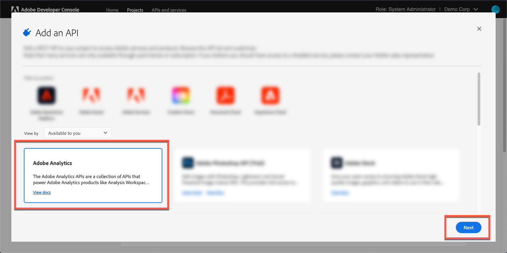

# Adobe Analytics へのログイン{#log-in-to-adobe-analytics}

ログインしてAdobe Analyticsレポートを設定し、Adobe Analyticsレポート変数をAdobeDynamic Media Classicイベントに一致させる前に、Adobe AnalyticsのWebサービスアクセスグループのメンバーであることを確認します。 このグループのメンバーは、インターフェイスで設定されている権限に関係なく、Experience CloudのWebサービスAPIを介して、指定したレポートスイートのすべてのレポートにアクセスできます。 グループにメンバーを追加するには、Adobe Analyticsで、**[!UICONTROL 管理ツール]** / **[!UICONTROL ユーザー管理]** / **[!UICONTROL グループの編集]**&#x200B;に移動します。

ログインする際に、最新のビデオ分析実装を使用するために、Experience Cloud組織IDを入力するオプションがあります。 IDを入力しない場合、ビデオレポートは引き続き機能します。 ただし、AdobeDynamic Media Classicの外部からのクライアントの他のデータとデータが正しく統合されない可能性があります。

>[!NOTE]
>
>Adobe AnalyticsアカウントがAdobe IMSベースの認証(Identity Managementシステム)に移行されてログインした場合、直接の資格情報の入力は機能しません。

**Dynamic Media ClassicからAdobe AnalyticsにAdobeするには：**

まず、Dynamic Media ClassicをAdobe Analytics OAuthと統合します。 Dynamic Media ClassicとのAdobe Analytics OAuth統合は、通常、ユーザーごとに1回だけおこなわれます。

1. [Adobe開発者コンソール](https://developer.adobe.com/console)にアクセスします。 アカウントに、統合が必要な組織の管理者権限があることを確認します。
1. ホームページの右上隅付近にあるドロップダウンリストから、適切な会社を選択します。 (以下のスクリーンショットは、情報を提供する目的でのみ使用されます。選択する実際の会社名は異なる場合があります)。

   

1. 次のいずれかの操作を行います。

   * ページの上部にある「**[!UICONTROL ホーム]**」タブで、「**[!UICONTROL 新しいプロジェクトを作成]**」を選択します。
   * ページの上部にある「**[!UICONTROL プロジェクト]**」タブから、 ページの右隅近くにある「**[!UICONTROL 新しいプロジェクトを作成]**」を選択します。

1. プロジェクトのページで、「**[!UICONTROL APIを追加]**」を選択します。
1. **[!UICONTROL API]**&#x200B;を追加ページで、**[!UICONTROL Adobe Analytics]**&#x200B;を選択します。
1. ページの右下隅付近にある「**[!UICONTROL 次へ]**」を選択します。

   

1. **[!UICONTROL APIを設定]**&#x200B;ページで、「**[!UICONTROL ユーザー認証OAuth]**」を選択します。
1. ページの右下隅付近にある「**[!UICONTROL 次へ]**」を選択します。
1. **[!UICONTROL APIを設定]**&#x200B;ページで、**[!UICONTROL OAUTH 2.0 Web]**&#x200B;を選択します。
1. 「 **[!UICONTROL デフォルトのリダイレクトURI]** 」テキストフィールドに、次のパスを図のとおりに入力します。

   `https://exploreadobe.com/dynamic-media-upgrade/`

1. 「 **[!UICONTROL リダイレクトURIパターン]** 」テキストフィールドに、次のパスを図のように正確に入力します。

   `https://exploreadobe\.com/dynamic-media-upgrade/`

1. ページの右下隅にある「**[!UICONTROL 設定済みAPIを保存]**」を選択します。
1. ナビゲーションパネルのAdobe Analyticsページの左側にある「**[!UICONTROL 資格情報]**」で、「**[!UICONTROL OAuth Web]**」を選択します。
1. **[!UICONTROL Credential details]**&#x200B;で、次の操作を行います。
   * 「**[!UICONTROL クライアントID]**」で、「**[!UICONTROL コピー]**」を選択して値をコピーします。 後続のDynamic Media ClassicデスクトップアプリケーションのAnalytics設定にこの値が必要です。
   * 「**[!UICONTROL Client Secret]**」で、「**[!UICONTROL Retrieve client secret]**」を選択して、関連する値を表示します。 「**[!UICONTROL コピー]**」を選択して値をコピーします。 後続のDynamic Media ClassicデスクトップアプリケーションでのAdobe Analytics設定にこの値が必要です。

**Dynamic Media ClassicデスクトップアプリケーションでのAdobe Analyticsの設定**

>[!NOTE]
>
>Dynamic Media ClassicでのAdobe Analyticsの初期設定後、設定をやり直す必要があるのは次の場合のみです。
>
>* 新しいレポートがAnalyticsに追加され、ユーザーがその新しいレポートへのデータの送信を開始しようとしている。
>* Adobe Analyticsでトラッキングサーバーが更新されました。
>* レポートに新しいトラッキング変数が導入され、Dynamic Media Classicユーザーインターフェイスの特定のビューア変数をその新しいAnalytics変数にリンクするとします。

>

1. AdobeDynamic Media Classicデスクトップアプリケーションの右上隅付近で、**[!UICONTROL 設定]** / **[!UICONTROL アプリケーション設定]**&#x200B;に移動します。
1. 左側のパネルの「**[!UICONTROL アプリケーション設定]**」で、「**[!UICONTROL Adobe Analytics]**」を選択します。
1. **[!UICONTROL Adobe Analytics設定]**&#x200B;ページで、「**[!UICONTROL Adobe Analyticsログイン]**」を選択します。
1. **[!UICONTROL Adobe Analytics Login]**&#x200B;ダイアログボックスの「Client ID」フィールドと「Client Secret」フィールドに、前にコピーしたそれぞれの値を貼り付けます。
1. IMSログインの実行

   正常にログインすると、使用可能な会社が開始する&#x200B;**[!UICONTROL COMPANIES]**&#x200B;ドロップダウンリストが表示されます。

1. **[!UICONTROL COMPANIES]**&#x200B;ドロップダウンリストから、会社を選択します。

   会社を選択すると、その会社で使用可能なレポートスイートから開始される&#x200B;**[!UICONTROL SUITES]**&#x200B;ドロップダウンリストが表示されます。

1. **[!UICONTROL SUITES]**&#x200B;ドロップダウンリストから、レポートスイートを選択します。

   >[!NOTE]
   >
   >デフォルトでは、**[!UICONTROL COMPANIES]**&#x200B;と&#x200B;**[!UICONTROL SUITES]**&#x200B;の両方のドロップダウンリストが空であることに注意する必要があります。 そのため、ユーザーは各リストから値を選択する必要があります。—>

1. 「**[!UICONTROL OK]**」を選択して設定を保存します。

>[!MORELIKETHIS]
>
>* [Adobe Analyticsレポートの設定](configuring-analytics-reports.md#configuring_adobe_analytics_reports)

