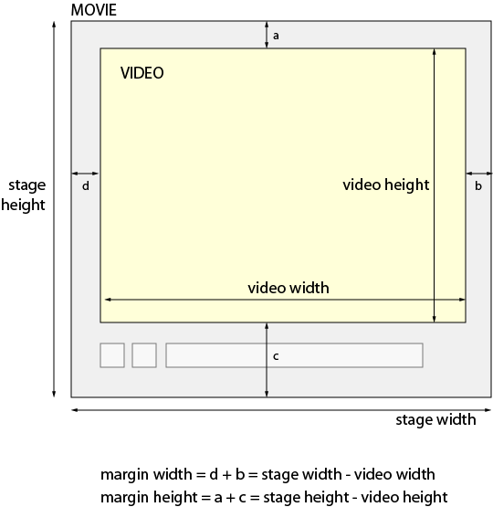
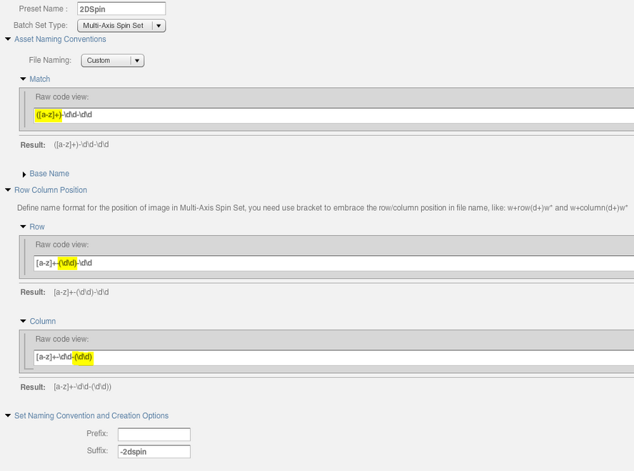

# アプリケーション設定{#application-setup}

アプリケーション設定ページを使用して、一般設定の入力、画像プリセットの作成、ビデオエンコーディングプリセット、ビューアプリセット、またはデフォルトビューアとメタデータの定義を行うことができます。 バッチセットプリセットを設定して、2D スピンセット（例えば）、公開設定、ビデオ SEO設定の生成を自動化できます。

>[!NOTE]
>
>Adobe Dynamic Media Classic管理者のみがアプリケーション設定で設定を変更できます。

## 全般設定 {#general-settings}

アプリケーションの一般設定ページを開くには、グローバルナビゲーションバーで、**[!UICONTROL 設定]** > **[!UICONTROL アプリケーション設定]** > **[!UICONTROL 一般設定]**&#x200B;に移動します。

### サーバ

アカウント作成時に、Adobe Dynamic Media Classicは割り当てられたサーバーを自動的に提供します。 これらのサーバーは、Web サイトとアプリケーションのURL文字列を作成するために使用されます。 これらの URL 呼び出しは、アカウントに固有です。

[&#x200B; セキュアテストサービスのテスト &#x200B;](testing-assets-making-them-public.md#testing_the_secure_testing_service)も参照してください。

* **[!UICONTROL 公開サーバー名]**：このサーバーは、アカウントに固有のすべてのシステム生成URL呼び出しで使用されるライブ CDN （コンテンツ配信ネットワーク）サーバーです。 このサーバー名を変更するのは、Adobe Dynamic Media Classicのサポート担当者から指示された場合のみです。

* **[!UICONTROL オリジンサーバー名]**：このサーバーは品質保証テストにのみ使用されます。 このサーバー名を変更するのは、Adobe Dynamic Media Classicのサポート担当者から指示された場合のみです。

<!-- **AGM Server Name** This server is used for Web-to-Print templates. This server is set on a company-wide basis. Do not change this server name unless instructed to do so by an Adobe DynamicMedia Classic support technician. -->

* **[!UICONTROL Test&amp;Target サーバー名]**: `.com`を含むTest&amp;Target URL。 このURLを取得する方法については、「[!DNL Adobe Dynamic Media Classic]と[!DNL Adobe Target Standard/Premium]の統合」を参照してください。

<!-- **Test Publish Context Server Name** -->

* **[!UICONTROL iOS ストリーミング サーバー名]**: [!DNL Adobe Dynamic Media Classic] iOS ストリーミング サーバーのURL。 このサーバーは、HTTP プロトコルを使用して、iOS ベースのデバイスにストリーミングビデオを配信します。

* **[!UICONTROL プログレッシブ ビデオ サーバー名]**: [!DNL Adobe Dynamic Media Classic] プログレッシブ ビデオ サーバーのURL。 このサーバーは、HTTP プロトコルを使用してプログレッシブビデオを配信します。

* **[!UICONTROL 未公開のアセットのURLを表示]**：公開済みかどうかを問わず、アセットをプレビューする際に[!DNL Adobe Dynamic Media Classic]にURLを表示する場合は、このオプションを選択します。 アセットが公開されていない場合は、URL は機能しません。 ただし、この URL を予定や組織的な目的で使用することができます。

<!-- **Allow AIR install** Select this option to allow users to download Adobe Dynamic Media Classic desktop version to their local hard drives. Users install the application from the Desktop Version area of the Personal Setup screen. -->

<!-- AIR users must manually uninstall their existing app and reinstall from the Web version of Adobe Dynamic Media Classic (in Personal Settings). After this one-time reinstallation, you are prompted to upgrade whenever the server has a newer version of Adobe Dynamic Media Classic AIR. Adobe Dynamic Media Classic is integrated with the Application Update Framework which streamlines the upgrade process. -->

* **[!UICONTROL CDN無効化テンプレート]**: CDN （コンテンツ配信ネットワーク）キャッシュの無効化に使用されるテンプレートを指定します。

  例えば、次の例のように、特定の画像IDの代わりに`<ID>`を参照する画像URL （画像プリセットまたは修飾子を含む）を入力するとします。

  `https://sample.scene7.com/is/image/Company/<ID>?$s7product$`

  テンプレートに`<ID>`だけが含まれている場合は、`https://<server>/is/image`にAdobe Dynamic Media Classicが入力されます。ここでは、`<server>`は一般設定で定義されている公開サーバー名です。

  CDN Invalidate Templateを設定し、Backpack_Bという名前の画像を選択し、**[!UICONTROL File]** > **[!UICONTROL Invalidate CDN]**&#x200B;に移動すると、CDN Invalidate インターフェイスで次の生成されたURLが表示されます。

  `https://sample.scene7.com/is/image/Company/Backpack_B?$s7product$`

  URL リストボックスで、**[!UICONTROL 続行]**&#x200B;を選択して、特定の画像URL呼び出しのキャッシュをクリアします。 URLを入力するか、URL リストボックスに貼り付けることで、URLを追加することもできます。事前にテンプレートを設定する必要はありません。

  CDN無効化テンプレートを選択してCDN無効化リクエストを行うと、ユーザーインターフェイスにインジケーターが表示されます。 キャッシュをクリアするのにかかる時間を見積もることができます。

  **[!UICONTROL ファイル]**/**[!UICONTROL CDN]**&#x200B;を無効にするをクリックすると、Dynamic Media Classicで複数の画像が選択されている場合、保存されたテンプレート URLで各画像が参照されます。 そのため、Web サイトで参照されている各URL （商品の詳細や検索結果など）を参照するCDN無効化テンプレートを定義できます。 次に、キャッシュから無効化する1つまたは複数の画像を選択すると、URLが自動的にインターフェイスに入力されます。

  詳しくは、[コンテンツのキャッシング](dmc-platform-overview.md#content_caching)を参照してください。

  詳しくは、[アセットの再公開と CDN の遅延](publishing-files.md#republished_assets_and_cdn_delays)を参照してください。

### 参照

* **[!UICONTROL プロジェクトを表示]**: Adobe Dynamic Media Classic アセットを整理する手段としてプロジェクトを使用できるかどうかを指定します。 [&#x200B; プロジェクトを使用した作業の整理](/help/using/organizing-projects.md)を参照してください。

* **[!UICONTROL サンプル eVideo コンテンツを表示]**:eVideo サンプルコンテンツの表示をオンまたはオフにします。

* **[!UICONTROL 生成されたコンテンツを表示]**: フォルダーには、アセットから生成されたコンテンツが表示されます。 例えば、PDF ファイルをアップロードするときにラスタライズすると、Adobe Dynamic Media Classicは元のPDFの各ページに1つの画像を作成します。 「生成されたコンテンツを表示」を選択すると、元のPDFがアップロードされたときに生成された各画像が表示されます。 PDFがアップロードされたフォルダーに、PDFと共に表示されます。

* **[!UICONTROL エンコードされたビデオを表示]**: デフォルトで選択解除（オフ）になっています。

  Adobe Dynamic Media Classicでは、同じビデオの多数のエンコードされた派生を操作しなくても、ビデオをすばやく検索して参照できます。 このオプションを選択解除したままにします（デフォルト）。 プライマリのビデオサムネール（アップロードし、アウトプットを作成するために使用したソースビデオ）と、「親」アダプティブビデオセットサムネール（エンコードされたビデオセットの「子」アウトプットを含む）のみが表示されます。

  ただし、プライマリビデオまたはアダプティブビデオセットから個々のエンコード済みビデオにアクセスすることはできます。 このようなアクセスを行うには、ビデオサムネール画像をダブルクリックして、詳細ビューを開きます。 次に、右側のパネルで「**[!UICONTROL エンコードされたビデオ]**」を選択して、すべての「子」ビデオにアクセスできるようにします。

  また、**[!UICONTROL ファイル]**/**[!UICONTROL 再処理]**&#x200B;に移動して、アダプティブビデオセットから直接、よりエンコードされた「子」ビデオを作成することもできます。 Adobe Dynamic Media Classicは、アダプティブビデオセットの「親」プライマリビデオを自動的に見つけ、それをトランスコードのソースビデオとして使用します。 ただし、新しく作成した個々のエンコードされたビデオを保存すると、検索または参照するときには表示されません。 しかし、詳細ビューの「エンコードされたビデオ」タブからはアクセスできます。

  [動画のアップロードとトランスコード &#x200B;](uploading-encoding-videos.md#uploading_and_encoding_videos)を参照してください。

  検索または参照時に、エンコードされたすべてのビデオ派生物にアクセスできるようにしておくには、**[!UICONTROL 「エンコードされたビデオを表示」]**&#x200B;を選択します。

  ビルドメニューには、個々のビデオでのみ機能する、または、オプションで機能するアクションがあります。 この機能により、**[!UICONTROL 「エンコードされたビデオを表示」]**&#x200B;がどう設定されているかに関係なく、エンコードされたすべてのビデオ派生物を必ず表示するようになり、ユーザはその中から選択できます。 **[!UICONTROL エンコードされたビデオを表示]**&#x200B;設定を上書きするビルドアクションには、**[!UICONTROL アダプティブビデオセット]**&#x200B;と&#x200B;**[!UICONTROL eCatalogs]**&#x200B;が含まれます。

  >[!NOTE]
  >
  >Adobe Dynamic Media Classicを使用してビデオアセットをアップロードおよびエンコードしなかった場合、Adobe Dynamic Media Classicには、エンコードされたすべての個々のビデオが表示されます。このオプションは選択解除されていても表示されます。

* **[!UICONTROL サブフォルダーの更新ボタンを表示]**: サブフォルダーの更新ボタンの表示をオンまたはオフにします。

### Adobe Dynamic Media Classic FTP アカウント

* **[!UICONTROL サーバー]**: FTP アカウント サーバーを一覧表示します。

* **[!UICONTROL ユーザー名]**: FTP アカウントのユーザー名を一覧表示します。

### アプリケーションへのアップロード

[&#x200B; アップロードジョブのオプション &#x200B;](https://s7d5.scene7.com/s7viewers/html5/VideoViewer.html?videoserverurl=https://s7d5.scene7.com/is/content/&emailurl=https://s7d5.scene7.com/s7/emailFriend&serverUrl=https://s7d5.scene7.com/is/image/&config=Scene7SharedAssets/Universal_HTML5_Video&contenturl=https://s7d5.scene7.com/skins/&asset=S7tutorials/569_Default%20Job%20Options_converted%20renamed_Getting%20Started-AVS)のトレーニングビデオも参照してください。

* **[!UICONTROL 画像を上書き]**: Adobe Dynamic Media Classicでは、2つのファイルに同じ名前を付けることはできません。 各項目のAdobe Dynamic Media Classic ID （画像の名前からファイル名の拡張子を除く）は一意である必要があります。 この規則のため、アップロードダイアログボックスには上書きオプションがあります。 このオプションの実際の効果は、指定した「画像を上書き」オプションによって異なります。 これらのオプションは、置き換え画像のアップロード方法、つまり元の画像を置き換えるか、画像を重複させるかを指定します。 重複する画像の名前は「–1」に変更されます（例えば、chair.tifはchair-1.tifに変更されます）。 これらのオプションは、元の画像とは別のフォルダにアップロードされる画像や、元の画像と異なるファイル名拡張子（JPG、TIF、PNG など）を持つ画像に影響を与えます 「[画像を上書きオプションを使用する](#using-the-overwrite-images-option)」を参照してください。

   * **[!UICONTROL 現在のフォルダー、同じベース画像名または拡張子]**&#x200B;で上書き：このオプションは最も厳格な置き換えルールです。 置き換え画像を元の画像と同じフォルダにアップロードし、置き換え画像と元の画像のファイル名拡張子が同じになっている必要があります。 これらの要件が満たされない場合は、重複する画像が作成されます。

   * **[!UICONTROL 現在のフォルダー内で、拡張子に関係なく同じベースアセット名を上書き]**：置き換え画像を元のフォルダーと同じフォルダーにアップロードする必要がありますが、ファイル名の拡張子は元のフォルダーと異なる場合があります。 例えば、chair.jpg を chair.tif に置き換える場合などです。

   * **[!UICONTROL 同じベースアセット名または拡張子]**&#x200B;の任意のフォルダーで上書き：置き換え画像のファイル名拡張子が元の画像と同じである必要があります。 例えば、chair.jpgはchair.tifではなくchair.jpgに置き換える必要があります）。 ただし、置き換え画像を、元の画像と別のフォルダにアップロードできます。 更新された画像は新しいフォルダにあり、元の場所のファイルはなくなります。

   * **[!UICONTROL 拡張子]**&#x200B;に関係なく、同じ基本アセット名の任意のフォルダーで上書きします。このオプションは、最も包括的な置き換えルールです。 置き換え画像を、元の画像と別のフォルダにアップロードでき、ファイル名拡張子が異なるファイルをアップロードして、元のファイルと置き換えることができます。 元のファイルが別のフォルダにある場合、置き換え画像は、アップロード先の新しいフォルダに存在します。

* **[!UICONTROL 公開を保持]**:Adobe Dynamic Media Classicにアップロードされた置き換え画像が、置き換える画像の「公開準備完了」設定を保持するかどうかを指定します。 または、設定はアップロード時に指定します。

* **[!UICONTROL 既定のカラープロファイル]**: CMYK画像を追加する際に、既定のカラープロファイルオプションの一部として適用されるカラープロファイルを指定します。

* **[!UICONTROL デフォルトのアップロードオプション]**: アップロードジョブオプションダイアログボックスを開き、デフォルトのアップロードオプションを指定できます。 これらのオプションについて詳しくは、[アップロードオプション](/help/using/uploading-files.md#upload_options)を参照してください。

### 画像マップエディター（アプリケーションへ）

* **[!UICONTROL デフォルトの画像マッピング HREF]**：画像マッピングでHREF列に使用されるデフォルト URLを定義します。 このURLは、画像マップの作成時に表示されるデフォルトのURLです。

* **[!UICONTROL 既定の画像マッピング テンプレート]**：画像マッピングのHREF テンプレートの既定のJavaScriptを定義します。 ここでカスタムコードを設定して、画像マップを選択するたびに実行できます。

### その他の設定（アプリケーションへ）

* **[!UICONTROL ごみ箱で警告をクリーンアップできます]**：ごみ箱に入っているAssetsは、7日以内に自動的に削除されます。 「ゴミ箱アイテムが自動的に削除される前にメールを送信」を選択すると、ゴミ箱に入っているアセットが完全に削除されてから4日後に会社の管理者に通知が送信されます。 [ごみ箱フォルダーの管理](/help/using/trash-folder.md)を参照してください。

## 「画像を上書き」オプションを使用する {#using-the-overwrite-images-option}

Adobe Dynamic Media Classicでは、2つのファイルに同じ名前を付けることはできません。 各項目のAdobe Dynamic Media Classic ID （画像の名前からファイル名の拡張子を除く）は一意である必要があります。 この規則のため、アップロードダイアログボックスには「画像を上書き」オプションがあります。 このオプションの正確な効果は、各会社のAdobe Dynamic Media Classic内部設定の設定によって異なります。

以前に画像をアップロードし、その後に元のファイルを変更（または置き換え）した場合、選択した「上書き」オプションは、Adobe Dynamic Media Classicで画像を置き換える方法を指定します。 画像に関する情報は変わりませんが、古い画像は新しい画像に置き換わります。 フォルダーにまだAdobe Dynamic Media Classicにない画像が含まれている場合は、これらの画像が追加されます。

アップロードした画像が何らかの方法で変更された場合（画像が変更された場合）は、このオプションを使用しますが、画像への参照は同じままです。 上書きは、Adobe® PDFをアップロードおよびリッピングする際にも役立ちます。 Adobe Dynamic Media Classic *が画像をどのようにリッピングするか*&#x200B;を微調整できます。 また、アップロードダイアログボックスでICC カラープロファイルオプションを調整し、上書き機能を使用して再アップロードすることもできます。

本番サーバーから画像にアクセスするために使用されるAdobe Dynamic Media Classic IDは、画像ファイル名から派生します。 ファイル名に大文字と小文字を使用することは、既存のファイルの置き換えと、画像へのアクセスに使用するAdobe Dynamic Media Classic IDの両方において重要です。 Adobe Dynamic Media Classicにアップロードする前に、大文字と小文字を含むファイル名を使用すると、同じ画像の場合にのみ異なるAdobe Dynamic Media Classic IDが使用されるのを防ぐことができます。

このオプションを選択しない場合、既存の画像と同じファイル名のすべての画像は、重複と見なされて追加されません。

## 画像プリセット {#image-presets}

画像プリセット画面は、画像プリセットを作成および編集するのに使用します。 画像プリセット Adobe Dynamic Media Classicでは、同じプライマリ画像から異なるサイズの画像を動的に配信できます。 各画像プリセットは、画像を表示するための定義済みサイズおよび形式に関するコマンドの集まりです。 画像プリセットを作成する場合は、画像配信用のサイズを選択します。 また、書式設定コマンドを選択して、画像を表示用に配信する際に画像の外観を最適化することもできます。

管理者は、アセット書き出し用のプリセットを作成できます。 ユーザーは、画像を書き出すときにプリセットを選択できます。また、管理者が指定した仕様に画像を再フォーマットすることもできます。

画像プリセット画面を開くには、グローバルナビゲーションバーで、**[!UICONTROL 設定]** > **[!UICONTROL 画像プリセット]**&#x200B;に移動します。

[&#x200B; スマートイメージング &#x200B;](https://experienceleague.adobe.com/ja/docs/experience-manager-65/content/assets/dynamic/imaging-faq)を参照してください。

### 画像プリセットの作成と編集 {#creating-and-editing-image-presets}

1. **[!UICONTROL 設定]** / **[!UICONTROL 画像プリセット]**&#x200B;に移動します。
1. プリセットを作成するか、既存のプリセットから開始します。

   * **画像プリセットを作成**: **[!UICONTROL 追加]**&#x200B;を選択します。
   * **既存のプリセットから画像プリセットを作成**：作成するプリセットに最も近い画像プリセットを選択し、**[!UICONTROL 編集]**&#x200B;を選択します。

1. プリセットの追加（または編集）ページで、プリセットの名前を入力します。
1. 目的のプリセットオプションを設定します。

   詳しくは、[画像プリセットのオプション](application-setup.md#image_preset_options)を参照してください。

1. **[!UICONTROL 保存]**&#x200B;を選択するか、既存のプリセットから開始した場合は、**[!UICONTROL 別名で保存]**&#x200B;を選択します。
1. 独自の画像でプリセットをプレビューするには、**[!UICONTROL 参照]**&#x200B;を選択してから画像を選択します。 デフォルトの画像でプレビューするには、**[!UICONTROL リセット]**&#x200B;を選択します。

画像プリセットを編集するには、画像プリセット画面で名前を選択し、**[!UICONTROL 編集]**&#x200B;を選択します。 画像プリセットを削除するには、その画像プリセットを選択し、**[!UICONTROL 削除]**&#x200B;を選択します。

### 画像プリセットのオプション {#image-preset-options}

プリセットを追加画面およびプリセットを編集画面には、画像プリセットを作成および編集するための次のオプションがあります。

* **[!UICONTROL プリセット名]**：空白なしで記述的な名前を入力します。 ユーザーがこの画像プリセットを識別しやすくするために、名前に画像サイズの指定を含めます。

* **[!UICONTROL 幅と高さ]**：画像を配信するサイズをピクセル単位で入力します。

* **[!UICONTROL 形式]**: メニューから形式を選択します。 GIF、JPEG、PDF、またはTIFFのフォーマットを選択すると、さらに多くのオプションが表示されます。

   * GIF カラー量子化オプション

      * **[!UICONTROL Type]**: アダプティブ（デフォルト）、Web、またはMacを選択します。 「**[!UICONTROL GIFとAlpha]**」を選択した場合、「Mac」オプションは使用できません。

      * **[!UICONTROL Dither]**: 「拡散」または「オフ」を選択します。

      * **[!UICONTROL 色数]**: スライダーをドラッグして2 ～ 255の値を入力します。

      * **[!UICONTROL カラーリスト]**: コンマ区切りのリストを入力します。 例えば、白、グレー、黒の場合は、`000000,888888,ffffff`と入力します。

   * JPEG オプション

      * **[!UICONTROL 品質]**: JPEGの圧縮レベルを制御します。 この設定は、ファイルサイズと画質の両方に影響を与えます。 JPEGの画質は1-100です。

      * **[!UICONTROL JPG Chrominance Downsamplingを有効にする]**：目は高周波の輝度よりも高周波のカラー情報に影響されにくいため、JPEGの画像では画像の情報を輝度とカラーのコンポーネントに分割します。 JPEG 画像を圧縮すると、輝度成分は最大解像度が維持され、色成分はピクセルのグループの平均化によりダウンサンプリングされます。 ダウンサンプリングは、データ量を半分または3分の1に減らし、知覚品質にほとんど影響を与えません。 ダウンサンプリングは、グレースケール画像では使用できません。 この方法は、コントラストが高い画像（テキストがオーバーレイされた画像など）で圧縮の量を低減させるのに役立ちます。

   * PDF および TIFF のオプション

      * **[!UICONTROL 圧縮]**：圧縮アルゴリズムを選択します。

* **[!UICONTROL カラースペース]**: カラースペースを選択します。

* **[!UICONTROL シャープニング]**: **[!UICONTROL `Enable Simple Sharpening`]** オプションを選択して、すべての拡大・縮小が行われた後に画像に基本的なシャープフィルターを適用します。 シャープにより、異なるサイズで画像を表示したときに生じるぼかしを補正できます。

  シャープ処理、リサンプルモード、アンシャープマスクについて詳しくは、[画像をシャープ化](sharpening-image.md#sharpening_an_image)を参照してください。 [&#x200B; シャープニング &#x200B;](https://s7d5.scene7.com/s7viewers/html5/VideoViewer.html?videoserverurl=https://s7d5.scene7.com/is/content/&emailurl=https://s7d5.scene7.com/s7/emailFriend&serverUrl=https://s7d5.scene7.com/is/image/&config=Scene7SharedAssets/Universal_HTML5_Video&contenturl=https://s7d5.scene7.com/skins/&asset=S7tutorials/547_sharpening1_converted%20renamed_Done-AVS)のトレーニングビデオも参照してください。

* **[!UICONTROL 再サンプルモード]**：再サンプリングモードオプションを選択します。 これらのオプションは、ダウンサンプリングした画像をシャープにします。

* **[!UICONTROL B-Linear]**：最も高速な再サンプリング方法です。一部のエイリアスアーティファクトが目立ちます。

* **[!UICONTROL Bi-Cubic]**: Image ServerでのCPUの使用率が増加しますが、目立たないエイリアシング アーティファクトを使用すると、画像のシャープが向上します。

* **[!UICONTROL `Sharp 2`]**: Bi-Cubic オプションよりもややシャープな結果を生成できますが、Image ServerのCPU コストはさらに高くなります。

* **[!UICONTROL Tri-Linear]**：使用可能な場合は、高い解像度と低い解像度の両方を使用します。エイリアスが問題である場合にのみ推奨します。 この方法では、周波数の高いデータが削減されるため JPEG のサイズが小さくなります。

* **[!UICONTROL アンシャープマスク]**：シャープを微調整するには、次のオプションを選択します。

* **[!UICONTROL 適用量]**: エッジ ピクセルに適用されるコントラストの量を制御します。 デフォルトは1.0です。 高解像度の画像の場合は、最大5.0まで拡大できます。 適用量は、フィルターの適用度を示す指標と考えてください。

* **[!UICONTROL 半径]**：シャープ処理に影響を与えるエッジ ピクセルの周囲のピクセル数を指定します。 高解像度画像では、1 ～ 2 の値を入力します。 小さい値を指定すると端のピクセルのみがシャープになります。大きい値を指定すると幅広い領域のピクセルがシャープになります。 適切な値は、画像のサイズに依存します。

* **[!UICONTROL しきい値]**：アンシャープマスクフィルターが適用されるときに無視するコントラストの範囲を指定します。 つまり、シャープ化されたピクセルが周囲の領域とどのように異なるのかを解決するのに役立ちます。 ノイズの発生を避けるには、`.02`から`0.2`の間の値を試してください。 デフォルト値の6は、画像内のすべてのピクセルをシャープにします。

* **[!UICONTROL カラースペース]**：画像が作成されたスペース（通常はRGB（元）または輝度スペース（強度）を使用するかどうかを指定します。

* **[!UICONTROL カラー]**&#x200B;次のオプションを選択できます。

* **[!UICONTROL 出力カラープロファイル]**:「**[!UICONTROL デフォルトを使用]**」またはAdobe Dynamic Media Classicで使用可能なICC カラープロファイルの1つを選択します。

  詳しくは、[ICC プロファイル](icc-profiles.md#icc_profiles)も参照してください。

* **[!UICONTROL レンダリングインテント]**: カラープロファイルのデフォルトのレンダリングインテントを上書きする場合は、オプションを選択します。 このオプションは、デフォルトのICC プロファイルの1つがカラー変換のターゲットカラースペースである場合に使用します。 または、このプロファイルは出力デバイス（プリンターまたはモニター）を特徴付け、指定されたレンダリングインテントはこのプロファイルに有効です。

* **[!UICONTROL プロファイルを埋め込む]**：このオプションを選択すると、この画像をAdobe®Photoshop®で開くと、このプロファイルが使用されます。

* **[!UICONTROL 印刷解像度]**：この画像を印刷する解像度を選択します。72 ピクセルがデフォルトです。

* **[!UICONTROL URL修飾子]**：設定ではなく、画像プリセットを定義するURL修飾子を指定する場合は、ここで修飾子を入力します。

* **[!UICONTROL サンプル画像URL]**: Dynamic Media Image Serverが、追加または編集する画像プリセットを含む画像を配信するために使用する「生」 URL文字列を一覧表示します。 このURL文字列は、プリセットの追加またはプリセットの編集画面で選択したすべてのフォーマット設定をエンコードします。

### 画像プリセットの編集、削除、またはアクティベート解除 {#editing-removing-or-deactivating-an-image-preset}

1. **[!UICONTROL 設定]** / **[!UICONTROL 画像プリセット]**&#x200B;に移動します。
1. 画像プリセット画面の表でプリセットを選択し、次のいずれかの操作を行います。

   * 「**[!UICONTROL 編集]**」を選択し、プリセットを編集ダイアログボックスで新しいオプションを指定します。
   * 「**[!UICONTROL 削除]**」を選択して、プリセットをリストから削除します。
   * MediaPortal ユーザーのAdobe Dynamic Media Classic ユーザーインターフェイス全体からプリセット名を削除する場合は、プリセット名の横にある「**[!UICONTROL アクティブ]**」チェックボックスの選択を解除します。

## アダプティブビデオプリセットのアクティベートまたはアクティベート解除 {#activating-or-deactivating-adaptive-video-presets}

Adobe Dynamic Media Classicでは、アダプティブビデオエンコーディングプリセットを提供しています。 これは、16:9個のアダプティブビデオプリセットと4:3個のアダプティブビデオプリセットの両方を1つのグループに統合したプリセットのプライマリリストです。 これらの定義済みプリセットは、最も一般的なエンコーディング設定を反映しており、ターゲットとなっている携帯端末、タブレットおよびデスクトップでの再生用に最適化されています。

デフォルトでは、「アダプティブビデオ」エンコーディングプリセットのみがアクティブ化されます（有効または「オン」）。 必要に応じて、このプリセットを非アクティブ化することができます。 非アクティブなアダプティブビデオプリセットは、アップロードオプションを設定ダイアログボックスの eVideo セクションに選択可能なオプションとして表示されません。

[&#x200B; ビデオのアップロードとエンコード &#x200B;](uploading-encoding-videos.md#uploading_and_encoding_videos)を参照してください。

[&#x200B; ビデオプリセット &#x200B;](https://s7d5.scene7.com/s7viewers/html5/VideoViewer.html?videoserverurl=https://s7d5.scene7.com/is/content/&emailurl=https://s7d5.scene7.com/s7/emailFriend&serverUrl=https://s7d5.scene7.com/is/image/&config=Scene7SharedAssets/Universal_HTML5_Video&contenturl=https://s7d5.scene7.com/skins/&asset=S7tutorials/549_video-presets_converted%20renamed_Done-AVS)のトレーニングビデオも参照してください。

**アダプティブビデオプリセットをアクティブ化または非アクティブ化するには：**

1. Adobe Dynamic Media Classicの右上隅付近で、**[!UICONTROL Setup]** > **[!UICONTROL Application Setup]** > **[!UICONTROL Video Presets]** > **[!UICONTROL Adaptive Video Presets]**&#x200B;に移動します。
1. アダプティブビデオプリセットページで、プリセット名の横にあるチェックボックスを選択解除して、アップロードオプションを設定ダイアログボックスの「eVideo オプション」リストからプリセットを削除します。
1. **[!UICONTROL 閉じる]**&#x200B;を選択します。

## ビデオファイルのエンコーディング用のビデオプリセット {#video-presets-for-encoding-video-files}

エンコーディングプリセットを選択するには、アップロードページの右下隅にある「**[!UICONTROL ジョブオプション]**」を選択します。 アップロードジョブオプションダイアログボックスで、「e ビデオオプション」を展開し、必要なビデオエンコーディングプリセットを選択します。

>[!NOTE]
>
>デフォルトで有効になっている「アダプティブビデオ」を除き、他のすべてのアダプティブビデオまたは単一のビデオエンコーディングプリセットをアップロードジョブオプションダイアログボックスに表示することはできません。 Adobe Dynamic Media Classic管理者は、アップロードジョブオプションダイアログボックスに表示されるビデオエンコーディングプリセットを指定します。

* 次のアダプティブビデオエンコーディングまたはシングルエンコーディングプリセットから選択します。

   * **[!UICONTROL 16:9 アダプティブビデオ]**: デスクトップ、モバイル（iPhone、iPad、Android™）およびタブレット（iPad、Android™）に配信するための16:9の縦横比ビデオを作成し、視聴者の接続速度に最も適した解像度とビットレートで最適化します。

   * **[!UICONTROL 4:3 アダプティブビデオ]**：デスクトップ、モバイル（iPhone、iPad、Android™）およびタブレット（iPad、Android™）に配信するための4:3の縦横比ビデオを作成し、視聴者の接続速度に最も適した解像度とビットレートで最適化します。

   * **[!UICONTROL アダプティブビデオ]**：任意のアスペクト比で動作する単一エンコーディングプリセットで、モバイル、タブレット、デスクトップに配信するビデオを作成します。 このプリセットを使用してエンコードされたアップロード済みのソースビデオには、固定の高さが設定されますが、 ただし、幅はビデオの縦横比を維持するために自動的に拡大・縮小されます。

     この「自動スケール」を持つ柔軟性は、独自のカスタムビデオエンコーディングプリセットを作成する際にもデフォルトで使用できます。

     [&#x200B; ビデオエンコーディングプリセットの追加または編集](uploading-encoding-videos.md#adding_or_editing_a_video_encoding_preset)を参照してください。

   * **[!UICONTROL アダプティブビデオエンコーディング （16:9または4:3）]**: デスクトップ、モバイル（iPhone、iPad、Android™）、およびタブレット（iPad、Android™）に配信する16:9と4:3の両方の縦横比ビデオを作成します。 これらはすべて、視聴者の接続速度に最も適した解像度とビットレートで最適化されています。

     [&#x200B; アダプティブビデオエンコーディング（16:9または4:3）ビデオプリセット &#x200B;](application-setup.md#adaptive_video_encoding_16_9_or_4_3_video_presets)を参照してください。

   * **[!UICONTROL 単一エンコーディングプリセット]**

     >[!NOTE]
     >
     >iPadにビデオを配信するには、モバイルエンコーディングプリセットまたはタブレットエンコーディングプリセットを選択します。 タブレットプリセットは特に iPad 用に設計され、一般に大きな画面サイズや接続の帯域幅の利点を活かせる高い解像度と品質を備えています。 タブレットプリセットでエンコードされたビデオファイルを配信するには、モバイルサイトやアプリケーションでデバイス検出コードが必要です。 このコードは、再生デバイスに応じて iPhone または iPad ビデオ表示を切り替えます。 iPad へのビデオファイルの配信用のモバイルプリセットを選択する方がワークフローは簡単です。 その理由は、iPhone と iPad の両方で同じビデオファイルを使用できるためです。 ただし、画質は低い解像度の iPhone での表示用に標準化されます。

      * 「エンコーディングプリセット」グループの「エンコーディングプリセットを並べ替え」ドロップダウンリストで、「名前」または「サイズ」を選択して、プリセットを名前または解像度サイズで並べ替えます。
      * ビデオの再生に使用する解像度サイズと帯域幅に基づいて、エンコーディングプリセットを選択します。
      * アダプティブビデオエンコーディングと、ビデオごとに1つ以上のエンコーディングプリセットを選択できます。 例えば、1 つのアップロードジョブでデスクトップとモバイルの両方のファイルをエンコードできます。

「**[!UICONTROL アップロードの開始]**」を選択すると、元のプライマリビデオファイルがアップロードされ、エンコードされたファイルがプライマリファイルから生成されます。

### エンコーディングプリセットオプションについて {#about-encoding-preset-options}

エンコーディングプリセットオプションのパラメータは次のとおりです。

* **[!UICONTROL ターゲット接続速度]**：ターゲットエンドユーザーのインターネット接続速度。

* **[!UICONTROL エンコードされたファイル サフィックス]**：識別のためにエンコードされたビデオ ファイルに添付されているサフィックス。

* **[!UICONTROL ビデオビットレート（データレート）]**:1秒間のビデオ再生を構成するためにエンコードされるデータ量（1秒あたりキロビット単位）。

* **[!UICONTROL ピクセル幅/高さ]**：画面画像の幅の寸法（ピクセル単位）。画面画像の高さの寸法（ピクセル単位）。

* **[!UICONTROL Frame per second （fps）]**：ビデオの1秒あたりのフレーム数、つまり静止画の数。 米国および日本では、ほとんどのビデオが 29.97 fps で撮影され、ヨーロッパとアジア（日本を除く）では、ほとんどのビデオが 25 fps で撮影されます。 この映画は24fpsで撮影されています。

* **[!UICONTROL 音声ビットレート]**: オーディオ再生の1秒を構成するためにエンコードされるデータ量（1秒あたりキロビット単位）。

以降に示す表に、ビデオプリセットを選択するためのベストプラクティスと、エンコードされたファイルを指定するために使用する命名規則を示します。

### アダプティブビデオ（初期設定） {#adaptive-video-default}

モバイル、タブレットおよびデスクトップに配信するビデオを作成するための、すべての縦横比で機能するエンコーディングプリセットです。 このプリセット（デフォルトおよびベストプラクティス）でエンコードされたアップロードされたソースビデオは、固定の高さに設定され、幅は自動的に拡大・縮小されてビデオの縦横比が維持されます。

**アダプティブビデオ （デフォルト）**

|  | エンコーディングプリセット名／ツールヒントテキスト | エンコードファイルのサフィックス | ビデオのデータレート（Kbps） | 幅/高さ（ピクセル） | fps | オーディオビットレート（kbps） | 推奨 |
|--- |--- |--- |--- |--- |--- |--- |--- |
| 1 | Auto × 360、800 Kbps | _Mobile_Auto×360p_800K | 800 | Auto×360 | ソースと同じ | 64 | モバイル版（iPhone、iPad、Android™） |
| 2 | Auto × 480、1400 Kbps | _Tablet_Auto×480p_1400K | 1400 | Auto×480 | ソースと同じ | 96 | タブレット用（iPad、Android™） |
| 3 | Auto × 720、2600 Kbps | _Desktop_Auto×720p_2600K | 2600 | Auto×720 | ソースと同じ | 128 | デスクトップ用 |

### アダプティブビデオエンコーディング（16:9または4:3）プリセット {#adaptive-video-encoding-or-video-presets}

これらのアダプティブビデオエンコーディングプリセットは、アップロードしたビデオの縦横比に基づいて自動的に選択される一連の個々のエンコードプリセットを組み合わせたものです。 例えば、4:3 ビデオをアップロードすると、**アダプティブビデオエンコーディング（16:9または4:3）** オプションのプライマリプリセットリスト内にある5つの4:3 プリセットすべてを使用して自動的にエンコードされます。

エンコーディングオプションパラメーターについては、[エンコーディングプリセットオプションについて](application-setup.md#about_encoding_preset_options)を参照してください。

**アダプティブビデオエンコーディング（16:9または4:3）プリセット**

|  | エンコードプリセット名/ツールヒントテキスト | ターゲット接続速度（Kbps） | エンコードファイルのサフィックス | ビデオのデータレート（Kbps） | 幅/高さ（ピクセル） | fps | オーディオビットレート（kbps） | 推奨 |
|--- |--- |--- |--- |--- |--- |--- |--- |--- |
| 1 | `16:9, 512x288, Mobile (iPhone, iPad, Android&trade;), (400 Kbps)` | 500 | _Mobile_512x288_400K | 400 | 512 x 288 | ソースと同じ | 64 | 低解像度、3G |
| 2 | `4:3, 384x288px, Mobile (iPhone, iPad, Android&trade;), (400 Kbps)` | 500 | _Mobile_384x288_400K | 400 | 384 x 288 | ソースと同じ | 64 | 低解像度、3G |
| 3 | `16:9, 512x288, Mobile (iPhone, iPad, Android&trade;), (600 Kbps)` | 700 | _Mobile_512x288_600K | 600 | 512 x 288 | ソースと同じ | 64 | Medium解像度、3G |
| 4 | `4:3, 384x288, Mobile (iPhone, iPad, Android&trade;), (600 Kbps)` | 700 | _Mobile_384x288_600 | 600 | 384 x 288 | ソースと同じ | 64 | Medium解像度、3G |
| 5 | `16:9, 640x360, Tablet (iPad, Android&trade;), (800 Kbps)` | 900 | _iPad_640x360_800K | 800 | 640 x 360 | ソースと同じ | 80 | Medium解像度、WiFi |
| 6 | `4:3, 640x480, Tablet (iPad, Android&trade;), (800 Kbps)` | 900 | _iPad_640x480_800K | 800 | 640 x 480 | ソースと同じ | 80 | Medium解像度、WiFi |
| 7 | `16:9, 768x432, Tablet (iPad, Android&trade;), (1200 Kbps)` | 1.5 Mbps | _iPad_768x432_1200K | 1200 | 768 x 432 | ソースと同じ | 96 | 高解像度、WiFi |
| 8 | `4:3, 768x576, Tablet (iPad, Android&trade;), (1200 Kbps)` | 1.5 Mbps | _iPad_768x576_1200K | 1200 | 768 x 576 | ソースと同じ | 96 | 高解像度、WiFi |
| 9 | `16:9, 1280x720, Desktop, (2000 Kbps)` | 3.0 Mbps | _1280x720_2000K | 2000 | 1280 x 720 | ソースと同じ | 128 | 高精細、ワイドスクリーン |
| 10 | `4:3, 1280x960, Desktop, (2000 Kbps)` | 3.0 Mbps | _1280x960_2000K | 2000 Kbps | 1280 x 960 | ソースと同じ | 128 | 高精細 |

### デスクトップビデオエンコーディングプリセット {#desktop-video-encoding-presets}

デスクトップコンピュータでの MP4 および OGV 対応のビデオエンコーディングプリセット

エンコードオプションパラメータについては、[エンコーディングプリセットオプションについて](application-setup.md#about_encoding_preset_options)を参照してください。

**H264 Main 3.2: オーディオ AAC、MP4 ファイル拡張子**

|  | エンコードプリセット名/ツールヒントテキスト | ターゲット接続速度（Kbps） | エンコードファイルのサフィックス | ビデオのデータレート（Kbps） | 幅/高さ（ピクセル） | fps | オーディオビットレート（Kbps） | 推奨 |
|--- |--- |--- |--- |--- |--- |--- |--- |--- |
| 1 | 16:9、480 x 270 （400 Kbps） | 500 | _480x270_400K | 400 | 480 x 270 | ソースと同じ | 64 | 低解像度のワイドスクリーン |
| 2 | 16:9、640 x 360 （800 Kbps） | 900 | _640x360_800K | 800 | 640 x 360 | ソースと同じ | 80 | 中解像度のワイドスクリーン |
| 3 | 16:9、800 x 450 （1200 Kbps） | 1.5 Mbps | _800x450_1200K | 1200 | 800 x 450 | ソースと同じ | 96 | 中～高解像度 |
| 4 | 16:9、1280 x 720 （2000 Kbps） | 3.0 Mbps | _1280x720_2000K | 2000 | 1280 x 720 | ソースと同じ | 128 | 高精細、ワイドスクリーン |
| 5 | 4:3、320 x 240 （400 Kbps） | 500 | _320x240_400K | 400 | 320 x 240 | ソースと同じ | 64 | 低解像度 |
| 6 | 4:3、480 x 360 （800 Kbps） | 900 | _480x360_800K | 800 | 480 x 360 | ソースと同じ | 80 | 中解像度 |
| 7 | 4:3、640 x 480 （1200 Kbps） | 1.5 Mbps | _640x480_1200K | 1200 | 640 x 480 | ソースと同じ | 96 | 中～高解像度 |
| 8 | 4:3、1280 x 960 （2000 Kbps） | 3.0 Mbps | _1280x960_2000K | 2000 | 1280 x 960 | ソースと同じ | 128 | 高精細 |

**OGG Theora Vorbis: OGV ファイル拡張子**

|  | エンコードプリセット名/ツールヒントテキスト | ターゲット接続速度（Kbps） | エンコードファイルのサフィックス | ビデオのデータレート（Kbps） | 幅/高さ（ピクセル） | fps | オーディオビットレート（Kbps） | 推奨 |
|--- |--- |--- |--- |--- |--- |--- |--- |--- |
| 1 | 16:9、480 x 270 （400 Kbps）、OGG | 500 | _OGG_480x270_400K | 400 | 480 x 270 | ソースと同じ | 64 | 低解像度のワイドスクリーン |
| 2 | 16:9、640 x 360 （800 Kbps）、OGG | 900 | _OGG_640x360_800K | 800 | 640 x 360 | ソースと同じ | 80 | 中解像度のワイドスクリーン |
| 3 | 16:9、800 x 450 （1200 Kbps）、OGG | 1.5 Mbps | _OGG_800x450_1200K | 1200 | 800 x 450 | ソースと同じ | 96 | 中～高解像度 |
| 4 | 16:9、1280 x 720 （2000 Kbps）、OGG | 3.0 Mbps | _OGG_1280x720_2000K | 2000 | 1280 x 720 | ソースと同じ | 128 | 高精細、ワイドスクリーン |
| 5 | 4:3、320 x 240 （400 Kbps）、OGG | 500 | _OGG_320X240_400K | 400 | 320 x 240 | ソースと同じ | 64 | 低解像度 |
| 6 | 4:3、480x360 （800 Kbps）、OGG | 900 | _OGG_480x360_800K | 800 | 480 x 360 | ソースと同じ | 80 | 中解像度 |
| 7 | 4:3、640x480 （1200 Kbps）、OGG | 1.5 Mbps | _OGG_640x480_1200K | 1200 | 640 x 480 | ソースと同じ | 96 | 中～高解像度 |
| 8 | 4:3、1280 x 960 （2000 Kbps）、OGG | 3.0 Mbps | _OGG_1280x960_2000K | 2000 | 1280 x 960 | ソースと同じ | 128 | 高精細 |

### モバイルビデオエンコーディングプリセット {#mobile-video-encoding-presets}

ソース fps と同じで、 IPhone、iPad、Android™ モバイルデバイス用のビデオエンコーディングプリセット。

エンコードオプションパラメータについては、[エンコーディングプリセットオプションについて](application-setup.md#about_encoding_preset_options)を参照してください。

**H264 ベースライン 2.1: オーディオ AAC、MP4 ファイル拡張子**

|  | エンコードプリセット名/ツールヒントテキスト | ターゲット接続速度（Kbps） | エンコードファイルのサフィックス | ビデオのビットレート（Kbps） | 幅/高さ（ピクセル） | fps | オーディオビットレート（Kbps） | 推奨 |
|--- |--- |--- |--- |--- |--- |--- |--- |--- |
| 1 | 16:9、512x288、モバイル（400 Kbps） | 500 | _Mobile_512x288_400K | 400 | 512 x 288 | ソースと同じ | 64 | 低解像度、3G |
| 2 | 16:9、512x288、モバイル （600 Kbps） | 700 | _Mobile_512x288_600K | 600 | 512 x 288 | ソースと同じ | 64 | Medium解像度、3G |
| 3 | 16:9、512x288、モバイル（800 Kbps） | 900 | _Mobile_512x288_800K | 800 | 512 x 288 | ソースと同じ | 80 | Medium解像度、Wi-Fi |
| 4 | 16:9、512x288、モバイル （1000 Kbps） | 1.2 Mbps | _Mobile_512x288_1000K | 1000 | 512 x 288 | ソースと同じ | 80 | 高解像度、Wi-Fi |
| 5 | 16:9、512x288、モバイル（1200 Kbps） | 1.5 Mbps | _Mobile_512x288_1200K | 1200 | 512 x 288 | ソースと同じ | 96 | 高解像度、Wi-Fi |
| 6 | 4:3、384 x 288、モバイル （400 Kbps） | 500 | _Mobile_384x288_400K | 400 | 384 x 288 | ソースと同じ | 64 | 低解像度、3G |
| 7 | 4:3、384 x 288、モバイル （600 Kbps） | 700 | _Mobile_384x288_600K | 600 | 384 x 288 | ソースと同じ | 64 | Medium解像度、3G |
| 8 | 4:3、448 x 336、モバイル （800 Kbps） | 900 | _Mobile_448x336_800K | 800 | 448x336 | ソースと同じ | 80 | Medium解像度、Wi-Fi |
| 9 | 4:3、448 x 336、モバイル （1000 Kbps） | 1.2 Mbps | _Mobile_448x336_1000K | 1000 | 448x336 | ソースと同じ | 80 | 高解像度、Wi-Fi |
| 10 | 4:3、448 x 336、モバイル （1200 Kbps） | 1.5 Mbps | _Mobile_448x336_1200K | 1200 | 448x336 | ソースと同じ | 96 | 高解像度、Wi-Fi |

## ビューアプリセット {#viewer-presets}

>[!NOTE]
>
>**Flash Viewers提供終了のお知らせ**:2017年1月31日をもって、Adobe Dynamic Media ClassicはFlash ビューアプラットフォームのサポートを正式に終了しました。

*ビューアプリセット*&#x200B;は、ユーザのコンピュータ画面および携帯端末上でリッチメディアアセットがどのように表示されるかを決定する設定です。 管理者は、ビューアプリセットを作成できます。 一連のビューア構成オプション用の設定があります。 例えば、ビューアの表示サイズ、ズーム動作、カラースキーム、境界線およびフォントを変更できます。

ベストプラクティスとして、Adobe Dynamic Media Classic HTML 5 ビデオビューアを使用します。 HTML5 ビデオビューアで使用されるプリセットは堅牢なビデオプレーヤーです。

1人のプレイヤーに以下を組み合わせます。

* HTML5とCSSを使用して再生コンポーネントをデザインする機能。
* 埋め込み再生があります。
* ブラウザーの機能に応じて、アダプティブストリーミングとプログレッシブストリーミングを使用します。

リッチメディアコンテンツのリーチを、デスクトップ、タブレット、モバイルのユーザーにも拡大し、効率的な動画体験を実現できます。

Adobe ビューアリファレンスガイドの「[HTML5 ビューアについて](https://experienceleague.adobe.com/ja/docs/dynamic-media-developer-resources/library/viewers-for-aem-assets-only/c-html5-aem-asset-viewers#viewers-for-aem-assets-only)」を参照してください。

[Adobe Dynamic Media Classic ビューアプリセットの互換性マトリックス &#x200B;](application-setup.md#scene7_viewer_preset_compatibility_matrix)を参照してください。

詳しくは、[ベストプラクティス：HTML5 ビデオビューアの使用](best-practice-using-html5-video.md#best_practice_using_the_html5_video_viewer)を参照してください。

ビューアによっては、コミュニティ機能を追加できます。 コミュニティ機能には、埋め込みボタン、電子メールボタン、リンクボタンおよびアクセスボタンがあります。 これらのボタンを使用すると、ビューアを使用するユーザーが他のユーザーとビューアを共有したり、Adobe Dynamic Media Classic Web サイトを開いたりできます。

[Adobe ビューアリファレンスライブラリの例](https://landing.adobe.com/en/na/dynamic-media/ctir-2755/live-demos.html)も参照してください。

### レスポンシブデザインのweb ページに対するビューアーサポート {#viewer-support-for-responsive-designed-web-pages}

web ページによって、ニーズは異なります。 別のブラウザーウィンドウでHTML 5 ビューアを開くリンクを提供するWeb ページが必要な場合があります。 それ以外の場合は、HTML 5 ビューアをホスティングページに直接埋め込む必要があります。 後者の場合、web ページはおそらく静的レイアウトです。 または、「レスポンシブ」であり、異なるデバイスまたは異なるブラウザーウィンドウのサイズに対して異なる表示を行います。 これらのニーズに対応するために、Adobe Dynamic Media Classicに付属しているHTML 5 ビューアは、静的なWeb ページとレスポンシブデザインのWeb ページの両方をサポートしています。

レスポンシブビューアをWeb ページに埋め込む方法について詳しくは、[&#x200B; レスポンシブ画像ライブラリについて](https://experienceleague.adobe.com/ja/docs/dynamic-media-developer-resources/image-serving-api/image-serving-api/responsive-static-image-library/c-about-responsive-static-image-library#image-serving-api)、[&#x200B; レスポンシブ画像ライブラリの使用](https://experienceleague.adobe.com/ja/docs/dynamic-media-developer-resources/image-serving-api/image-serving-api/responsive-static-image-library/t-using-responsive-static-image-library#image-serving-api)、[&#x200B; コマンドリファレンス：コマンド属性](https://experienceleague.adobe.com/ja/docs/dynamic-media-developer-resources/image-serving-api/image-serving-api/responsive-static-image-library/t-using-responsive-static-image-library#responsive-static-image-library)を参照してください。

### ビューアプリセットのタイプ {#viewer-preset-types}

管理者は、次のタイプのビューアプリセットを作成およびカスタマイズできます。

* **[!UICONTROL eCatalog Viewer]**：印刷されたカタログの読み取りをシミュレートします。 ページ間の移動、ページ上のアイテムのズームインとズームアウト、画像マップを使用したページ上のアイテムに関する詳細情報の表示、カタログの検索を行うことができます。 マップ領域に有効なrollover_key属性がある場合は、情報パネルを含めて詳細情報と画像マッピングされた項目を表示することもできます。 情報パネルを含めるには、eCatalog ビューアプリセットウィンドウの情報パネル設定パネルで情報サーバーのURLを指定します。

* **[!UICONTROL スウォッチセットビューア]**：異なる色、素材、テクスチャ、仕上げ、または生地で画像を表示します。 サムネールを選択すると、画像のバリエーションが表示されます。

* **[!UICONTROL 混在メディアセットビューア]**:1つのビューアに異なるタイプのメディアを表示します。 スウォッチセット、スピンセット、画像およびビデオを含めることができます。 画像セットのタブやビデオのタブなど、様々なタイプのコンテンツを含むタブを設定できます。 混在メディアセットから再生されたビデオは、タイムラインとビデオのコントロール（停止、一時停止、巻き戻し、再生など）を備えた標準のビデオビューアを使用します。 混在メディアセットビューアプリセットを設定する場合、混在メディアセット内の様々なタイプのアセットに使用するビューアを指定します。 グリッドビューアまたはカルーセルビューアを使用して混在メディアセットを表示することもできます。

* **[!UICONTROL スピンセットビューア]**：画像の複数のビューを提供して、ユーザーがオブジェクトを回転させて様々な側面と角度を調べられるようにします。

* **ビデオ ビューア**: ソースファイルの解像度サイズまたはカスタムサイズを使用してビデオを表示します。 Adobe Dynamic Media Classicには、ビデオを再生するための多くの定義済みビューアプリセットが用意されています。管理者であれば、カスタムビデオビューアプリセットを作成できます。 ビデオビューアの設定には、12以上の異なる設定があります。 次のように設定できます。

   * サイズ
   * 描画色と背景色
   * ビデオとオーディオのコントロール
   * プログレスバー
   * ユーザーインターフェイススキン
   * ソーシャル機能
   * とヘルプ

* **[!UICONTROL ズームビューア]**: 3種類のズームビューアを選択できます。

* **[!UICONTROL ズームビューア]**：ユーザーは選択して領域をズームインできます。 コントロールを選択してズームイン、ズームアウトし、画像をデフォルトのサイズにリセットできます。

* **[!UICONTROL ズームビューア：フライアウト]**：元の画像の横にズームされた領域の2番目の画像を表示します。 使用できるコントロールはなく、ユーザは表示する範囲の選択だけが可能です。

このビューアの完全な帯域幅使用量を決定する場合、メイン画像とフライアウト画像の両方がビューアに提供されます。 メイン画像のサイズ（ステージの幅と高さ）とズーム率によって、フライアウト画像のサイズが決まります。 フライアウト画像のサイズを大きくなり過ぎないようにするには、メイン画像のサイズとズーム率の値のバランスを保ってください。大きいサイズのメイン画像を使用する場合は、ズーム率の値を小さくします （フライアウト幅とフライアウト高さは、フライアウトウィンドウのサイズを決定しますが、ビューアに供給されるフライアウト画像のサイズは決定しません）。

例えば、350 x 350 pixel、ズーム率 3 のメイン画像の場合、表示されるフライアウト画像は 1050 x 1050 pixel になります。 300 x 300 pixel、ズーム率 4 のメイン画像の場合、表示されるフライアウト画像は 1200 x 1200 pixel になります。 JPEG の画質設定（推奨される設定は 80 ～ 90 です）に応じて、ファイルのサイズを大幅に小さくすることができます。 メイン画像のサイズによりますが、推奨されるズーム率は 2.5 ～ 4 です。

### Adobe Dynamic Media Classic ビューアプリセットの互換性マトリックス {#scene-viewer-preset-compatibility-matrix}

**Flash Viewers提供終了のお知らせ**:2017年1月31日をもって、Adobe Dynamic Media ClassicはFlash ビューアプラットフォームのサポートを正式に終了しました。

次の表に、現在使用可能なAdobe Dynamic Media Classic ビューアプリセットを示します。 この表では、ビューアのデスクトップおよびモバイルデバイスとの互換性、および各ビューアに使用されるテクノロジーも指定します。

[Adobe ビューアリファレンスライブラリの例](https://landing.adobe.com/en/na/dynamic-media/ctir-2755/live-demos.html)も参照してください。

ビューアでサポートされているWeb ブラウザーとオペレーティングシステムのバージョンについて詳しくは、ビューアのリリースノートを参照してください。

[Adobe Viewers リファレンスリリースノート &#x200B;](https://experienceleague.adobe.com/ja/docs/dynamic-media-developer-resources)を参照してください。

|  | ビューアテクノロジ | デスクトップ | Apple iPhone | Apple iPad | Android™ スマートフォン | Android™ Tablet |
|--- |--- |--- |--- |--- |--- |--- |
| ズームビューア |  |  |  |  |  |  |
| Universal_HTML5_Flyout | HTML5 | X | X | X | X | X |
| Universal_HTML5_Zoom_inline | HTML5 | X | X | X | X | X |
| Universal_HTML5_Zoom_dark | HTML5 | X | X | X | X | X |
| Universal_HTML5_Zoom_light | HTML5 | X | X | X | X | X |


|  | ビューアテクノロジ | デスクトップ | Apple iPhone | Apple iPad | Android™ スマートフォン | Android™ Tablet |
|--- |--- |--- |--- |--- |--- |--- |
| 画像セットビューア |  |  |  |  |  |  |
| Universal_HTML5_Flyout | HTML5 | X | X | X | X | X |
| Universal_HTML5_ImageSet_dark | HTML5 | X | X | X | X | X |
| Universal_HTML5_ImageSet_light | HTML5 | X | X | X | X | X |

|  | ビューアテクノロジ | デスクトップ | Apple iPhone | Apple iPad | Android™ スマートフォン | Android™ Tablet |
|--- |--- |--- |--- |--- |--- |--- |
| スウォッチセットビューアー |  |  |  |  |  |  |
| Universal_HTML5_Flyout | HTML5 | X | X | X | X | X |
| Universal_HTML5_SwatchSet_dark | HTML5 | X | X | X | X | X |
| Universal_HTML5_SwatchSet_light | HTML5 | X | X | X | X | X |

|  | ビューアテクノロジ | デスクトップ | Apple iPhone | Apple iPad | Android™ スマートフォン | Android™ Tablet |
|--- |--- |--- |--- |--- |--- |--- |
| eCatalog Viewers |  |  |  |  |  |  |
| Universal_HTML5_eCatalog_Adv （ソーシャルメディアとカタログ検索のサポートを含む） | HTML5 | X | X | X | X | X |
| Universal_HTML5_eCatalog （ソーシャルメディアとカタログ検索のサポートを含む） | HTML5 | X | X | X | X | X |

|  | ビューアテクノロジ | デスクトップ | Apple iPhone | Apple iPad | Android™ スマートフォン | Android™ Tablet |
|--- |--- |--- |--- |--- |--- |--- |
| スピンビューアー |  |  |  |  |  |  |
| Universal_HTML5_SpinSet_dark | HTML5 | X | X | X | X | X |
| Universal_HTML5_SpinSet_light | HTML5 | X | X | X | X | X |

**eVideo ビューア**

Adobe Dynamic Media Classicは、MP4 H.264 ビデオのモバイルビデオ再生をサポートしています。

* このビデオ形式をサポートするBlackBerry® デバイスは、[BlackBerry®](https://developers.blackberry.com/us/en)でサポートされているビデオ形式で見つけることができます。
* このビデオ形式をサポートするWindows® デバイスは、次の場所にあります。[Windows® Phone](https://learn.microsoft.com/en-us/windows/uwp/audio-video-camera/supported-codecs)でサポートされているビデオ形式

|  | ビューアテクノロジ | デスクトップ | Apple iPhone | Apple iPad | Android™ スマートフォン | Android™ Tablet | BlackBerry® スマートフォン | Windows® Phone |
|--- |--- |--- |--- |--- |--- |--- |--- |--- |
| Universal_HTML5_Video （クローズドキャプションのサポートを含む） [&#x200B; ベストプラクティス：ユニバーサル HTML5 ビデオ ビューアの使用](best-practice-using-html5-video.md#best_practice_using_the_html5_video_viewer)を参照してください。 | HTML5 | X | X | X | X | X | X | X |
| Universal_HTML5_Video_social （クローズドキャプションとソーシャルメディアのサポートを含む） | HTML5 | X | X | X | X | X | X | X |

|  | ビューアテクノロジ | デスクトップ | Apple iPhone | Apple iPad | Android™ スマートフォン | Android™ Tablet |
|--- |--- |--- |--- |--- |--- |--- |
| 混在メディアセットビューア |  |  |  |  |  |  |
| Universal_HTML5_MixedMedia_dark | HTML5 | X | X | X | X | X |
| Universal_HTML5_MixedMedia_light | HTML5 | X | X | X | X | X |

### サポートされているモバイルビューアのジェスチャに関する表 {#supported-mobile-viewers-gestures-matrix}

次の表に、iOS、Android™ 2.xおよびAndroid™ 3.x デバイスでサポートされているモバイルビューアジェスチャーを示します。

|  | ビューアテクノロジ | デスクトップ | Apple iPhone | Apple iPad | Android™ スマートフォン | Android™ Tablet |
|--- |--- |--- |--- |--- |--- |--- |
| 画像セットビューア |  |  |  |  |  |  |
| Universal_HTML5_Flyout | HTML5 | X | X | X | X | X |
| Universal_HTML5_ImageSet_dark | HTML5 | X | X | X | X | X |
| Universal_HTML5_ImageSet_light | HTML5 | X | X | X | X | X |

### ビューアプリセット画面について {#about-the-viewer-preset-screen}

ビューアプリセット画面で、ビューアプリセットを作成して管理します。 この画面を開くには、**[!UICONTROL 設定]** > **[!UICONTROL ビューアプリセット]**&#x200B;に移動します。

ビューアプリセット画面には、次のタスクを実行するためのツールがあります。

* **プリセットを追加**:「**[!UICONTROL 追加]**」を選択し、ビューアプリセットを追加ダイアログボックスで選択します。

  [&#x200B; ビューアプリセットの追加と編集](application-setup.md#adding_and_editing_viewer_presets)を参照してください。

* **プリセットを編集**: プリセットを選択し、**[!UICONTROL 編集]**&#x200B;を選択します。

  [&#x200B; ビューアプリセットの追加と編集](application-setup.md#adding_and_editing_viewer_presets)を参照してください。

* **プリセットを削除**: プリセットを選択し、**[!UICONTROL 削除]**&#x200B;を選択します。

* **プリセットの書き出し**: HTML5 ビューアプリセットを選択します。 次に、**[!UICONTROL 書き出し]**&#x200B;をクリックしてビューア スキンをダウンロードし、別のビューア プリセットを作成および追加する際のベースとして使用できるようにします。

  [HTML5 ビューアプリセットの書き出しを参照](application-setup.md#exporting_an_html5_viewer_preset)。

* **ビューアプリセットリストをフィルタリング**：次のツールを使用して、リストをフィルタリングします。

   * 「**アクティブ/非アクティブ**」ドロップダウンリストを開き、アクティブなプリセット、非アクティブなプリセット、またはすべてのプリセットを表示するオプションを選択します。
   * **ビューア** ドロップダウンリストを開き、特定の種類のビューアのみを表示するオプションを選択します。 すべてのビューアを表示するには、**[!UICONTROL すべてのビューア]**&#x200B;を選択します。

* **プリセットの並べ替え**：列見出し（**[!UICONTROL アクティブ]**、**[!UICONTROL タイプ]**、**[!UICONTROL プリセット]**、または&#x200B;**[!UICONTROL プラットフォーム]**）を選択して、列のリストを並べ替えます。 リストを降順（または昇順）で並べ替えるには、2回目に見出しの列を選択します。

* **プリセットのアクティベートとアクティベート解除**: プリセットを選択し、その「アクティブ」オプションを選択して、アクティベートまたはアクティベート解除できます。

  [&#x200B; ビューアプリセットの有効化または無効化](application-setup.md#activating_or_deactivating_viewer_presets)を参照してください。

>[!NOTE]
>
>ビューアプリセットページの右側にある「**[!UICONTROL プレビュー]**」を選択すると、選択したビューアプリセットでアセットがどのように表示されるかを確認できます。 別のアセットを表示するには、ビューアプリセットページで「**[!UICONTROL 参照]**」を選択し、アセットのプレビューダイアログボックスで別のアセットを選択します。

### ビューアプリセットの追加と編集 {#adding-and-editing-viewer-presets}

ユーザーインターフェイスで&#x200B;**[!UICONTROL Add]**&#x200B;を使用してビューアプリセットを追加するだけでなく、**[!UICONTROL Export]**&#x200B;を使用してビューアプリセットを追加することもできます。 既存のHTML5 ビューアプリセットを書き出し、それを新しいプリセットのベースとして使用するだけです。

「[HTML5 ビューアプリセットの書き出し](application-setup.md#exporting_an_html5_viewer_preset)」を参照してください。

[&#x200B; ビューアプリセット &#x200B;](https://s7d5.scene7.com/s7viewers/html5/VideoViewer.html?videoserverurl=https://s7d5.scene7.com/is/content/&emailurl=https://s7d5.scene7.com/s7/emailFriend&serverUrl=https://s7d5.scene7.com/is/image/&config=Scene7SharedAssets/Universal_HTML5_Video&contenturl=https://s7d5.scene7.com/skins/&asset=S7tutorials/550_viewer-presets_converted%20renamed_Done-AVS)のトレーニングビデオも参照してください。

**ビューアプリセットを追加および編集するには：**

1. Adobe Dynamic Media Classicの右上隅付近で、**[!UICONTROL 設定]** > **[!UICONTROL ビューアプリセット]**&#x200B;に移動します。

   プリセットのリストをフィルタリングすることができます。 例えば、ビデオビューアのプリセットのみを表示するには、表の真上にある「ビューア」ドロップダウンメニューから「ビデオビューア」を選択します。

1. ビューアプリセット ページで、ビューアプリセット画面でビューアプリセットを追加または編集します。

   * **追加**: ツールバーで「**[!UICONTROL 追加]**」を選択します。 ビューアプリセットを追加ダイアログボックスで、プラットフォームを選択し、リッチメディアアセットタイプを選択します。

     ビューアプリセットの作成が完了したら、**[!UICONTROL 別名で保存]**&#x200B;を選択します。

   * **既存のビューアプリセットから開始して追加する**: テーブルでビデオビューアプリセットを選択し、ツールバーの「**[!UICONTROL 編集]**」を選択します。

     ビデオビューアを再設定した後、「**[!UICONTROL 別名で保存]**」を選択し、「プリセット名」テキストフィールドに別の名前を使用してプリセットを保存します。

   * **編集**：既存のビューアプリセットを選択し、**[!UICONTROL 編集]**&#x200B;を選択します。

1. ビューアの設定ページの「プリセット名」フィールドに、プリセット名を入力または編集します。
1. 必要に応じてその他のオプションを設定します。

   >[!NOTE]
   >
   >「**[!UICONTROL Sourceと同じ]**」を選択すると、エンコードされたビデオ自体の解像度サイズに合わせてビデオビューアのサイズを自動的に調整できます。 このオプションを選択すると、ステージの幅とステージの高さは入力できません。 その代わり、これらのオプションはビデオ自体から取得されます。 「**[!UICONTROL Sourceと同じ]**」を選択した場合は、「マージンサイズ」オプションを設定して、ビデオの再生領域の外側のスキンのサイズを反映します。 このマージンサイズは、ビデオコントロールのピクセル単位の高さと幅です。 次の画像を使用して、使用する余白サイズを決定できます。*

   

1. 次のいずれかの操作を行います。

   * 既存のプリセットから開始してビューアプリセットを追加した場合は、**[!UICONTROL 別名で保存]**&#x200B;を選択します。
   * ビューアプリセットを追加または編集した場合は、**[!UICONTROL 保存]**&#x200B;を選択します。

### HTML5 ビューアプリセットの書き出し {#exporting-an-html-viewer-preset}

既存のHTML5 ビューアプリセットを書き出して、HTML5 ビューアプリセットを作成するためのベースとして使用できます。 この書き出しオプションが便利なのは、ビューアプリセットをゼロから作成する必要がなくなる点にあります。 代わりに、外観や動作が希望に近いプリセットを書き出すことで、それをデザインを調整するための出発点として使用できます。

Adobe Dynamic Media Classicのすべてのデフォルトの標準ビューアプリセット CSS ファイルでは、`Scene7SharedAssets`上のアセットを指す相対イメージ提供パスが使用されます。 例えば、次は、上のビューアプリセット CSS ファイルの画像アセットへの相対パスです

`Scene7SharedAsset`: `.s7videoviewer .s7fullscreenbutton[state][selected] { background-image: url(/is/image/Scene7SharedAssets/FullScreenButton_dark_sprite?scl=1&fmt=png-alpha); }`

ただし、独自のサイトでViewer CSS ファイルをホストする場合は、独自の環境でImage Serverへの明示的なパスを使用して、これらの相対イメージパスを解決する必要があります。 例えば、上記の相対パスを明示的なパスに更新した場合、`https://s7d1.scene7.com`はImage Serverへの直接パスになります。`https://s7d1.scene7.com/is/image/Scene7SharedAssets/FullScreenButton_dark_sprite?scl=1&fmt=png-alpha`

**HTML5 ビューアプリセットを書き出すには：**

```as3
.s7videoviewer .s7fullscreenbutton[state][selected] 
{ background-image: url(/is/image/Scene7SharedAssets/FullScreenButton_dark_sprite?scl=1&fmt=png-alpha); }
```

```as3
https://s7d1.scene7.com/is/image/Scene7SharedAssets/FullScreenButton_dark_sprite?scl=1&fmt=png-alpha
```

1. **[!UICONTROL セットアップ]** / **[!UICONTROL ビューアプリセット]**&#x200B;に移動します。
1. ビューアプリセットツールバーの左側の2番目のドロップダウンリストで、「**[!UICONTROL HTML5]**」を選択します。
1. 左から 3 番目のドロップダウンリストで「**[!UICONTROL すべてのビューア]**」を選択します。
1. 新しいHTML5 ビューアプリセットのベースとして使用するビューアプリセットを選択します。
1. ツールバーで、**[!UICONTROL 書き出し]**&#x200B;を選択します。
1. 選択したAssetsを書き出しダイアログボックスで、**[!UICONTROL 書き出しを送信]**&#x200B;を選択します。

   書き出し後、CSS ファイルを取得します。 そのファイルをダウンロードして展開します。

1. CSS ファイルを CSS エディタで開き、変更を行い、ファイルを保存します。
1. CSS ファイルをAdobe Dynamic Media Classicにアップロードします。

   [&#x200B; ファイルのアップロード &#x200B;](uploading-files.md#uploading_files)を参照してください。

1. Dynamic Media Image ServerにCSS ファイルを公開します。

   [&#x200B; ファイルの公開](publishing-files.md#publishing_files)を参照してください。

1. 新しいビューアプリセットを通常どおりに追加します。 アップロードしたビューア CSS ファイルを選択します。

   [&#x200B; ビューアプリセットの追加と編集](application-setup.md#adding_and_editing_viewer_presets)を参照してください。

### ビューアプリセットのアクティベートまたはアクティベート解除 {#activating-or-deactivating-viewer-presets}

アセットを表示するURLを作成するには、プレビューダイアログボックスで「プリセット」ドロップダウンリストを開き、「**[!UICONTROL ビューアプリセットを選択し、「]** URLをコピー」を選択します（[&#x200B; ビューアプリセットのURLをコピー](application-setup.md#copying_the_url_of_a_viewer_preset)を参照）。 このプリセットリストには、管理者がビューアプリセット画面で追加して管理するビューアプリセットが表示されます。 例えば、ユーザーがeCatalogをプレビューすると、アクティブなすべてのeCatalog ビューアプリセットがプレビューダイアログボックスのプリセットドロップダウンリストに表示されます。

ビューアプリセット画面でビューアプリセットを非アクティブ化しないと、プレビューダイアログボックスの「プリセット」ドロップダウンリストの件数が増加します。

**ビューアプリセットをアクティブ化または非アクティブ化するには：**

1. **[!UICONTROL セットアップ]** / **[!UICONTROL ビューアプリセット]**&#x200B;に移動します。
1. ビューアプリセット ページで、「**[!UICONTROL アクティブ]**」オプションを選択または選択解除して、ビューアプリセットをアクティブまたは非アクティブ化します。

### ビューアプリセットのURLをコピー {#copying-the-url-of-a-viewer-preset}

アセットを公開した後に、ビューアプリセットの設定でアセットを表示するための URL をコピーすることができます。

URL がクリップボードにコピーされます。 必要に応じて、Web ページ、モバイルデバイス、またはアプリケーションのHTML コードで使用できます。

**ビューアプリセットのURLをコピーするには：**

1. 参照パネルでアセットを選択します。
1. アセットの参照パネルの上のツールバーの右側で、次のいずれかの操作を行います。

   * **[!UICONTROL グリッドビュー]**&#x200B;を選択します。 アセットの参照パネルで、1 つのアセットをダブルクリックし、アセットを詳細ビューで開きます。 右側の「URLと埋め込みコード」パネルで、必要なビューアの右側にある「**[!UICONTROL URL]**&#x200B;をコピー」を選択します。
   * **[!UICONTROL グリッドビュー]**&#x200B;を選択します。 アセット参照パネルで、1つのアセットを選択し、サムネイル画像の下の&#x200B;**[!UICONTROL プレビュー]**/**[!UICONTROL ビューアーリスト]**&#x200B;に移動します。

   ビューアーリストページのテーブルの「アクション」列で、「**[!UICONTROL URLをコピー]**」を選択します。

   * **[!UICONTROL リストビュー]**&#x200B;を選択します。 アセット参照パネルで、1つのアセットを選択し、サムネイル画像の右側にある&#x200B;**[!UICONTROL プレビュー]**/**[!UICONTROL ビューアーリスト]**&#x200B;に移動します。

   ビューアーリストページのテーブルの「アクション」列で、「**[!UICONTROL URLをコピー]**」を選択します。

   * **[!UICONTROL グリッドビュー]**、**[!UICONTROL リストビュー]**、または&#x200B;**[!UICONTROL 詳細表示]**&#x200B;を選択します。 同じツールバーで、**[!UICONTROL プレビュー]** > **[!UICONTROL ビューアーリスト]**&#x200B;に移動します。

   ビューアーリストページのテーブルの「アクション」列で、「**[!UICONTROL URLをコピー]**」を選択します。

### ビューアプリセットの埋め込みコードのコピー {#copying-the-embed-code-of-a-viewer-preset}

埋め込みコード機能を使用すると、選択したビューアプリセットのビューアコードを確認できます。 コードをクリップボードにコピーして、ビューアのデプロイメント用にWeb ページに貼り付けることもできます。

埋め込みコードダイアログボックスでは、コードを編集することはできません。

**ビューアプリセットの埋め込みコードをコピーするには：**

1. アセット参照パネルでアセットを選択します。
1. アセットの参照パネルの上のツールバーの右側で、次のいずれかの操作を行います。

   * **[!UICONTROL グリッドビュー]**&#x200B;を選択します。 アセットの参照パネルで、1 つのアセットをダブルクリックし、アセットを詳細ビューで開きます。 右側のURL パネルで、**[!UICONTROL 埋め込みコード]**&#x200B;を選択します。
   * **[!UICONTROL グリッドビュー]**&#x200B;を選択します。 アセット参照パネルで、1つのアセットを選択し、サムネイル画像の下の&#x200B;**[!UICONTROL プレビュー]**/**[!UICONTROL ビューアーリスト]**&#x200B;に移動します。

   ビューアーリストページのテーブルの「アクション」列で、「**[!UICONTROL コードを埋め込む]**」を選択します。

   * **[!UICONTROL リストビュー]**&#x200B;を選択します。 アセット参照パネルで、1つのアセットを選択し、サムネイル画像の右側にある&#x200B;**[!UICONTROL プレビュー]**/**[!UICONTROL ビューアーリスト]**&#x200B;に移動します。

   ビューアーリストページのテーブルの「アクション」列で、「**[!UICONTROL コードを埋め込む]**」を選択します。

   * **[!UICONTROL グリッドビュー]**、**[!UICONTROL リストビュー]**、または&#x200B;**[!UICONTROL 詳細表示]**&#x200B;を選択します。 同じツールバーで、**[!UICONTROL プレビュー]** > **[!UICONTROL ビューアーリスト]**&#x200B;に移動します。

   ビューアーリストページのテーブルの「アクション」列で、「**[!UICONTROL コードを埋め込む]**」を選択します。

1. 埋め込みコードダイアログボックスで、**[!UICONTROL クリップボードにコピー]**&#x200B;を選択します。
1. **[!UICONTROL 閉じる]**&#x200B;を選択します。

## デフォルトビューアーの設定 {#configure-default-viewers}

Adobe Dynamic Media Classicでプレビューを使用する場合は、デフォルトビューアを使用して、アセットに関連付けられているデフォルトビューアを設定できます。 次のアセットタイプの初期設定のプレビュー環境を設定できます。

* 画像
* ビデオ
* スピンセット
* カタログ
* 画像セット
* スウォッチセット
* メディアセット

**デフォルトビューアーを設定するには：**

1. 設定ドロップダウンリストで、**[!UICONTROL アプリケーション設定]**&#x200B;を選択します。
1. 設定ウィンドウの左側のペインで、**[!UICONTROL アプリケーション設定]** > **[!UICONTROL ビューア]**&#x200B;に移動します
1. **[!UICONTROL Default Viewers]**&#x200B;を選択します。
1. デフォルトビューアーウィンドウの各アセットタイプのドロップダウンリストで、アセットのプレビューに関連付けるビューアーを選択します。
1. デフォルトビューアウィンドウの右下隅にある「**[!UICONTROL 設定を保存]**」を選択します。
1. 設定ウィンドウの右下隅にある「**[!UICONTROL 閉じる]**」を選択して、アセットウィンドウに戻ります。

## メタデータビュー {#metadata-views}

*メタデータ*&#x200B;はアセットに関する標準化された情報です。 メタデータを使用して、ワークフローを合理化し、アセットを整理し、検索を向上できます。 Adobe Dynamic Media Classicは、IPTC（International Press Telecommunications Council）標準およびXMP（Extensible Metadata Platform）標準をサポートしています。 ユーザーは、アセットに関するメタデータを詳細ビューで表示または入力する前に、メタデータビューメニューを開くことができます。 そこから、表示するメタデータフィールドのセットを選択したり、アセットの説明に使用したりできます。

Adobe Dynamic Media Classicには事前に定義されたメタデータビューが用意されており、管理者はユーザーがメタデータを入力するときに選択できる独自のメタデータビューを作成できます。

### メタデータビューの作成 {#creating-a-metadata-view}

1. **[!UICONTROL 設定]** > **[!UICONTROL アプリケーション設定]** > **[!UICONTROL メタデータ]** > **[!UICONTROL メタデータビュー]**&#x200B;に移動します。
1. 「**[!UICONTROL 追加]**」を選択します。
1. 「プリセット名」テキストフィールドに、ビューの名前を入力します。
1. （オプション）「**[!UICONTROL デフォルトにする]**」をオンにして、ユーザーが詳細ビューでメタデータパネルを開いたときに表示するビューにします。
1. （オプション）「**[!UICONTROL UDF]**&#x200B;を含める」を選択して、ユーザー定義フィールドをビューに含めます。 ユーザ定義フィールドは、詳細ビューのメタデータパネルの上部に表示されます。
1. 表示するフィールドを選択します（**[!UICONTROL すべてを選択]**&#x200B;を選択してすべてのフィールドを選択）。
1. **[!UICONTROL 保存]**&#x200B;を選択します。

   ビュー用に選択したカテゴリとフィールドがプレビューパネルに表示されます。

### メタデータビューの管理 {#managing-metadata-views}

1. **[!UICONTROL 設定]** > **[!UICONTROL アプリケーション設定]** > **[!UICONTROL メタデータ]** > **[!UICONTROL メタデータビュー]**&#x200B;に移動します。
1. 次のいずれかの操作を行います。

   * ビューをプレビューするには、ビューを選択します。 ビューのフィールドがプレビューパネルに表示されます。
   * ビューを編集するには、ビューを選択し、**[!UICONTROL 編集]**&#x200B;を選択します。 次に、プレビューパネルでフィールド名を選択または選択解除し、**[!UICONTROL UDF]**&#x200B;を含めるオプションを選択または選択解除します。
   * ビューを削除するには、ビューを選択し、**[!UICONTROL 削除]**&#x200B;を選択します。
   * ビューをデフォルトにするには、ビューを選択し、**[!UICONTROL デフォルトを作成]**&#x200B;を選択します。 デフォルトのビューは、ユーザーがアセットを詳細ビューで開いてメタデータパネルに移動したときに表示されるビューです。

## メタデータプリセット {#metadata-presets}

メタデータプリセットを使用すると、管理者はアセットに割り当てられたメタデータを制御および規制できます。 詳細ビューでは、ユーザーはその目的のために提供されたフィールドにアセットに関するメタデータを入力できます。 例えば、ユーザは所有者名、著作権情報、アドレスを入力できます。 ユーザーがこの情報を正確かつ完全に入力できるように、メタデータプリセットを作成できます。 詳細ビューでメタデータプリセットを選択すると、事前定義された値がメタデータフィールドに入力されます。 例えば、所有者名、著作権情報、アドレスが自動的に入力されます。

ユーザーが詳細ビューに自動的に入力してアセットを記述できるようにするメタデータ値のセットごとにメタデータプリセットを作成します。

### メタデータプリセットの作成または編集 {#creating-or-editing-a-metadata-preset}

1. **[!UICONTROL 設定]** > **[!UICONTROL アプリケーション設定]** > **[!UICONTROL メタデータ]** > **[!UICONTROL メタデータプリセット]**&#x200B;に移動します。
1. メタデータプリセット画面で、次のいずれかの操作を実行します。

   * プリセットを作成するには、**[!UICONTROL 追加]**&#x200B;を選択します。 「メタデータテンプレート名」テキストフィールドに、プリセットの名前を入力します。 **[!UICONTROL メタデータビュー]**&#x200B;を選択し、ドロップダウンリストからビューを選択します（[&#x200B; メタデータビュー](application-setup.md#metadata_views)を参照）。
   * 既存のプリセットを編集するには、メタデータプリセットリストからプリセットを選択し、**[!UICONTROL 編集]**&#x200B;を選択します。

1. プリセットに含める見出しを展開し、プリセットに含める様々なフィールドに値を入力します。
1. **[!UICONTROL 保存]**&#x200B;を選択します。

   プリセット用に選択したカテゴリとフィールドがプレビューパネルに表示されます。

### メタデータプリセットの管理 {#managing-metadata-presets}

1. **[!UICONTROL 設定]** > **[!UICONTROL アプリケーション設定]** > **[!UICONTROL メタデータ]** > **[!UICONTROL メタデータプリセット]**&#x200B;に移動します。
1. 次のいずれかの操作を行います。

   * プリセットをプレビューするには、プレビューするプリセットを選択します。 プリセット情報（カテゴリとフィールド）がプレビュー画面に表示されます。
   * プリセットを削除するには、プリセットを選択し、**[!UICONTROL 削除]**&#x200B;を選択します。

## ユーザ定義フィールド {#user-defined-fields}

Media Portal 管理者または会社管理者が、ユーザ定義のカスタムメタデータフィールドを作成できます。 カスタムフィールドは、Adobe Dynamic Media Classicでのアセットの整理に役立ちます。 必要に応じて、フィールドをアクティブとしてマークできます。 アクティブ化すると、これらのカスタムメタデータフィールドの名前が詳細ビューのメタデータパネルに表示されます。 ユーザは、ユーザ定義メタデータフィールドに情報を入力して、アセットの説明を追加することができます。 また、ユーザ定義メタデータフィールドを検索条件にすることもできます。

ユーザ定義メタデータフィールドの効果的な使用方法の 1 つとして、特定の発売（販売）でアセットのアクティブ化の時間を遅らせることができます。 タイプ *日付*&#x200B;に基づいて、「アクティベーション」フィールドを定義します。 次に、詳細表示の&#x200B;**[!UICONTROL メタデータ]** パネルまたは&#x200B;**[!UICONTROL ファイル]** > **[!UICONTROL 情報を編集]**&#x200B;を使用して、アセットがアクティブ化されるタイミングを指定できます。 Adobe Dynamic Media Classicは、アセットの公開ステータスと公開履歴を確認します。 アクティブ化時間内でない場合、公開ステータスは「未公開」と表示されます。

>[!NOTE]
>
>ユーザー定義フィールドを詳細ビューのメタデータパネルに表示するには、メタデータビューにユーザー定義フィールドを含めます。 メタデータビュー画面で、「**[!UICONTROL `Include UDF (user-defined fields)`]」オプションを選択します。 詳しくは、[メタデータビュー](application-setup.md#metadata_views)を参照してください。

>[!NOTE]
>
>カスタムのユーザー定義フィールドを使用してアセットを検索するには、**[!UICONTROL 設定]**/**[!UICONTROL 個人設定]**&#x200B;に移動し、**[!UICONTROL 検索にUDFを含める]**&#x200B;を選択します。 詳しくは、[個人設定](personal-setup.md#personal_setup)を参照してください。

### ユーザー定義メタデータフィールドの作成 {#creating-a-user-defined-metadata-field}

1. **[!UICONTROL 設定]** > **[!UICONTROL アプリケーション設定]** > **[!UICONTROL メタデータ]** > **[!UICONTROL ユーザー定義フィールド]**&#x200B;に移動します。
1. **[!UICONTROL 追加]**&#x200B;を選択
1. カスタムフィールドダイアログボックスで、目的のオプションを設定します。

   * **[!UICONTROL 名前]**: メタデータフィールドの名前を入力します。

   * **[!UICONTROL 種類]**: ユーザーがメタデータ フィールドに入力できる情報の種類を定義するオプションを選択します。

   * **[!UICONTROL String]**: テキスト文字列。

   * **[!UICONTROL Int]**：整数。

   * **[!UICONTROL Float]**：浮動小数点数。

   * **[!UICONTROL Yes/No]**: yes/no ブール値。

   * **[!UICONTROL 日付]**：日付。 MM/DD/YYYY 形式で指定できます。

   * **[!UICONTROL Filename]**: ファイルの名前。

   * **[!UICONTROL Color]**: カラーの名前。

   * **[!UICONTROL Dimension]**: アセットの幅と高さ。

   * **[!UICONTROL 未入力]**：後方互換性を保つため。 このオプションを選択してはいけません。

   * **[!UICONTROL デフォルト値]**: オプション。 ユーザーが最も入力しやすい値をフィールドに入力します。 入力した値が、作成したフィールドの初期設定値になります。

   * **[!UICONTROL 適用先]**: オプション。 メタデータフィールドを特定のタイプのアセットにのみ適用する場合は、アセットタイプを選択します。

     >[!NOTE]
     >
     >ユーザー定義フィールドを作成した後、「**[!UICONTROL 適用先]**」オプションを変更できないので、「**[!UICONTROL 適用先]**」オプションを慎重に選択します。 Adobe Dynamic Media Classicを使用すると、ユーザー定義フィールドの名前、タイプ、デフォルト値を変更できますが、**[!UICONTROL 適用先]**&#x200B;の設定は変更できません。 *

1. メタデータフィールドの作成が完了したら、**[!UICONTROL 保存]**&#x200B;を選択します。

### ユーザ定義フィールドの管理 {#manage-user-defined-fields}

ユーザ定義フィールド画面には、ユーザ定義のカスタムメタデータフィールドを管理するためのコマンドが用意されています。

Media Portal 管理者または会社管理者のみが、ユーザ定義フィールドを管理できます。

この画面を開くには、**[!UICONTROL 設定]** > **[!UICONTROL アプリケーション設定]** > **[!UICONTROL メタデータ]** > **[!UICONTROL ユーザー定義フィールド]**&#x200B;に移動します。

* **フィールドを編集**: フィールドを選択し、**[!UICONTROL 編集]**&#x200B;を選択します。

* **フィールドを削除**: フィールドを選択し、**[!UICONTROL 削除]**&#x200B;を選択します。

* **フィールドをアクティブ化**: フィールド名の横にある&#x200B;**[!UICONTROL アクティブ]** オプションを選択または選択解除します。 会社の管理業務を担当している場合、このオプションは表示されません。 このオプションはMediaPortalに関連しているため、アクティブ化されたフィールドを表示するには、「個人設定でMediaPortal機能を表示」を選択（オン）する必要があります。

## ファイルの最適化 {#optimize-files}

Adobe Dynamic Media Classicにファイルをアップロードすると、保存と公開のためにファイルが最適化されます。 ただし、アップロード処理を中断した場合は、一部の画像が最適化されません。 この場合、「画像がまだ最適化されていません」というメッセージが表示されます。 これらのファイルは、管理者が最適化できます。

Adobe Dynamic Media Classicでは、ファイル内の画像が検索され、以前は完全に最適化されていなかった画像のみが最適化されます。

1. **[!UICONTROL Setup]** > **[!UICONTROL Application Setup]**&#x200B;に移動し、**[!UICONTROL Optimize Files]**&#x200B;を選択します。
1. 最適化ジョブの情報を入力し、**[!UICONTROL 送信]**&#x200B;を選択します。

   複数の会社で作業をしている場合は、異なる会社のファイルは別個に最適化します。

## バッチセットプリセット {#batch-set-presets}

バッチセットプリセットを使用すると、ジョブの実行中に画像セットまたはスピンセットを自動的に作成し、Adobe Dynamic Media Classicにアセットをアップロードできます。

会社の管理者は、まず、セット内でグループ化するアセットの命名規則を定義します。 次に、バッチセットプリセットを作成して、これらの画像を参照できます。 各プリセットは、プリセット手法で定義された命名規則に一致する画像を使用してセットの構成方法を定義する、固有の名前を持ち自己完結した命令のセットです。

会社のすべてのアクティブなバッチセットプリセットは、アップロードジョブオプションダイアログボックスに表示されるので、各アップロードセッションに適用するプリセットを指定できます。 会社管理者には、アクティブなバッチセットプリセットと非アクティブなバッチセットプリセットがすべて表示されます。 ファイルをアップロードすると、Adobe Dynamic Media Classicは、アクティブなプリセット内の定義された命名規則に一致するすべてのファイルを含むセットを自動的に作成します。

### 初期設定の名前 {#default-naming}

会社管理者は、任意のバッチセットプリセットレシピで使用されるデフォルトの命名規則を作成します。 バッチセットプリセット定義で選択されるデフォルトの命名規則は、すべてのweb サイトのセットをバッチ生成するために必要な命名規則のすべてである場合があります。 定義した既定の命名規則を使用するように、`Batch Set Preset`が作成されます。 会社定義のデフォルトの命名規則に例外がある場合は、特定のコンテンツセットに必要な代替のカスタム命名規則を使用して、バッチセットプリセットをいくつでも作成できます。

バッチセットプリセット機能を使用するために、デフォルトの命名規則を設定する必要はありません。 ただし、Adobeのベストプラクティスでは、デフォルトの命名規則を使用して、セットにグループ化する命名規則の要素を複数定義することをお勧めします。 これにより、バッチセット作成を効率化できます。

1. **[!UICONTROL 設定]** > **[!UICONTROL アプリケーション設定]** > **[!UICONTROL バッチセットプリセット]** > **[!UICONTROL デフォルトの命名]**&#x200B;に移動します。
1. 「**[!UICONTROL フォームを表示]**」または「**[!UICONTROL コードを表示]**」を選択し、各要素に関する情報の表示と入力の方法を指定します。

   「**[!UICONTROL コードを表示]**」チェックボックスを選択すると、フォームの選択範囲と一緒に正規表現の値の構築を表示できます。 フォームビューで何らかの理由で制限がある場合は、これらの値を入力または変更することで、命名規則の要素を定義できます。 フォームビューで値を解析できない場合、フォームフィールドは非アクティブになります。

   >[!NOTE]
   >
   >非アクティブな形式フィールドは、無効な正規表現を表示しません。 正規表現の正誤に関する検証は行われません。 結果行の後に、各要素に対して構築する正規表現の結果が表示されます。 完全な正規表現は、ページの一番下に表示されます。

1. 必要に応じて各要素を展開し、使用する命名規則を入力します。
1. 必要に応じて、**[!UICONTROL Add]**&#x200B;を選択して、要素に別の命名規則を追加します。 または、**[!UICONTROL 削除]**&#x200B;を選択して、要素の命名規則を削除します。
1. 「**[!UICONTROL 別名で保存]**」を選択し、プリセットの名前を入力します。 または、既存のプリセットを編集する場合は、**[!UICONTROL 保存]**&#x200B;を選択します。

または、形式フィールドを利用しないで、「コードを表示」を使用することもできます。 このビューでは、命名規則の定義をすべて正規表現を使用して作成します。

定義には、一致とベース名という 2 つの要素を使用できます。 これらのフィールドは、命名規則で定義したすべての要素です。 これらは、それらが含まれるセットの名前を付けるために使用される規則の一部を特定するのに役立ちます。 会社の個々の命名規則では、これらの各要素に1つ以上の定義行を使用できます。 一意の定義に何行でも使用でき、メイン画像、カラー要素、代替ビュー要素、スウォッチ要素などの個別の要素にグループ化できます。

### バッチセットプリセットの作成 {#creating-a-batch-set-preset}

Adobe Dynamic Media Classicでは、バッチセットプリセットを使用して、一部の共通情報やコンテンツを共有するアセットを画像セットに整理し、ビューアで表示します。 バッチセットプリセットレシピは、Adobe Dynamic Media Classicでスケジュールしたアセット読み込みジョブと並行して自動的に実行されます。

バッチセットプリセットを使用して、バッチセットプリセットを作成、編集、管理します。 必要なすべてのアセット取り込みジョブをカバーするために、必要な数のプリセットを作成できます。 バッチセットプリセット定義には、2つの形式があります。1つは設定したデフォルトの命名規則に対して、もう1つは即座に作成するカスタム命名規則に対して使用します。

フォームフィールドメソッドを使用してバッチセットプリセットを定義するか、コードメソッドを使用して正規表現を使用できます。 **[!UICONTROL デフォルトの命名]**&#x200B;と同様に、**[!UICONTROL コードビュー]**&#x200B;を選択できます。同時に、フォームビューで定義し、正規表現を使用して定義を作成できます。 また、いずれかの表示をオフにして、一方の表示のみを使用することもできます。

2D スピンセットを自動生成するためのバッチセットプリセットの作成[も参照してください](application-setup.md#creating_a_batch_set_preset_for_the_auto_generation_of_a_2d_spin_set)。

[2D スピンセット &#x200B;](https://s7d5.scene7.com/s7viewers/html5/VideoViewer.html?videoserverurl=https://s7d5.scene7.com/is/content/&emailurl=https://s7d5.scene7.com/s7/emailFriend&serverUrl=https://s7d5.scene7.com/is/image/&config=Scene7SharedAssets/Universal_HTML5_Video&contenturl=https://s7d5.scene7.com/skins/&asset=S7tutorials/537_2d-spin_converted%20renamed_Done-AVS)のトレーニングビデオも参照してください。

**バッチセットプリセットを作成するには：**

1. **[!UICONTROL 設定]** > **[!UICONTROL アプリケーション設定]** > **[!UICONTROL バッチセットプリセット]** > **[!UICONTROL バッチセットプリセット]**&#x200B;に移動します。 詳細ページの右上隅に設定されている&#x200B;**[!UICONTROL 「フォームを表示」]**&#x200B;は初期設定の表示です。
1. プリセットリストパネルで「**[!UICONTROL 追加]**」を選択し、ページの右側にある詳細パネルの定義フィールドをアクティブにします。
1. 詳細パネルの「プリセット名」フィールドにプリセットの名前を入力します。
1. 「バッチセットの種類」ドロップダウンメニューで、プリセットの種類を選択します。

   2D スピンセットを自動生成するには、「バッチセットの種類」ドロップダウンリストで「**[!UICONTROL 多軸スピンセット]**」を選択します。

1. 次のいずれかの操作を行います。

   * 以前に&#x200B;**[!UICONTROL アプリケーション設定]** > **[!UICONTROL バッチセットプリセット]** > **[!UICONTROL デフォルト命名]**&#x200B;で設定したデフォルトの命名規則を使用している場合は、**[!UICONTROL アセット命名規則]**&#x200B;を展開し、ファイル命名ドロップダウンリストで「**[!UICONTROL デフォルト]**」を選択します。
   * プリセットを設定する際に命名規則を定義するには、**[!UICONTROL アセット命名規則]**&#x200B;を展開し、「ファイル名」ドロップダウンリストで「**[!UICONTROL カスタム]**」を選択します。

1. 「シーケンスの順序」では、セットがAdobe Dynamic Media Classicでグループ化された後の画像の順序を定義します。 初期設定では、アセットはアルファベット順に並んでいます。 ただし、カンマ区切りの正規表現リストを使用して順番を定義できます。
1. Set Naming and Creation Conventionの場合は、Asset Naming Conventionで定義したベース名のサフィックスまたはプレフィックスを指定します。 Adobe Dynamic Media Classic フォルダー構造内で画像セットを作成する場所も定義します。

   多数の画像セットを定義する場合は、これらのセットを、アセット自体を含むフォルダーとは別に保持します。 多くの顧客が画像セットフォルダーを作成し、アプリケーションをリダイレクトして、バッチセット生成セットをここに配置します。

1. 詳細パネルで「**[!UICONTROL 保存]**」を選択します。

### 2D スピンセットを自動生成するためのバッチセットプリセットの作成 {#creating-a-batch-set-preset-for-the-auto-generation-of-a-d-spin-set}

バッチセットタイプ **複数軸スピンセット**&#x200B;を使用して、2D スピンセットの生成を自動化する「レシピ」を作成できます。 画像のグループ化では行と列の正規表現を使用するので、画像アセットが多次元の配列の対応する場所に正しく配置されます。

[&#x200B; バッチセットプリセットの作成](application-setup.md#creating_a_batch_set_preset)も参照してください。

多軸スピンセットに必要な行または列の最小数または最大数はありません。

例えば、*spin-2dspin*&#x200B;という名前の多軸スピンセットを作成するとします。 3つの行を含むスピンセット画像のセットがあり、1行あたり12枚の画像があります。 画像の名前は次のとおりです。

```as3
spin-01-01
spin-01-02
… 
spin-01-12
spin-02-01
… 
spin-03-12
```

この情報を使用して、バッチセットタイプのレシピを次のように作成できます。



スピニングセットの共有アセット名部分のグループ化は、（強調表示されているように）一致フィールドに追加されます。 行と列を含むアセット名の変数部分が、行と列のフィールドにそれぞれ追加されます。

スピンセットをアップロードして公開すると、アップロードジョブオプションダイアログボックスの&#x200B;**[!UICONTROL バッチセットプリセット]**&#x200B;にリストされている2D スピンセットレシピの名前がアクティブになります。

**2D スピンセットの自動生成用のバッチセットプリセットを作成するには：**

1. **[!UICONTROL 設定]** > **[!UICONTROL アプリケーション設定]** > **[!UICONTROL バッチセットプリセット]** > **[!UICONTROL バッチセットプリセット]**&#x200B;に移動します。 詳細ページの右上隅に設定されている&#x200B;**[!UICONTROL 「フォームを表示」]**&#x200B;は初期設定の表示です。
1. プリセットリストパネルで「**[!UICONTROL 追加]**」を選択し、ページの右側にある詳細パネルの定義フィールドをアクティブにします。
1. 詳細パネルの「プリセット名」フィールドにプリセットの名前を入力します。
1. 「バッチセットの種類」ドロップダウンメニューで、**[!UICONTROL 「アセットセット」]**&#x200B;を選択します。
1. サブタイプ ドロップダウンリストで、**[!UICONTROL 複数軸スピンセット]**&#x200B;を選択します。
1. **[!UICONTROL アセットの命名規則]**&#x200B;を展開し、「ファイル名」ドロップダウンリストで「**[!UICONTROL カスタム]**」を選択します。
1. **[!UICONTROL 「一致」]**&#x200B;およびオプションとして&#x200B;**[!UICONTROL 「ベース名」]**&#x200B;の属性を使用して、グループを構成する画像アセットの命名に使用する正規表現を定義します。

   例えば、リテラル一致の正規表現は次のようになります。

   `(\w+)-\w+-\w+`

1. **[!UICONTROL 「行と列の位置」]**&#x200B;を展開し、2D スピンセット配列内の画像アセットの位置の名前形式を定義します。

   ファイル名内での行または列の位置は丸括弧で囲みます。

   例えば、行の正規表現の場合、次のようになります。

   `\w+-R([0-9]+)-\w+`

   または

   `\w+-(\d+)-\w+`

   列の正規表現では、次のようになります。

   `\w+-\w+-C([0-9]+)`

   または

   `\w+-\w+-C(\d+)`

   これらの式は単なる例であることに注意してください。 必要に応じて独自の正規表現を作成できます。

   >[!NOTE]
   >
   >行と列の正規表現の組み合わせで、多次元スピンセット配列内のアセットの位置を決定できない場合、そのアセットはセットに追加されません。 エラーがログに記録されます。

1. Set Naming and Creation Conventionの場合は、Asset Naming Conventionで定義したベース名のサフィックスまたはプレフィックスを指定します。 Adobe Dynamic Media Classic フォルダー構造内で画像セットを作成する場所も定義します。

   多数の画像セットを定義する場合は、これらのセットを、アセット自体を含むフォルダーとは別に保持します。 多くの顧客が画像セットフォルダーを作成し、アプリケーションをリダイレクトして、バッチセット生成セットをここに配置します。

1. 詳細パネルで「**[!UICONTROL 保存]**」を選択します。
1. スピンセットを通常どおりにアップロードして公開します。バッチセットプリセットの下のジョブロードオプションダイアログボックスで、2D スピンセットの名前を必ずアクティブにします。

>[!MORELIKETHIS]
>
>* [&#x200B; アセットのプレビュー](previewing-asset.md#previewing_an_asset)
>* [画像プリセットの設定](setting-image-presets.md#setting_up_image_presets)
>* [&#x200B; メタデータの表示、追加、書き出し](viewing-adding-exporting-metadata.md#viewing_adding_and_exporting_metadata)
>* [&#x200B; ジョブ ファイルを確認](checking-job-files.md#checking_job_files)
