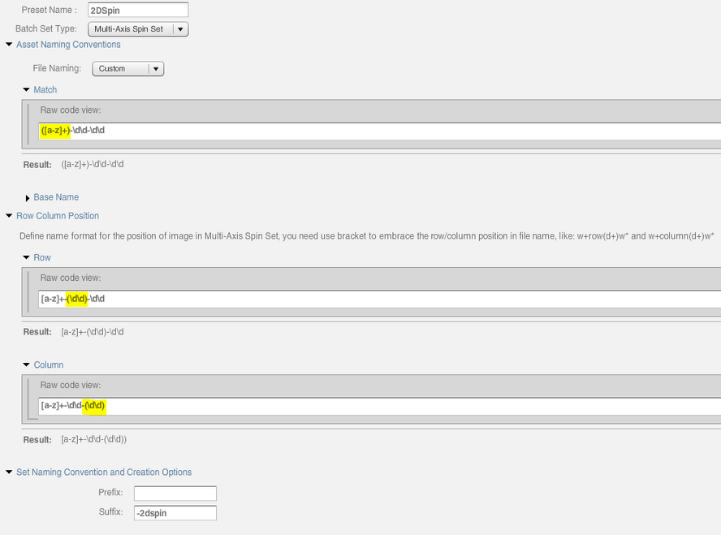

# アプリケーション設定{#application-setup}

アプリケーション設定ページを使用して、一般設定を入力したり、画像プリセット、ビデオエンコーディングプリセット、ビューアプリセットを作成したり、デフォルトのビューアとメタデータを定義したりできます。 バッチセットプリセットを設定して、2D スピンセット（例えば）、公開設定、ビデオ SEO 設定の生成を自動化できます。

>[!NOTE]
>
>アプリケーション設定の設定を変更できるのは、Adobe Dynamic Media Classic管理者のみです。

## 全般設定 {#general-settings}

アプリケーションの一般設定ページを開くには、グローバル ナビゲーション バーで、次の場所に移動します。 **[!UICONTROL 設定]** > **[!UICONTROL アプリケーション設定]** > **[!UICONTROL 一般設定]**.

### サーバ

アカウントの作成時に、会社に割り当てられているサーバーがAdobe Dynamic Media Classicによって自動的に提供されます。 これらのサーバは、Web サイトとアプリケーションの URL 文字列を生成するのに使用されます。これらの URL 呼び出しは、アカウントに固有です。

関連トピック [セキュアテストサービスのテスト](testing-assets-making-them-public.md#testing_the_secure_testing_service).

* **[!UICONTROL 公開先サーバー名]**  – このサーバーは、アカウントに固有のすべてのシステム生成 URL 呼び出しで使用されるライブ CDN （コンテンツ配信ネットワーク）サーバーです。 このサーバー名は、Adobe Dynamic Media Classic サポート技術者から指示された場合にのみ変更してください。

* **[!UICONTROL 公開元サーバー名]**  – このサーバーは、品質保証テストにのみ使用されます。 このサーバー名は、Adobe Dynamic Media Classic サポート技術者から指示された場合にのみ変更してください。

<!-- **AGM Server Name** This server is used for Web-to-Print templates. This server is set on a company-wide basis. Do not change this server name unless instructed to do so by an Adobe DynamicMedia Classic support technician. -->

* **[!UICONTROL Test&amp;Target サーバー名]** - Test&amp;Target の URL （以下を含む） `.com`. この URL の取得手順については、統合を参照してください。 [!DNL Adobe Dynamic Media Classic] （を使用） [!DNL Adobe Target Standard/Premium].

<!-- **Test Publish Context Server Name** -->

* **[!UICONTROL iOS ストリーミングサーバー名]**  – への URL [!DNL Adobe Dynamic Media Classic] iOS ストリーミングサーバー。 このサーバーは、HTTP プロトコルを使用して、iOS ベースのデバイスにストリーミングビデオを配信します。

* **[!UICONTROL プログレッシブビデオサーバー名]**  – への URL [!DNL Adobe Dynamic Media Classic] プログレッシブビデオサーバー。 このサーバーは、HTTP プロトコルを使用してプログレッシブビデオを配信します。

* **[!UICONTROL 非公開アセットの URL を表示]**  – 必要に応じて、このオプションを選択 [!DNL Adobe Dynamic Media Classic] 公開されているかどうかに関係なく、アセットのプレビュー時に URL を表示できます。 アセットが公開されていない場合は、URL は機能しません。ただし、この URL を予定や組織的な目的で使用することができます。

<!-- **Allow AIR install** Select this option to allow users to download Adobe Dynamic Media Classic desktop version to their local hard drives. Users install the application from the Desktop Version area of the Personal Setup screen. -->

<!-- AIR users must manually uninstall their existing app and reinstall from the web version of Adobe Dynamic Media Classic (in Personal Settings). After this one-time reinstallation, you are prompted to upgrade whenever the server has a newer version of Adobe Dynamic Media Classic AIR. Adobe Dynamic Media Classic is integrated with the Application Update Framework which streamlines the upgrade process. -->

* **[!UICONTROL CDN 無効化テンプレート]** - CDN （コンテンツ配信ネットワーク）キャッシュの無効化に使用するテンプレートを指定します。

  例えば、を参照する画像 URL （画像プリセットや修飾子を含む）を入力するとします `<ID>`次の例のように、特定の画像 ID ではなく、

  `https://sample.scene7.com/is/image/Company/<ID>?$s7product$`

  テンプレートにが含まれる場合 `<ID>`を入力すると、Adobe Dynamic Media Classicによって `https://<server>/is/image`、ここで `<server>` は、一般設定で定義されているパブリッシュサーバー名です。

  CDN 無効化テンプレートの設定で、Backpack_B という名前の画像を選択し、に移動します。 **[!UICONTROL ファイル]** > **[!UICONTROL CDN を無効にする]** 結果として、CDN 無効化インターフェイスには、次のように URL が生成されます。

  `https://sample.scene7.com/is/image/Company/Backpack_B?$s7product$`

  URL リストボックスで、を選択します。 **[!UICONTROL 続行]** 特定の画像 URL 呼び出しのキャッシュをクリアする。 URL リストボックスでは、URL を入力または貼り付けることによって URL を追加することもできます。事前にテンプレートを設定する必要はありません。

  CDN 無効化テンプレートを選択し、CDN 無効化リクエストを行うと、ユーザーインターフェイスにインジケーターがポップアップ表示されます。 キャッシュの消去にかかる時間の概算が表示されます。

  クリックした場合 **[!UICONTROL ファイル]** > **[!UICONTROL CDN を無効にする]** Dynamic Media Classicで複数の画像が選択されている場合、保存済みのテンプレート URL の各画像が参照されます。 したがって、Web サイトで参照される各 URL （製品の詳細や検索結果など）を参照する CDN 無効化テンプレートを定義できます。 これにより、キャッシュの無効化の対象として 1 つ以上の画像を選択したときに、それらの URL が自動的にインターフェイスに入力されます。

  詳しくは、[コンテンツのキャッシング](dmc-platform-overview.md#content_caching)を参照してください。

  詳しくは、[アセットの再公開と CDN の遅延](publishing-files.md#republished_assets_and_cdn_delays)を参照してください。

### 参照

* **[!UICONTROL プロジェクトの表示]** - Adobe Dynamic Media Classic アセットを整理する手段としてプロジェクトを使用できるかどうかを指定します。 参照： [プロジェクトを使用して作業を整理する](/help/using/organizing-projects.md).

* **[!UICONTROL サンプル eVideo コンテンツの表示]** - eVideo サンプルコンテンツの表示のオン/オフを切り替えます。

* **[!UICONTROL 生成されたコンテンツを表示]** - フォルダーで、アセットから生成されたコンテンツを表示します。 例えば、PDFファイルがアップロード時にラスタライズされる場合、Adobe Dynamic Media Classicでは元のPDFのページごとに 1 つの画像を作成します。 「生成コンテンツを表示」が選択されている場合は、元のPDFがアップロードされたときに生成された各画像が表示されます。 PDFがアップロードされたフォルダー内のPDFと共に表示されます。

* **[!UICONTROL エンコードされたビデオの表示]** - デフォルトでは選択解除（オフ）されています。

  同じビデオのエンコードされた多数の派生画像を移動しなくても、Adobe Dynamic Media Classicでビデオをすばやく検索および参照できます。 このオプションは選択しない（デフォルト）ままにします。 プライマリビデオサムネール（アップロードし、派生画像の作成に使用したソースビデオ）と「親」アダプティブビデオセットサムネール（エンコードされたビデオセットの「子」派生画像を含む）のみが表示されます。

  ただし、プライマリビデオまたはアダプティブビデオセットから、個々のエンコードされたビデオにアクセスすることはできます。 このようなアクセスを行うには、ビデオサムネール画像をダブルクリックして、詳細ビューを開きます。次に、を選択します **[!UICONTROL エンコードされたビデオ]** 右側のパネルで、すべての「子」ビデオにアクセスできるようにします。

  また、次に移動することもできます。 **[!UICONTROL ファイル]** > **[!UICONTROL 再処理]** よりエンコードされた「子」ビデオをアダプティブビデオセットから直接作成する場合 Adobe Dynamic Media Classicがアダプティブビデオセットの「親」プライマリビデオを自動的に見つけ、それをトランスコードのソースビデオとして使用します。 ただし、新しく作成した個々のエンコードされたビデオを保存すると、検索または参照するときには表示されません。しかし、詳細ビューの「エンコードされたビデオ」タブからはアクセスできます。

  参照： [ビデオのアップロードとトランスコード](uploading-encoding-videos.md#uploading_and_encoding_videos).

  検索または参照時に、エンコードされたすべてのビデオ派生物にアクセスできるようにしておくには、**[!UICONTROL 「エンコードされたビデオを表示」]**&#x200B;を選択します。

  ビルドメニューには、個々のビデオでのみ機能する、または、オプションで機能するアクションがあります。この機能により、**[!UICONTROL 「エンコードされたビデオを表示」]**&#x200B;がどう設定されているかに関係なく、エンコードされたすべてのビデオ派生物を必ず表示するようになり、ユーザはその中から選択できます。をオーバーライドするビルドアクション **[!UICONTROL エンコードされたビデオの表示]** 設定に含める **[!UICONTROL アダプティブビデオセット]**、および **[!UICONTROL eCatalog]**.

  >[!NOTE]
  >
  >Adobe Dynamic Media Classicを使用してビデオアセットをアップロードしてエンコードしなかった場合、このオプションが選択解除されていても、Adobe Dynamic Media Classicにはエンコードされた個々のビデオがすべて表示されます。

* **[!UICONTROL [ サブフォルダの更新 ] ボタンを表示する]** - サブフォルダーの「更新」ボタンの表示のオンとオフを切り替えます。

### Adobe Dynamic Media Classic FTP アカウント

* **[!UICONTROL サーバー]** - FTP アカウントサーバーを一覧表示します。

* **[!UICONTROL ユーザー名]** - FTP アカウントのユーザー名を一覧表示します。

### アプリケーションへのアップロード

関連トピック [アップロードジョブのオプション](https://s7d5.scene7.com/s7viewers/html5/VideoViewer.html?videoserverurl=https://s7d5.scene7.com/is/content/&amp;emailurl=https://s7d5.scene7.com/s7/emailFriend&amp;serverUrl=https://s7d5.scene7.com/is/image/&amp;config=Scene7SharedAssets/Universal_HTML5_Video&amp;contenturl=https://s7d5.scene7.com/skins/&amp;asset=S7tutorials/569_Default%20Job%20Options_converted%20renamed_Getting%20Started-AVS) トレーニングビデオ。

* **[!UICONTROL 画像を上書き]** - Adobe Dynamic Media Classicでは、2 つのファイルが同じ名前を持つことはできません。 各項目のAdobe Dynamic Media Classic ID （画像名からファイル名拡張子を引いた部分）は一意である必要があります。 この規則のため、アップロードダイアログボックスには上書きオプションがあります。このオプションの実際の効果は、指定した「画像を上書き」オプションによって異なります。これらのオプションは、置き換え画像のアップロード方法、つまり元の画像を置き換えるか、画像を重複させるかを指定します。重複する画像の名前は「–1」に変更されます（例：chair.tif は chair-1.tif に変更されます）。 これらのオプションは、元の画像とは別のフォルダにアップロードされる画像や、元の画像と異なるファイル名拡張子（JPG、TIF、PNG など）を持つ画像に影響を与えます参照： [「画像を上書き」オプションを使用します](#using-the-overwrite-images-option).

   * **[!UICONTROL 現在のフォルダーにあるベース名と拡張子が同じファイルを上書き]**  – このオプションは、置き換えの最も厳しいルールです。 置き換え画像を元の画像と同じフォルダにアップロードし、置き換え画像と元の画像のファイル名拡張子が同じになっている必要があります。これらの要件が満たされない場合は、重複する画像が作成されます。

   * **[!UICONTROL 現在のフォルダーにある、ベースが同じアセット名を拡張子に関わらず上書き]**  – 置換画像を元の画像と同じフォルダーにアップロードする必要がありますが、ファイル名の拡張子は元の画像と異なることができます。 例えば、chair.jpg を chair.tif に置き換える場合などです。

   * **[!UICONTROL 任意のフォルダーにあるベース名と拡張子が同じファイルを上書き]**  – 置き換え画像のファイル名拡張子が元の画像と同じである必要があります（例えば、chair.jpg は chair.tif ではなく chair.jpg と置き換える必要があります）。 ただし、置き換え画像を、元の画像と別のフォルダにアップロードできます。更新された画像は新しいフォルダにあり、元の場所のファイルはなくなります。

   * **[!UICONTROL 任意のフォルダーにある、ベース名が同じファイルを拡張子に関わらず上書き]**  – このオプションは、最も包括的な置換ルールです。 置き換え画像を、元の画像と別のフォルダにアップロードでき、ファイル名拡張子が異なるファイルをアップロードして、元のファイルと置き換えることができます。元のファイルが別のフォルダにある場合、置き換え画像は、アップロード先の新しいフォルダに存在します。

* **[!UICONTROL 公開を保持]** - Adobe Dynamic Media Classicにアップロードされた置換画像に、置き換え後の画像の「公開準備完了」設定を保持するかどうかを指定します。 または、アップロード時に設定が指定されていること。

* **[!UICONTROL デフォルトカラープロファイル]** - CMYK 画像を追加する際に、デフォルトカラープロファイルオプションの一部として適用されるカラープロファイルを指定します。

* **[!UICONTROL デフォルトのアップロードオプション]** - 「アップロードジョブオプション」 ダイアログボックスが開き、デフォルトのアップロードオプションを指定できます。 これらのオプションについて詳しくは、[アップロードオプション](/help/using/uploading-files.md#upload_options)を参照してください。

### 画像マップエディター（アプリケーションへ）

* **[!UICONTROL 既定の画像マッピング HREF]**  – 画像マッピングの HREF 列に使用するデフォルトの URL を定義します。 この URL は、画像マップを作成するときに表示されるデフォルトの URL です。

* **[!UICONTROL デフォルトの画像マッピングテンプレート]**  – 画像マッピングで HREF テンプレートのデフォルトの JavaScript を定義します。 画像マップを選択するたびに実行されるように、ここでカスタムコードを設定できます。

### その他の設定（アプリケーションに対して）

* **[!UICONTROL ごみ箱は警告をクリーンアップできます]** - ゴミ箱内のアセットは、7 日以内に自動的に削除されます。 「ごみ箱に入っているアセットが完全に削除されてから 4 日後に会社の管理者に通知を送信する場合は、「ごみ箱アイテムが自動的に削除される前にメールを送信する」を選択します。 参照： [ごみ箱フォルダーの管理](/help/using/trash-folder.md).

## 「画像を上書き」オプションを使用します {#using-the-overwrite-images-option}

Adobe Dynamic Media Classicでは、2 つのファイルが同じ名前を持つことはできません。 各項目のAdobe Dynamic Media Classic ID （画像名からファイル名拡張子を引いた部分）は一意である必要があります。 この規則のため、アップロードダイアログボックスには「画像を上書き」オプションがあります。このオプションの正確な効果は、各会社の「Adobe Dynamic Media Classic内部設定」の設定によって異なります。

以前に画像をアップロードして元のファイルを変更（または置き換え）した場合、選択した「上書き」オプションによって、Adobe Dynamic Media Classicでの画像の置き換え方法が指定されます。 画像に関する情報は変わりませんが、古い画像は新しい画像に置き換わります。Adobe Dynamic Media Classicにない画像がフォルダーにも含まれている場合は、画像が追加されます。

アップロードされた画像が何らかの方法で変更された（画像が変更された）が、画像への参照は同じままの場合は、このオプションを使用します。 上書きは、Adobe®PDFをアップロードおよびリッピングする場合にも役立ちます。 Adobe Dynamic Media Classicの方法を微調整できます *リップ* 画像。 アップロードダイアログボックスで ICC カラープロファイルオプションを調整し、上書き機能を使用して再度アップロードすることもできます。

実稼働サーバーから画像へのアクセスに使用されるAdobe Dynamic Media Classic ID は、画像ファイル名から派生します。 ファイル名で大文字と小文字を使用することは、既存のファイルを置き換える場合にも、画像へのアクセスに使用するAdobe Dynamic Media Classic ID にも重要です。 大文字と小文字を含むファイル名を使用する場合は、Adobe Dynamic Media Classicにアップロードする前に、同じ画像に対して大文字と小文字のみが異なるAdobe Dynamic Media Classic ID を使用しないようにするために適切です。

このオプションを選択しない場合、既存の画像と同じファイル名のすべての画像は、重複と見なされて追加されません。

## 画像プリセット {#image-presets}

画像プリセット画面は、画像プリセットを作成および編集するのに使用します。画像プリセットを使用すると、Adobe Dynamic Media Classicは同じプライマリ画像から異なるサイズの画像を動的に配信できます。 各画像プリセットは、画像を表示するための定義済みサイズおよび形式に関するコマンドの集まりです。画像プリセットを作成する場合、画像配信のサイズを選択します。 また、表示する画像を配信する際に画像の外観が最適化されるように、書式設定コマンドを選択することもできます。

管理者は、アセット書き出し用のプリセットを作成できます。ユーザーは画像を書き出すときにプリセットを選択できます。また、この操作によって、管理者が指定した仕様に合わせて画像が再フォーマットされます。

画像プリセット画面を開くには、グローバルナビゲーションバーで以下に移動します。 **[!UICONTROL 設定]** > **[!UICONTROL 画像プリセット]**.

参照： [スマートイメージング](https://experienceleague.adobe.com/en/docs/experience-manager-65/content/assets/dynamic/imaging-faq).

### 画像プリセットの作成と編集 {#creating-and-editing-image-presets}

1. に移動 **[!UICONTROL 設定]** > **[!UICONTROL 画像プリセット]**.
1. プリセットを作成するか、既存のプリセットから開始します。

   * **画像プリセットの作成**  – を選択 **[!UICONTROL 追加]**.
   * **既存のプリセットからの画像プリセットの作成**  – 作成したい画像プリセットに最も似ている画像プリセットを選択し、選択します **[!UICONTROL 編集]**.

1. プリセットを追加（または編集）ページで、プリセットの名前を入力します。
1. 目的のプリセットオプションを設定します。

   詳しくは、[画像プリセットのオプション](application-setup.md#image_preset_options)を参照してください。

1. を選択 **[!UICONTROL 保存]**&#x200B;または、既存のプリセットから開始した場合は、を選択します **[!UICONTROL 名前を付けて保存]**.
1. プリセットを独自の画像でプレビューするには、次のオプションを選択します。 **[!UICONTROL 参照]** 画像を選択します。 デフォルトの画像をプレビューするには、を選択します。 **[!UICONTROL Reset]**.

画像プリセット画面で画像プリセットの名前を選択して選択すると、画像プリセットを編集できます **[!UICONTROL 編集]**. 画像プリセットを削除するには、画像プリセットを選択してから選択します **[!UICONTROL 削除]**.

### 画像プリセットのオプション {#image-preset-options}

プリセットを追加画面およびプリセットを編集画面には、画像プリセットを作成および編集するための次のオプションがあります。

* **[!UICONTROL プリセット名]**  – わかりやすい名前を空白なしで入力します。 この画像プリセットを識別しやすくするには、名前に画像サイズを含めます。

* **[!UICONTROL 幅と高さ]**  – 画像が配信されるサイズをピクセル単位で入力します。

* **[!UICONTROL 形式]** - メニューから形式を選択します。 GIF、JPEG、PDFまたはTIFFの形式を選択すると、より多くのオプションが表示されます。

   * GIF カラー量子化オプション

      * **[!UICONTROL タイプ]** - 「アダプティブ」（デフォルト）、「Web」、「Mac」のいずれかを選択します。 を選択する場合 **[!UICONTROL Alpha付きGIF]**&#x200B;の場合、「Mac」オプションは使用できません。

      * **[!UICONTROL ディザ]** - [ 拡散反射光 ] または [ オフ ] を選択します。

      * **[!UICONTROL カラー数]** - スライダーをドラッグして 2-255 と入力します。

      * **[!UICONTROL カラーリスト]** - コンマ区切りリストを入力します。 例えば、白、グレー、黒の場合は、 `000000,888888,ffffff`.

   * JPEG オプション

      * **[!UICONTROL 画質]** - JPEGの圧縮レベルを制御します。 この設定は、ファイルサイズと画質の両方に影響を与えます。JPEG 画質レベルは、1 ～ 100 の範囲で指定します。

      * **[!UICONTROL JPGクロミナンスのダウンサンプリングの有効化]** -JPEG像は、高周波の輝度に比べて高周波のカラー情報に対する感度が低いため、輝度とカラーの成分にイメージ情報を分割します。 JPEG 画像を圧縮すると、輝度成分は最大解像度が維持され、色成分はピクセルのグループの平均化によりダウンサンプリングされます。ダウンサンプリングは、知覚品質にほとんど影響を与えることなく、データ量を半分または 3 分の 1 に減らします。 ダウンサンプリングは、グレースケール画像では使用できません。この方法は、コントラストが高い画像（テキストがオーバーレイされた画像など）で圧縮の量を低減させるのに役立ちます。

   * PDF および TIFF のオプション

      * **[!UICONTROL 圧縮]**  – 圧縮アルゴリズムを選択します。

* **[!UICONTROL 色空間]** - カラースペースを選択します。

* **[!UICONTROL シャープニング]**  – すべての拡大縮小の実行後、画像に対して基本的なシャープフィルターを適用するには、「シンプルシャープを有効にする」オプションを選択します。 シャープにより、異なるサイズで画像を表示したときに生じるぼかしを補正できます。

  シャープ、リサンプル モード、アンシャープマスクの詳細については、を参照してください。 [画像のシャープニング](sharpening-image.md#sharpening_an_image). 関連トピック [シャープニング](https://s7d5.scene7.com/s7viewers/html5/VideoViewer.html?videoserverurl=https://s7d5.scene7.com/is/content/&amp;emailurl=https://s7d5.scene7.com/s7/emailFriend&amp;serverUrl=https://s7d5.scene7.com/is/image/&amp;config=Scene7SharedAssets/Universal_HTML5_Video&amp;contenturl=https://s7d5.scene7.com/skins/&amp;asset=S7tutorials/547_sharpening1_converted%20renamed_Done-AVS) トレーニングビデオ。

* **[!UICONTROL リサンプル モード]** - 「再サンプリングモード」オプションを選択します。 これらのオプションは、ダウンサンプリングした画像をシャープにします。

* **[!UICONTROL B 線形]**  – 最も速い再サンプリング方法。一部のエイリアシング アーティファクトが目立ちます。

* **[!UICONTROL 2 立方]** - Image Server の CPU 使用率が向上しますが、より目立たないエイリアスアーティファクトで、よりシャープな画像が得られます。

* **[!UICONTROL `Sharp 2`]** - Bi-Cubic オプションよりもわずかにシャープな結果が得られますが、Image Server の CPU コストはさらに高くなります。

* **[!UICONTROL トリリニア]**  – 高い解像度と低い解像度の両方を使用します（使用可能な場合）。エイリアシングが問題な場合にのみ推奨されます。 この方法では、周波数の高いデータが削減されるため JPEG のサイズが小さくなります。

* **[!UICONTROL アンシャープマスク]** - シャープを微調整するには、次のオプションを選択します。

* **[!UICONTROL 量]** - エッジピクセルに適用するコントラストの量を制御します。 初期設定値は 1.0 です。高解像度画像では、この値を 5.0 まで高めることができます。適用量は、フィルタ強度の度合いと考えることができます。

* **[!UICONTROL 半径]** - シャープニングに影響を与えるエッジピクセルを囲むピクセル数を決定します。 高解像度画像では、1 ～ 2 の値を入力します。小さい値を指定すると端のピクセルのみがシャープになります。大きい値を指定すると幅広い領域のピクセルがシャープになります。適切な値は、画像のサイズに依存します。

* **[!UICONTROL しきい値]** - アンシャープマスクフィルターの適用時に無視するコントラストの範囲を決定します。 つまり、シャープにされるピクセルが周囲の領域とどの程度違えば、そのピクセルをエッジピクセルと見なしてシャープにするかを判断するのに役立ちます。 ノイズが入らないように、 `.02` および `0.2`. デフォルト値の 6 では、画像内のすべてのピクセルがシャープになります。

* **[!UICONTROL カラースペース]**  – 画像が作成されたスペース（通常はRGB（オリジナル））または輝度スペース（輝度）のどちらを使用するかを指定します。

* **[!UICONTROL カラー]** 次のオプションを選択します。

* **[!UICONTROL 出力カラープロファイル]**  – を選択 **[!UICONTROL デフォルトを使用]** または、Adobe Dynamic Media Classicで使用できる ICC カラープロファイルの 1 つ。

  詳しくは、[ICC プロファイル](icc-profiles.md#icc_profiles)も参照してください。

* **[!UICONTROL レンダリングインテント]** - カラープロファイルのデフォルトのレンダリングインテントを上書きする場合は、オプションを選択します。 デフォルトの ICC プロファイルの 1 つがカラー変換のターゲットカラースペースである場合に、このオプションを使用します。 または、このプロファイルは出力デバイス（プリンターまたはモニター）を特徴付け、指定されたレンダリングインテントはこのプロファイルに対して有効です。

* **[!UICONTROL プロファイルを埋め込み]**  – この画像をAdobe®Photoshop® で開くと、このプロファイルが使用されます。

* **[!UICONTROL 印刷解像度]**  – この画像を印刷する解像度を選択します。デフォルトは 72 ピクセルです。

* **[!UICONTROL URL 修飾子]**  – 設定ではなく、画像プリセットを定義する URL 修飾子を指定する場合は、ここに修飾子を入力します。

* **[!UICONTROL サンプル画像 URL]** - Dynamic Media Image Server が追加または編集中の画像プリセットで画像を配信するために使用する「Raw」 URL 文字列をリストします。 この URL 文字列は、プリセットの追加画面またはプリセットの編集画面で選択したすべての形式設定をエンコードします。

### 画像プリセットの編集、削除、非アクティブ化 {#editing-removing-or-deactivating-an-image-preset}

1. に移動 **[!UICONTROL 設定]** > **[!UICONTROL 画像プリセット]**.
1. 画像プリセット画面の表でプリセットを選択し、次のいずれかの操作を行います。

   * を選択 **[!UICONTROL 編集]** 次に、プリセットを編集ダイアログボックスで新しいオプションを指定します。
   * を選択 **[!UICONTROL 削除]** リストからプリセットを削除します。
   * の選択を解除 **[!UICONTROL アクティブ]** mediaPortal ユーザーのAdobe Dynamic Media Classic ユーザーインターフェイス全体からプリセット名を削除する場合は、プリセット名の横にあるチェックボックスをオンにします。

## アダプティブビデオプリセットをアクティベートまたはアクティベート解除する {#activating-or-deactivating-adaptive-video-presets}

Adobe Dynamic Media Classicには、アダプティブビデオエンコーディングプリセットが用意されています。 16:9 のアダプティブビデオプリセットと 4:3 のアダプティブビデオプリセットの両方を 1 つのグループに組み合わせたプリセットの主なリストです。 これらの定義済みプリセットは、最も一般的なエンコーディング設定を反映しており、ターゲットとなっている携帯端末、タブレットおよびデスクトップでの再生用に最適化されています。

デフォルトでは、「アダプティブビデオ」エンコーディングプリセットのみがアクティブ化されています（有効または「オン」）。 必要に応じて、このプリセットを非アクティブ化することができます。非アクティブなアダプティブビデオプリセットは、アップロードオプションを設定ダイアログボックスの eVideo セクションに選択可能なオプションとして表示されません。

参照： [ビデオのアップロードとエンコード](uploading-encoding-videos.md#uploading_and_encoding_videos).

関連トピック [ビデオプリセット](https://s7d5.scene7.com/s7viewers/html5/VideoViewer.html?videoserverurl=https://s7d5.scene7.com/is/content/&amp;emailurl=https://s7d5.scene7.com/s7/emailFriend&amp;serverUrl=https://s7d5.scene7.com/is/image/&amp;config=Scene7SharedAssets/Universal_HTML5_Video&amp;contenturl=https://s7d5.scene7.com/skins/&amp;asset=S7tutorials/549_video-presets_converted%20renamed_Done-AVS) トレーニングビデオ。

**アダプティブビデオプリセットをアクティブまたは非アクティブにするには：**

1. Adobe Dynamic Media Classicの右上隅にあるに移動します。 **[!UICONTROL 設定]** > **[!UICONTROL アプリケーション設定]** > **[!UICONTROL ビデオプリセット]** > **[!UICONTROL アダプティブビデオプリセット]**.
1. アダプティブビデオプリセットページで、プリセット名の横にあるチェックボックスを選択解除して、アップロードオプションを設定ダイアログボックスの「eVideo オプション」リストからプリセットを削除します。
1. を選択 **[!UICONTROL 閉じる]**.

## ビデオファイルのエンコーディング用のビデオプリセット {#video-presets-for-encoding-video-files}

エンコーディングプリセットを選択するには、アップロード ページの右下隅で「」を選択します **[!UICONTROL ジョブオプション]**. アップロードジョブオプション ダイアログボックスで、「eVideo オプション」を展開し、必要なビデオエンコーディングプリセットを選択します。

>[!NOTE]
>
>デフォルトで有効になっている「アダプティブビデオ」を除き、アップロードジョブオプション ダイアログボックスには、他のすべてのアダプティブビデオまたは単一のビデオエンコーディングプリセットは表示されません。 Adobe Dynamic Media Classic管理者は、アップロードジョブオプション ダイアログボックスで表示するビデオエンコーディングプリセットを決定します。

* 次のアダプティブビデオエンコーディングまたはシングルエンコーディングプリセットから選択します。

   * **[!UICONTROL 16:9 アダプティブビデオ]** - デスクトップ、モバイル（iPhone、iPad、Android™）、タブレット（iPad、Android™）に配信する 16:9 の縦横比のビデオを作成します。このビデオは、ビューアの接続速度に最適な解像度とビットレートで最適化されています。

   * **[!UICONTROL 4:3 アダプティブビデオ]** - デスクトップ、モバイル（iPhone、iPad、Android™）、タブレット（iPad、Android™）に配信する 4:3 の縦横比のビデオを作成します。このビデオは、ビューアの接続速度に最適な解像度とビットレートで最適化されています。

   * **[!UICONTROL アダプティブビデオ]**  – あらゆる縦横比で機能する単一エンコーディングプリセットで、モバイル、タブレットおよびデスクトップに配信するビデオを作成します。 このプリセットを使用してエンコードされたアップロード済みのソースビデオには、固定の高さが設定されますが、ただし、幅は、ビデオの縦横比を維持するために自動的に調整されます。

     「自動スケール」のこの柔軟性は、独自のカスタムビデオエンコーディングプリセットを作成する場合にも、デフォルトで使用できます。

     参照： [ビデオエンコーディングプリセットを追加または編集する](uploading-encoding-videos.md#adding_or_editing_a_video_encoding_preset).

   * **[!UICONTROL アダプティブビデオエンコーディング （16:9 または 4:3）]** - デスクトップ、モバイル（iPhone、iPad、Android™）、タブレット（iPad、Android™）に配信するための 16:9 および 4:3 の縦横比ビデオを作成します。 いずれもビューアの接続速度に応じた解像度とビットレートで最適化されています。

     詳しくは、[アダプティブビデオエンコーディング（16:9 または 4:3）ビデオプリセット](application-setup.md#adaptive_video_encoding_16_9_or_4_3_video_presets)を参照してください。

   * **[!UICONTROL 単一エンコーディングプリセット]**

     >[!NOTE]
     >
     >ビデオを iPad に配信するには、モバイルエンコーディングプリセットまたはタブレットエンコーディングプリセットを選択します。 タブレットプリセットは特に iPad 用に設計され、一般に大きな画面サイズや接続の帯域幅の利点を活かせる高い解像度と品質を備えています。タブレットプリセットでエンコードされたビデオファイルを配信するには、モバイルサイトやアプリケーションでデバイス検出コードが必要です。このコードは、再生デバイスに応じて iPhone または iPad ビデオ表示を切り替えます。iPad へのビデオファイルの配信用のモバイルプリセットを選択する方がワークフローは簡単です。その理由は、iPhone と iPad の両方で同じビデオファイルを使用できるためです。ただし、画質は低い解像度の iPhone での表示用に標準化されます。

      * 「エンコーディングプリセット」グループのエンコーディングプリセットを並べ替えドロップダウンリストで、「名前」または「サイズ」を選択して、プリセットを名前または解像度サイズで並べ替えます。
      * ビデオを再生する解像度のサイズと帯域幅に基づいて、エンコーディングプリセットを選択します。
      * アダプティブビデオエンコーディングと、ビデオごとに 1 つ以上のエンコーディングプリセットを選択できます。 例えば、1 つのアップロードジョブでデスクトップとモバイルの両方のファイルをエンコードできます。

を選択した後 **[!UICONTROL アップロードを開始]**&#x200B;を選択すると、元のプライマリビデオファイルがアップロードされ、そのプライマリファイルからエンコードされたファイルが生成されます。

### エンコーディングプリセットオプションについて {#about-encoding-preset-options}

エンコーディングプリセットオプションのパラメータは次のとおりです。

* **[!UICONTROL ターゲット接続速度]** - ターゲットエンドユーザーのインターネット接続速度。

* **[!UICONTROL エンコードされたファイルサフィックス]** - エンコードされたビデオファイルに識別目的で付加されるサフィックス。

* **[!UICONTROL ビデオのビットレート（データレート）]** - ビデオ再生の 1 秒を構成するエンコードされたデータ量（キロビット/秒）。

* **[!UICONTROL ピクセルの幅/高さ]**  – 画面画像の幅の寸法（ピクセル単位）。画面画像の高さの寸法（ピクセル単位）。

* **[!UICONTROL フレーム/秒（fps）]** - ビデオの 1 秒あたりのフレーム数（静止画）。 米国および日本では、ほとんどのビデオが 29.97 fps で撮影され、ヨーロッパとアジア（日本を除く）では、ほとんどのビデオが 25 fps で撮影されます。フィルムは 24 fps で撮影されます。

* **[!UICONTROL オーディオビットレート]** - オーディオ再生の 1 秒を構成するエンコードされたデータ量（キロビット/秒）。

以降に示す表に、ビデオプリセットを選択するためのベストプラクティスと、エンコードされたファイルを指定するために使用する命名規則を示します。

### アダプティブビデオ（初期設定） {#adaptive-video-default}

モバイル、タブレットおよびデスクトップに配信するビデオを作成するための、すべての縦横比で機能するエンコーディングプリセットです。このプリセット（デフォルトおよびベストプラクティス）でエンコードされたアップロード済みソースビデオは、固定の高さに設定され、幅はビデオの縦横比を維持して自動的にスケールされます。

**アダプティブビデオ（デフォルト）**

|  | エンコーディングプリセット名／ツールヒントテキスト | エンコードファイルのサフィックス | ビデオのデータレート（Kbps） | 幅/高さ（ピクセル） | fps | オーディオビットレート（kbps） | 推奨 |
|--- |--- |--- |--- |--- |--- |--- |--- |
| 1 | Auto × 360、800 Kbps | _Mobile_Auto×360p_800K | 800 | Auto×360 | ソースと同じ | 64 | モバイルの場合（iPhone、iPad、Android™） |
| 2 | Auto × 480、1400 Kbps | _Tablet_Auto×480p_1400K | 1400 | Auto×480 | ソースと同じ | 96 | タブレットの場合（iPad、Android™） |
| 3 | Auto × 720、2600 Kbps | _デスクトップ_Auto×720p_2600K | 2600 | Auto×720 | ソースと同じ | 128 | デスクトップ用 |

### アダプティブビデオエンコーディング（16:9 または 4:3）プリセット {#adaptive-video-encoding-or-video-presets}

これらのアダプティブビデオエンコーディングプリセットでは、アップロードされたビデオの縦横比に基づいて自動的に選択される一連の個別エンコーディングプリセットを組み合わせます。 例えば、4:3 ビデオをアップロードすると、のプライマリプリセットリスト内にある 5 つの 4:3 プリセットをすべて使用して自動的にエンコードされます **アダプティブビデオエンコーディング （16:9 または 4:3）** オプション。

エンコーディングオプションパラメーターについては、[エンコーディングプリセットオプションについて](application-setup.md#about_encoding_preset_options)を参照してください。

**アダプティブビデオエンコーディング（16:9 または 4:3）プリセット**

|  | エンコードプリセット名/ツールヒントテキスト | ターゲット接続速度（Kbps） | エンコードファイルのサフィックス | ビデオのデータレート（Kbps） | 幅/高さ（ピクセル） | fps | オーディオビットレート（kbps） | 推奨 |
|--- |--- |--- |--- |--- |--- |--- |--- |--- |
| 1 | `16:9, 512x288, Mobile (iPhone, iPad, Android&trade;), (400 Kbps)` | 500 | _Mobile_512x288_400K | 400 | 512 x 288 | ソースと同じ | 64 | 低解像度、3G |
| 2 | `4:3, 384x288px, Mobile (iPhone, iPad, Android&trade;), (400 Kbps)` | 500 | _Mobile_384x288_400K | 400 | 384 x 288 | ソースと同じ | 64 | 低解像度、3G |
| 3 | `16:9, 512x288, Mobile (iPhone, iPad, Android&trade;), (600 Kbps)` | 700 | _Mobile_512x288_600K | 600 | 512 x 288 | ソースと同じ | 64 | 中解像度、3G |
| 4 | `4:3, 384x288, Mobile (iPhone, iPad, Android&trade;), (600 Kbps)` | 700 | _Mobile_384x288_600 | 600 | 384 x 288 | ソースと同じ | 64 | 中解像度、3G |
| 5 | `16:9, 640x360, Tablet (iPad, Android&trade;), (800 Kbps)` | 900 | _iPad_640x360_800K | 800 | 640 x 360 | ソースと同じ | 80 | 中解像度、WiFi |
| 6 | `4:3, 640x480, Tablet (iPad, Android&trade;), (800 Kbps)` | 900 | _iPad_640x480_800K | 800 | 640 x 480 | ソースと同じ | 80 | 中解像度、WiFi |
| 7 | `16:9, 768x432, Tablet (iPad, Android&trade;), (1200 Kbps)` | 1.5 Mbps | _iPad_768x432_1200K | 1200 | 768 x 432 | ソースと同じ | 96 | 高解像度、WiFi |
| 8 | `4:3, 768x576, Tablet (iPad, Android&trade;), (1200 Kbps)` | 1.5 Mbps | _iPad_768x576_1200K | 1200 | 768 x 576 | ソースと同じ | 96 | 高解像度、WiFi |
| 9 | `16:9, 1280x720, Desktop, (2000 Kbps)` | 3.0 Mbps | _1280x720_2000K | 2000 | 1280 x 720 | ソースと同じ | 128 | 高精細、ワイドスクリーン |
| 10 | `4:3, 1280x960, Desktop, (2000 Kbps)` | 3.0 Mbps | _1280x960_2000K | 2000 Kbps | 1280 x 960 | ソースと同じ | 128 | 高精細 |

### デスクトップビデオエンコーディングプリセット {#desktop-video-encoding-presets}

デスクトップコンピュータでの MP4 および OGV 対応のビデオエンコーディングプリセット

エンコードオプションパラメータについては、[エンコーディングプリセットオプションについて](application-setup.md#about_encoding_preset_options)を参照してください。

**H264 Main 3.2 - オーディオ AAC、MP4 ファイル拡張子**

|  | エンコードプリセット名/ツールヒントテキスト | ターゲット接続速度（Kbps） | エンコードファイルのサフィックス | ビデオのデータレート（Kbps） | 幅/高さ（ピクセル） | fps | オーディオビットレート（Kbps） | 推奨 |
|--- |--- |--- |--- |--- |--- |--- |--- |--- |
| 1 | 16:9、480x270（400 Kbps） | 500 | _480x270_400K | 400 | 480 x 270 | ソースと同じ | 64 | 低解像度のワイドスクリーン |
| 2 | 16:9、640x360（800 Kbps） | 900 | _640x360_800K | 800 | 640 x 360 | ソースと同じ | 80 | 中解像度のワイドスクリーン |
| 3 | 16:9、800x450（1200 Kbps） | 1.5 Mbps | _800x450_1200K | 1200 | 800 x 450 | ソースと同じ | 96 | 中～高解像度 |
| 4 | 16:9、1280x720（2000 Kbps） | 3.0 Mbps | _1280x720_2000K | 2000 | 1280 x 720 | ソースと同じ | 128 | 高精細、ワイドスクリーン |
| 5 | 4:3、320x240（400 Kbps） | 500 | _320x240_400K | 400 | 320 x 240 | ソースと同じ | 64 | 低解像度 |
| 6 | 4:3、480x360（800 Kbps） | 900 | _480x360_800K | 800 | 480 x 360 | ソースと同じ | 80 | 中解像度 |
| 7 | 4:3、640x480（1200 Kbps） | 1.5 Mbps | _640x480_1200K | 1200 | 640 x 480 | ソースと同じ | 96 | 中～高解像度 |
| 8 | 4:3、1280x960（2000 Kbps） | 3.0 Mbps | _1280x960_2000K | 2000 | 1280 x 960 | ソースと同じ | 128 | 高精細 |

**OGG Theora Vorbis - OGV ファイル拡張子**

|  | エンコードプリセット名/ツールヒントテキスト | ターゲット接続速度（Kbps） | エンコードファイルのサフィックス | ビデオのデータレート（Kbps） | 幅/高さ（ピクセル） | fps | オーディオビットレート（Kbps） | 推奨 |
|--- |--- |--- |--- |--- |--- |--- |--- |--- |
| 1 | 16:9、480x270（400 Kbps）、OGG | 500 | _OGG_480x270_400K | 400 | 480 x 270 | ソースと同じ | 64 | 低解像度のワイドスクリーン |
| 2 | 16:9、640 x 360 （800 Kbps）、OGG | 900 | _OGG_640x360_800K | 800 | 640 x 360 | ソースと同じ | 80 | 中解像度のワイドスクリーン |
| 3 | 16:9、800 x 450 （1200 Kbps）、OGG | 1.5 Mbps | _OGG_800x450_1200K | 1200 | 800 x 450 | ソースと同じ | 96 | 中～高解像度 |
| 4 | 16:9、1280 x 720 （2000 Kbps）、OGG | 3.0 Mbps | _OGG_1280x720_2000K | 2000 | 1280 x 720 | ソースと同じ | 128 | 高精細、ワイドスクリーン |
| 5 | 4:3、320 x 240 （400 Kbps）、OGG | 500 | _OGG_320X240_400K | 400 | 320 x 240 | ソースと同じ | 64 | 低解像度 |
| 6 | 4:3、480 x 360 （800 Kbps）、OGG | 900 | _OGG_480x360_800K | 800 | 480 x 360 | ソースと同じ | 80 | 中解像度 |
| 7 | 4:3、640 x 480 （1200 Kbps）、OGG | 1.5 Mbps | _OGG_640x480_1200K | 1200 | 640 x 480 | ソースと同じ | 96 | 中～高解像度 |
| 8 | 4:3、1280 x 960 （2000 Kbps）、OGG | 3.0 Mbps | _OGG_1280x960_2000K | 2000 | 1280 x 960 | ソースと同じ | 128 | 高精細 |

### モバイルビデオエンコーディングプリセット {#mobile-video-encoding-presets}

ソース fps と同じで、iPhone、iPadおよび Android™ モバイルデバイス用のビデオエンコーディングプリセット。

エンコードオプションパラメータについては、[エンコーディングプリセットオプションについて](application-setup.md#about_encoding_preset_options)を参照してください。

**H264 ベースライン 2.1 - オーディオ AAC、MP4 ファイル拡張子**

|  | エンコードプリセット名/ツールヒントテキスト | ターゲット接続速度（Kbps） | エンコードファイルのサフィックス | ビデオのビットレート（Kbps） | 幅/高さ（ピクセル） | fps | オーディオビットレート（Kbps） | 推奨 |
|--- |--- |--- |--- |--- |--- |--- |--- |--- |
| 1 | 16:9、512x288、モバイル（400 Kbps） | 500 | _Mobile_512x288_400K | 400 | 512 x 288 | ソースと同じ | 64 | 低解像度、3G |
| 2 | 16:9、512x288、モバイル（600 Kbps） | 700 | _Mobile_512x288_600K | 600 | 512 x 288 | ソースと同じ | 64 | 中解像度、3G |
| 3 | 16:9、512x288、モバイル（800 Kbps） | 900 | _Mobile_512x288_800K | 800 | 512 x 288 | ソースと同じ | 80 | 中解像度、Wi-Fi |
| 4 | 16:9、512x288、モバイル（1000 Kbps） | 1.2 Mbps | _Mobile_512x288_1000K | 1000 | 512 x 288 | ソースと同じ | 80 | 高解像度、Wi-Fi |
| 5 | 16:9、512x288、モバイル（1200 Kbps） | 1.5 Mbps | _Mobile_512x288_1200K | 1200 | 512 x 288 | ソースと同じ | 96 | 高解像度、Wi-Fi |
| 6 | 4:3、384x288、モバイル（400 Kbps） | 500 | _Mobile_384x288_400K | 400 | 384 x 288 | ソースと同じ | 64 | 低解像度、3G |
| 7 | 4:3、384x288、モバイル（600 Kbps） | 700 | _Mobile_384x288_600K | 600 | 384 x 288 | ソースと同じ | 64 | 中解像度、3G |
| 8 | 4:3、448x336、モバイル（800 Kbps） | 900 | _Mobile_448x336_800K | 800 | 448x336 | ソースと同じ | 80 | 中解像度、Wi-Fi |
| 9 | 4:3、448x336、モバイル（1000 Kbps） | 1.2 Mbps | _Mobile_448x336_1000K | 1000 | 448x336 | ソースと同じ | 80 | 高解像度、Wi-Fi |
| 10 | 4:3、448x336、モバイル（1200 Kbps） | 1.5 Mbps | _Mobile_448x336_1200K | 1200 | 448x336 | ソースと同じ | 96 | 高解像度、Wi-Fi |

## ビューアプリセット {#viewer-presets}

>[!NOTE]
>
>**Flashビューアの提供終了に関するお知らせ** - 2017 年 1 月 31 日（PT）をもって、Adobe Dynamic Media ClassicはFlashビューアプラットフォームのサポートを正式に終了しました。

*ビューアプリセット*&#x200B;は、ユーザのコンピュータ画面および携帯端末上でリッチメディアアセットがどのように表示されるかを決定する設定です。管理者は、ビューアプリセットを作成できます。一連のビューア構成オプション用の設定があります。例えば、ビューアの表示サイズ、ズーム動作、カラースキーム、境界線およびフォントを変更できます。

ベストプラクティスは、Adobe Dynamic Media Classic HTML5 ビデオビューアを使用することです。 HTML5 ビデオビューアで使用されるプリセットは、堅牢なビデオプレーヤーです。

単一のプレーヤーに結合する方法は次のとおりです。

* HTML5 と CSS を使用して再生コンポーネントをデザインする機能。
* 埋め込み再生が可能。
* ブラウザーの機能に応じて、アダプティブストリーミングとプログレッシブストリーミングを使用します。

リッチメディアコンテンツの配信範囲をデスクトップ、タブレットおよびモバイルユーザーに拡大し、ビデオエクスペリエンスを確実に効率化できます。

参照： [HTML5 ビューアについて](https://experienceleague.adobe.com/en/docs/dynamic-media-developer-resources/library/viewers-for-aem-assets-only/c-html5-aem-asset-viewers#viewers-for-aem-assets-only) （Adobeビューアリファレンスガイド）を参照してください。

参照： [Adobe Dynamic Media Classic ビューアプリセットの互換表](application-setup.md#scene7_viewer_preset_compatibility_matrix).

詳しくは、[ベストプラクティス：HTML5 ビデオビューアの使用](best-practice-using-html5-video.md#best_practice_using_the_html5_video_viewer)を参照してください。

ビューアによっては、コミュニティ機能を追加できます。コミュニティ機能には、埋め込みボタン、電子メールボタン、リンクボタンおよびアクセスボタンがあります。ビューアを使用するユーザーは、これらのボタンを使用して、ビューアを他のユーザーと共有したり、Adobe Dynamic Media Classicの web サイトを開いたりできます。

関連トピック [Adobeビューアリファレンスライブラリの例](https://landing.adobe.com/en/na/dynamic-media/ctir-2755/live-demos.html).

### レスポンシブデザイン web ページのビューアサポート {#viewer-support-for-responsive-designed-web-pages}

Web ページごとに異なるニーズがあります。別のブラウザーウィンドウでHTML5 ビューアを開くリンクを提供する web ページが必要な場合があります。 その他の場合は、ホスティングページに直接HTML5 ビューアを埋め込む必要があります。 後者の場合、web ページは静的レイアウトになっている可能性があります。 または、「レスポンシブ」であり、デバイスの違いやブラウザーウィンドウのサイズの違いによって表示が異なります。 これらのニーズに対応するために、Adobe Dynamic Media Classicに付属するHTML5 ビューアでは、静的な web ページとレスポンシブデザイン web ページの両方をサポートしています。

レスポンシブビューアを Web ページに埋め込む方法について詳しくは、を参照してください。 [レスポンシブ画像ライブラリについて](https://experienceleague.adobe.com/en/docs/dynamic-media-developer-resources/image-serving-api/image-serving-api/responsive-static-image-library/c-about-responsive-static-image-library#image-serving-api), [レスポンシブ画像ライブラリの使用](https://experienceleague.adobe.com/en/docs/dynamic-media-developer-resources/image-serving-api/image-serving-api/responsive-static-image-library/t-using-responsive-static-image-library#image-serving-api)、および [コマンドリファレンス – コマンド属性](https://experienceleague.adobe.com/en/docs/dynamic-media-developer-resources/image-serving-api/image-serving-api/responsive-static-image-library/t-using-responsive-static-image-library#responsive-static-image-library).

### ビューアプリセットのタイプ {#viewer-preset-types}

管理者は、次のタイプのビューアプリセットを作成およびカスタマイズできます。

* **[!UICONTROL eCatalog ビューア]**  – 印刷されたカタログを読むエクスペリエンスをシミュレートします。 ページ間の移動、ページ上の項目のズームイン/ズームアウト、画像マップを使用したページ上の項目の詳細情報の表示、カタログの検索を行うことができます。 マップ領域に有効な rollover_key 属性がある場合は、詳細情報と画像マッピングされた項目を表示する情報パネルを含めることもできます。 情報パネルを含めるには、eCatalog ビューアプリセットウィンドウの情報パネル設定パネルで、情報サーバーの URL を指定します。

* **[!UICONTROL スウォッチセットビューア]**  – 異なる色、マテリアル、テクスチャ、仕上げ、またはファブリックでイメージを表示します。 ユーザーはサムネールを選択して、画像のバリエーションを表示します。

* **[!UICONTROL 混在メディアセットビューア]** - 1 つのビューアに様々なタイプのメディアを表示します。 スウォッチセット、スピンセット、画像およびビデオを含めることができます。画像セット用のタブやビデオ用のタブなど、様々なタイプのコンテンツを含むタブを設定できます。 混在メディアセットから再生されるビデオでは、タイムラインとビデオコントロール（停止、一時停止、巻き戻し、再生など）を備えた標準ビデオビューアが使用されます。 混在メディアセットビューアプリセットを設定する場合、混在メディアセットの様々なタイプのアセットに使用するビューアを指定します。 グリッドビューアまたはカルーセルビューアを使用して混在メディアセットを表示することもできます。

* **[!UICONTROL スピンセットビューア]**  – 画像の複数のビューを提供し、ユーザーがオブジェクトを回転させて様々な側面や角度を調べられるようにします。

* **ビデオビューア** - ソースファイルの解像度サイズまたはカスタムサイズを使用してビデオを表示します。 Adobe Dynamic Media Classicには、ビデオを再生するための事前定義済みのビューアプリセットが多数用意されています。管理者は、カスタムビデオビューアプリセットを作成できます。 ビデオビューアの設定には、12 種類以上の設定があります。 次の項目を設定できます。

   * サイズ
   * 前景色と背景色
   * ビデオおよびオーディオの制御
   * プログレスバー
   * ユーザインターフェイススキン
   * ソーシャル機能
   * とヘルプ

* **[!UICONTROL ズームビューア]** - 3 種類のズームビューアから選択できます。

* **[!UICONTROL ズームビューア]** - ユーザーは選択してエリアにズームインできます。 コントロールを選択して、ズームイン、ズームアウトおよび画像をデフォルトのサイズにリセットすることができます。

* **[!UICONTROL ズームビューア：フライアウト]** - ズームされた領域の 2 つ目の画像を元の画像の横に表示します。 使用できるコントロールはなく、ユーザは表示する範囲の選択だけが可能です。

このビューアの完全な帯域幅使用量を決定する場合、メイン画像とフライアウト画像の両方がビューアに提供されます。メイン画像のサイズ（ステージの幅と高さ）とズーム率によって、フライアウト画像のサイズが決まります。フライアウト画像のサイズを大きくなり過ぎないようにするには、メイン画像のサイズとズーム率の値のバランスを保ってください。大きいサイズのメイン画像を使用する場合は、ズーム率の値を小さくします（フライアウト幅とフライアウト高さは、フライアウトウィンドウのサイズを決定しますが、ビューアに供給されるフライアウト画像のサイズは決定しません）。

例えば、350 x 350 pixel、ズーム率 3 のメイン画像の場合、表示されるフライアウト画像は 1050 x 1050 pixel になります。300 x 300 pixel、ズーム率 4 のメイン画像の場合、表示されるフライアウト画像は 1200 x 1200 pixel になります。JPEG の画質設定（推奨される設定は 80 ～ 90 です）に応じて、ファイルのサイズを大幅に小さくすることができます。メイン画像のサイズによりますが、推奨されるズーム率は 2.5 ～ 4 です。

### Adobe Dynamic Media Classic ビューアプリセットの互換表 {#scene-viewer-preset-compatibility-matrix}

**Flashビューアの提供終了に関するお知らせ**: 2017 年 1 月 31 日（PT）をもって、Adobe Dynamic Media ClassicはFlashビューアプラットフォームのサポートを正式に終了しました。

次の表に、現在使用可能なAdobe Dynamic Media Classic ビューアプリセットを示します。 また、デスクトップやモバイルデバイスとのビューアの互換性、および特定のビューアごとに使用されるテクノロジーも明記されています。

関連トピック [Adobeビューアリファレンスライブラリの例](https://landing.adobe.com/en/na/dynamic-media/ctir-2755/live-demos.html).

ビューアでサポートされる Web ブラウザーとオペレーティングシステムのバージョンについて詳しくは、ビューアのリリースノートに記載されています。

参照： [Adobeビューアリファレンスリリースノート](https://experienceleague.adobe.com/en/docs/dynamic-media-developer-resources).

|  | ビューアテクノロジ | デスクトップ | Apple iPhone | Apple iPad | Android™ スマートフォン | Android™ タブレット |
|--- |--- |--- |--- |--- |--- |--- |
| ズームビューア |  |  |  |  |  |  |
| Universal_HTML5_Flyout | HTML5 | X | X | X | X | X |
| Universal_HTML5_Zoom_inline | HTML5 | X | X | X | X | X |
| Universal_HTML5_Zoom_dark | HTML5 | X | X | X | X | X |
| Universal_HTML5_Zoom_light | HTML5 | X | X | X | X | X |


|  | ビューアテクノロジ | デスクトップ | Apple iPhone | Apple iPad | Android™ スマートフォン | Android™ タブレット |
|--- |--- |--- |--- |--- |--- |--- |
| 画像セットビューア |  |  |  |  |  |  |
| Universal_HTML5_Flyout | HTML5 | X | X | X | X | X |
| Universal_HTML5_ImageSet_dark | HTML5 | X | X | X | X | X |
| Universal_HTML5_ImageSet_light | HTML5 | X | X | X | X | X |

|  | ビューアテクノロジ | デスクトップ | Apple iPhone | Apple iPad | Android™ スマートフォン | Android™ タブレット |
|--- |--- |--- |--- |--- |--- |--- |
| スウォッチセットビューア |  |  |  |  |  |  |
| Universal_HTML5_Flyout | HTML5 | X | X | X | X | X |
| Universal_HTML5_SwatchSet_dark | HTML5 | X | X | X | X | X |
| Universal_HTML5_SwatchSet_light | HTML5 | X | X | X | X | X |

|  | ビューアテクノロジ | デスクトップ | Apple iPhone | Apple iPad | Android™ スマートフォン | Android™ タブレット |
|--- |--- |--- |--- |--- |--- |--- |
| eCatalog ビューア |  |  |  |  |  |  |
| Universal_Catalog5_eCatalog_Adv （ソーシャルメディアとHTML検索のサポートが含まれます。） | HTML5 | X | X | X | X | X |
| Universal_Campaign5_eCatalog （ソーシャルHTMLとカタログ検索のサポートを含みます。） | HTML5 | X | X | X | X | X |

|  | ビューアテクノロジ | デスクトップ | Apple iPhone | Apple iPad | Android™ スマートフォン | Android™ タブレット |
|--- |--- |--- |--- |--- |--- |--- |
| スピンビューア |  |  |  |  |  |  |
| Universal_HTML5_SpinSet_dark | HTML5 | X | X | X | X | X |
| Universal_HTML5_SpinSet_light | HTML5 | X | X | X | X | X |

**eVideo ビューア**

Adobe Dynamic Media Classicでは、MP4 H.264 ビデオのモバイルビデオ再生がサポートされています。

* このビデオ形式をサポートする BlackBerry® デバイスについては、次の場所で確認できます。 [BlackBerry® でサポートされるビデオ形式](https://developers.blackberry.com/us/en)
* このビデオ形式をサポートする Windows® デバイスについては、次のページでも確認できます。 [Windows® Phone でサポートされるビデオ形式](https://learn.microsoft.com/en-us/windows/uwp/audio-video-camera/supported-codecs)

|  | ビューアテクノロジ | デスクトップ | Apple iPhone | Apple iPad | Android™ スマートフォン | Android™ タブレット | BlackBerry® スマートフォン | Windows® Phone |
|--- |--- |--- |--- |--- |--- |--- |--- |--- |
| Universal_Caption5_Video （クローズドキャプションのサポートをHTMLします。） 参照： [ベストプラクティス：ユニバーサルHTML5 ビデオビューアの使用。](best-practice-using-html5-video.md#best_practice_using_the_html5_video_viewer) | HTML5 | X | X | X | X | X | X | X |
| Universal_Personalization5_Video_social （クローズドキャプションおよびソーシャルHTMLのサポートを含みます。） | HTML5 | X | X | X | X | X | X | X |

|  | ビューアテクノロジ | デスクトップ | Apple iPhone | Apple iPad | Android™ スマートフォン | Android™ タブレット |
|--- |--- |--- |--- |--- |--- |--- |
| 混在メディアセットビューア |  |  |  |  |  |  |
| Universal_HTML5_MixedMedia_dark | HTML5 | X | X | X | X | X |
| Universal_HTML5_MixedMedia_light | HTML5 | X | X | X | X | X |

### サポートされているモバイルビューアのジェスチャに関する表 {#supported-mobile-viewers-gestures-matrix}

iOS、Android™ 2.x および Android™ 3.x デバイスでサポートされているモバイルビューアジェスチャーを次の表に示します。

|  | ビューアテクノロジ | デスクトップ | Apple iPhone | Apple iPad | Android™ スマートフォン | Android™ タブレット |
|--- |--- |--- |--- |--- |--- |--- |
| 画像セットビューア |  |  |  |  |  |  |
| Universal_HTML5_Flyout | HTML5 | X | X | X | X | X |
| Universal_HTML5_ImageSet_dark | HTML5 | X | X | X | X | X |
| Universal_HTML5_ImageSet_light | HTML5 | X | X | X | X | X |

### ビューアプリセット画面について {#about-the-viewer-preset-screen}

ビューアプリセット画面で、ビューアプリセットを作成して管理します。この画面を開くには、に移動してください。 **[!UICONTROL 設定]** > **[!UICONTROL ビューアプリセット]**.

ビューアプリセット画面には、次のタスクを実行するためのツールがあります。

* **プリセットを追加**  – を選択 **[!UICONTROL 追加]** ビューアプリセットを追加ダイアログボックスで選択します。

      詳しくは、[ ビューアプリセットの追加と編集 ] （application-setup.md#adding_and_editing_viewer_presets）を参照してください。
  
* **プリセットの編集** - プリセットを選択してから、を選択します **[!UICONTROL 編集]**.

      詳しくは、[ ビューアプリセットの追加と編集 ] （application-setup.md#adding_and_editing_viewer_presets）を参照してください。
  
* **プリセットの削除** - プリセットを選択してから、を選択します **[!UICONTROL 削除]**.

* **プリセットのエクスポート** - HTML5 ビューアプリセットを選択します。 次に、 **[!UICONTROL Export]** 別のビューアプリセットの作成と追加の基礎として使用できるように、ビューアスキンをダウンロードする場合。

      詳しくは、[HTML5 ビューアプリセットの書き出し ] （application-setup.md#exporting_an_html5_viewer_preset）を参照してください。
  
* **ビューアプリセットリストのフィルタリング**  – これらのツールを使用してリストをフィルタリングします。

      * 「**アクティブ/非アクティブ**」ドロップダウンリストを開き、アクティブなプリセット、非アクティブなプリセットまたはすべてのプリセットを表示するオプションを選択します。
      * **ビューア**ドロップダウンリストを開き、特定の種類のビューアのみを表示するオプションを選択します。 Select **[!UICONTROL すべてのビューア]すべてのビューアを表示するには、を**リックします。
  
* **プリセットの並べ替え**  – 列見出しを選択します（**[!UICONTROL アクティブ]**, **[!UICONTROL タイプ]**, **[!UICONTROL プリセット]**、または **[!UICONTROL Platform]**）を選択して、リストを列で並べ替えます。 2 回目に列見出しを選択して、リストを降順（または昇順）で並べ替えます。

* **プリセットのアクティベートとアクティベート解除** - プリセットを選択してから、そのプリセットの「アクティブ」オプションを選択して、プリセットをアクティベートまたはアクティベート解除できるようにします。

      詳しくは、[ ビューアプリセットのアクティベートとアクティベート解除 ] （application-setup.md#activating_or_deactivating_viewer_presets）を参照してください。
  
>[!NOTE]
>
>を選択 **[!UICONTROL プレビュー]** ビューアプリセットページの右側で、選択したビューアプリセットでのアセットの表示を確認できます。 別のアセットを表示するには、を選択します。 **[!UICONTROL 参照]** ビューアプリセットページのアセット プレビューを選択ダイアログボックスで、別のアセットを選択します。

### ビューアプリセットの追加と編集 {#adding-and-editing-viewer-presets}

さらに、を使用してビューアプリセットを追加します **[!UICONTROL 追加]** ユーザーインターフェイスでは、を使用することもできます **[!UICONTROL Export]** でビューアプリセットを追加します。 既存のHTML5 ビューアプリセットを書き出し、それを新しいプリセットのベースとして使用するだけです。

参照： [HTML5 ビューアプリセットの書き出し](application-setup.md#exporting_an_html5_viewer_preset).

関連トピック [ビューアプリセット](https://s7d5.scene7.com/s7viewers/html5/VideoViewer.html?videoserverurl=https://s7d5.scene7.com/is/content/&amp;emailurl=https://s7d5.scene7.com/s7/emailFriend&amp;serverUrl=https://s7d5.scene7.com/is/image/&amp;config=Scene7SharedAssets/Universal_HTML5_Video&amp;contenturl=https://s7d5.scene7.com/skins/&amp;asset=S7tutorials/550_viewer-presets_converted%20renamed_Done-AVS) トレーニングビデオ。

**ビューアプリセットを追加および編集するには：**

1. Adobe Dynamic Media Classicの右上隅にあるに移動します。 **[!UICONTROL 設定]** > **[!UICONTROL ビューアプリセット]**.

   プリセットのリストをフィルタリングすることができます。例えば、ビデオビューアのプリセットのみを表示するには、表の真上にある「ビューア」ドロップダウンメニューから「ビデオビューア」を選択します。

1. ビューアプリセットページのビューアプリセット画面で、ビューアプリセットを追加または編集します。

   * **追加** - ツールバーでを選択します **[!UICONTROL 追加]**. ビューアプリセットを追加ダイアログボックスで、プラットフォームを選択し、リッチメディアアセットタイプを選択します。

         Select **[!UICONTROL 名前を付けて保存]ビューアプリセットの作成が完了したら、**をクリックします。
     
   * **既存のビューアプリセットから開始して追加**  – 表で、ビデオビューアプリセットを選択し、次に選択します **[!UICONTROL 編集]** ツールバーで上書きできます。

         ビデオ・ビューアを再構成した後、「**」を選択します[!UICONTROL 名前を付けて保存]プリセット名テキストフィールドで、別の名前を使用してプリセットを保存で**ない。
     
   * **編集**  – 既存のビューアプリセットを選択し、次に選択します **[!UICONTROL 編集]**.

1. ビューアの設定ページの「プリセット名」フィールドで、プリセット名を入力または編集します。
1. 必要に応じてその他のオプションを設定します。

   >[!NOTE]
   >
   >を選択 **[!UICONTROL ソースと同じ]** そのため、ビデオビューアのサイズを、エンコードされたビデオ自体の解像度サイズに自動的に調整できます。 このオプションを選択した場合は、「ステージの幅」と「ステージの高さ」を入力できません。 その代わり、これらのオプションはビデオ自体から取得されます。を選択する場合 **[!UICONTROL ソースと同じ]**&#x200B;を選択し、「余白サイズ」オプションを設定して、ビデオ再生領域外のスキンサイズを反映させます。 このマージンサイズは、ビデオコントロールのピクセル単位の高さと幅です。次の画像を使用すると、使用する余白のサイズを判断するのに役立ちます。*

   

1. 次のいずれかの操作を行います。

   * を選択 **[!UICONTROL 名前を付けて保存]** 既存のプリセットから開始してビューアプリセットを追加した場合。
   * を選択 **[!UICONTROL 保存]** ビューアプリセットを追加または編集した場合。

### HTML5 ビューアプリセットの書き出し {#exporting-an-html-viewer-preset}

既存のHTML5 ビューアプリセットを書き出し、HTML5 ビューアプリセットの作成の基礎として使用できます。 この書き出しオプションが便利なのは、ビューアプリセットをゼロから作成する必要がなくなる点にあります。代わりに、外観や動作が希望に近いプリセットを書き出すことで、それをデザインを調整するための出発点として使用できます。

Adobe Dynamic Media Classicのすべてのデフォルトの標準提供ビューアプリセット CSS ファイルは、上のアセットを指す相対画像サービングパスを使用します `Scene7SharedAssets`. 例えば、以下はビューアプリセット CSS ファイル内の画像アセットへのの相対パスです。

`Scene7SharedAsset`: `.s7videoviewer .s7fullscreenbutton[state][selected] { background-image: url(/is/image/Scene7SharedAssets/FullScreenButton_dark_sprite?scl=1&fmt=png-alpha); }`

ただし、独自のサイトでビューアの CSS ファイルをホストする場合は、独自の環境で Image Server への明示的なパスを使用して、これらの相対画像パスを解決する必要があります。 例えば、上記の相対パスを明示的パスに更新した場合、次のように表示されます。この場合、次のようになります。 `https://s7d1.scene7.com` は image server への直接パスです。 `https://s7d1.scene7.com/is/image/Scene7SharedAssets/FullScreenButton_dark_sprite?scl=1&fmt=png-alpha`

**HTML5 ビューアプリセットを書き出すには：**

```as3
.s7videoviewer .s7fullscreenbutton[state][selected] 
{ background-image: url(/is/image/Scene7SharedAssets/FullScreenButton_dark_sprite?scl=1&fmt=png-alpha); }
```

```as3
https://s7d1.scene7.com/is/image/Scene7SharedAssets/FullScreenButton_dark_sprite?scl=1&fmt=png-alpha
```

1. に移動 **[!UICONTROL 設定]** > **[!UICONTROL ビューアプリセット]**.
1. ビューアプリセットツールバーの左から 2 番目のドロップダウンリストで、を選択します **[!UICONTROL HTML5]**.
1. 左から 3 番目のドロップダウンリストで「**[!UICONTROL すべてのビューア]**」を選択します。
1. 新しいHTML5 ビューアプリセットの基礎として使用するビューアプリセットを選択します。
1. ツールバーで、を選択します。 **[!UICONTROL Export]**.
1. 選択したアセットを書き出しダイアログボックスで、 **[!UICONTROL 書き出しを送信]**.

   書き出し後に、CSS ファイルを取得します。 そのファイルをダウンロードして展開します。

1. CSS ファイルを CSS エディタで開き、変更を行い、ファイルを保存します。
1. CSS ファイルをAdobe Dynamic Media Classicにアップロードします。

   参照： [ファイルをアップロード](uploading-files.md#uploading_files).

1. CSS ファイルをDynamic Media Image Server に公開します。

   参照： [ファイルを公開](publishing-files.md#publishing_files).

1. 通常どおり、新しいビューアプリセットを追加します。 アップロードしたビューア CSS ファイルを選択します。

   参照： [ビューアプリセットの追加と編集](application-setup.md#adding_and_editing_viewer_presets).

### ビューアプリセットのアクティベートとアクティベート解除 {#activating-or-deactivating-viewer-presets}

アセットを表示する URL を作成するには、プレビューダイアログボックスのプリセットドロップダウンリストを開き、ビューアプリセットを選択して、次に選択します **[!UICONTROL URL をコピー]** （を参照） [ビューアプリセットの URL のコピー](application-setup.md#copying_the_url_of_a_viewer_preset)）に設定します。 このプリセットリストには、管理者がビューアプリセット画面で追加して管理するビューアプリセットが表示されます。例えば、ユーザーが eCatalog をプレビューすると、すべてのアクティブな eCatalog ビューアプリセットが、プレビューダイアログボックスのプリセットドロップダウンリストに表示されます。

ビューアプリセット画面でビューアプリセットを非アクティブ化しないと、プレビューダイアログボックスの「プリセット」ドロップダウンリストの件数が増加します。

**ビューアプリセットをアクティベートまたはアクティベート解除するには：:**

1. に移動 **[!UICONTROL 設定]** > **[!UICONTROL ビューアプリセット]**.
1. ビューアプリセットページで、選択または選択解除します **[!UICONTROL アクティブ]** ビューアプリセットをアクティベートまたはアクティベート解除するオプション。

### ビューアプリセットの URL のコピー {#copying-the-url-of-a-viewer-preset}

アセットを公開した後に、ビューアプリセットの設定でアセットを表示するための URL をコピーすることができます。

URL がクリップボードにコピーされます。Web ページ、携帯端末またはアプリケーションの HTML コードで必要に応じてこの URL を使用することができます。

**ビューアプリセットの URL をコピーするには：**

1. 参照パネルでアセットを選択します。
1. アセットの参照パネルの上のツールバーの右側で、次のいずれかの操作を行います。

   * を選択 **[!UICONTROL グリッド表示]**. アセットの参照パネルで、1 つのアセットをダブルクリックし、アセットを詳細ビューで開きます。右側の URL と埋め込みコード パネルで、を選択します。 **[!UICONTROL URL をコピー]** をビューアの右側にクリックします。
   * を選択 **[!UICONTROL グリッド表示]**. アセット参照パネルで、1 つのアセットを選択し、サムネール画像の下のに移動します。 **[!UICONTROL プレビュー]** > **[!UICONTROL ビューアリスト]**.

   ビューアリストページの表の「アクション」列で、次の項目を選択します **[!UICONTROL URL をコピー]**.

   * を選択 **[!UICONTROL リスト表示]**. アセット参照パネルで、1 つのアセットを選択し、サムネール画像の右側で、 **[!UICONTROL プレビュー]** > **[!UICONTROL ビューアリスト]**.

   ビューアリストページの表の「アクション」列で、次の項目を選択します **[!UICONTROL URL をコピー]**.

   * を選択 **[!UICONTROL グリッド表示]**, **[!UICONTROL リスト表示]**、または **[!UICONTROL 詳細ビュー]**. 同じツールバーで、に移動します **[!UICONTROL プレビュー]** > **[!UICONTROL ビューアリスト]**.

   ビューアリストページの表の「アクション」列で、次の項目を選択します **[!UICONTROL URL をコピー]**.

### ビューアプリセットの埋め込みコードのコピー {#copying-the-embed-code-of-a-viewer-preset}

埋め込みコード機能を使用すると、選択したビューアプリセットのビューアコードをレビューすることができます。コードをクリップボードにコピーして、ビューアを配信する Web ページにペーストすることもできます。

埋め込みコードダイアログボックスでは、コードを編集することはできません。

**ビューアプリセットの埋め込みコードをコピーするには：**

1. アセット参照パネルでアセットを選択します。
1. アセットの参照パネルの上のツールバーの右側で、次のいずれかの操作を行います。

   * を選択 **[!UICONTROL グリッド表示]**. アセットの参照パネルで、1 つのアセットをダブルクリックし、アセットを詳細ビューで開きます。右側の URL パネルで、次を選択します。 **[!UICONTROL 埋め込みコード]**.
   * を選択 **[!UICONTROL グリッド表示]**. アセット参照パネルで、1 つのアセットを選択し、サムネール画像の下のに移動します。 **[!UICONTROL プレビュー]** > **[!UICONTROL ビューアリスト]**.

   ビューアリストページの表の「アクション」列で、次の項目を選択します **[!UICONTROL 埋め込みコード]**.

   * を選択 **[!UICONTROL リスト表示]**. アセット参照パネルで、1 つのアセットを選択し、サムネール画像の右側で、 **[!UICONTROL プレビュー]** > **[!UICONTROL ビューアリスト]**.

   ビューアリストページの表の「アクション」列で、次の項目を選択します **[!UICONTROL 埋め込みコード]**.

   * を選択 **[!UICONTROL グリッド表示]**, **[!UICONTROL リスト表示]**、または **[!UICONTROL 詳細ビュー]**. 同じツールバーで、に移動します **[!UICONTROL プレビュー]** > **[!UICONTROL ビューアリスト]**.

   ビューアリストページの表の「アクション」列で、次の項目を選択します **[!UICONTROL 埋め込みコード]**.

1. 埋め込みコード ダイアログボックスで、を選択します。 **[!UICONTROL クリップボードにコピー]**.
1. を選択 **[!UICONTROL 閉じる]**.

## デフォルトビューアを設定 {#configure-default-viewers}

デフォルトビューアを使用して、Adobe Dynamic Media Classicでプレビューを使用する際にアセットに関連付けられているデフォルトのビューアを設定できます。 次のアセットタイプの初期設定のプレビュー環境を設定できます。

* 画像
* ビデオ
* スピンセット
* カタログ
* 画像セット
* スウォッチセット
* メディアセット

**デフォルトビューアを設定するには：**

1. 「設定」ドロップダウンリストで以下を選択します。 **[!UICONTROL アプリケーション設定]**.
1. セットアップ ウィンドウの左側のウィンドウで、次に移動します **[!UICONTROL アプリケーション設定]** > **[!UICONTROL 閲覧者]**
1. を選択 **[!UICONTROL デフォルトのビューア]**.
1. デフォルトビューア ウィンドウの各アセットタイプのドロップダウンリストで、アセットのプレビューに関連付けるビューアを選択します。
1. デフォルトビューアウィンドウの右下隅にある以下のオプションを選択します。 **[!UICONTROL 設定の保存]**.
1. セットアップウィンドウの右下隅にある **[!UICONTROL 閉じる]** をクリックして、アセット ウィンドウに戻ります。

## メタデータビュー {#metadata-views}

*メタデータ*&#x200B;はアセットに関する標準化された情報です。メタデータを使用して、ワークフローを合理化し、アセットを整理し、検索を向上できます。Adobe Dynamic Media Classicは、IPTC （International Press Telecommunications Council）標準とXMP（extensible metadata platform）標準をサポートしています。 詳細表示でアセットに関するメタデータを表示または入力する前に、メタデータビューメニューを開くことができます。 ここから、アセットを説明するために表示または使用する一連のメタデータフィールドを選択できます。

Adobe Dynamic Media Classicには事前定義済みのメタデータビューが付属しており、管理者は、ユーザーがメタデータを入力する際に選択できる独自のメタデータビューを作成できます。

### メタデータビューの作成 {#creating-a-metadata-view}

1. に移動 **[!UICONTROL 設定]** > **[!UICONTROL アプリケーション設定]** > **[!UICONTROL メタデータ]** > **[!UICONTROL メタデータビュー]**.
1. を選択 **[!UICONTROL 追加]**.
1. 「プリセット名」テキストフィールドに、ビューの名前を入力します。
1. （任意）確認 **[!UICONTROL デフォルトにする]** これにより、詳細ビューでメタデータパネルを開いたときに表示されるビューに変更できます。
1. （オプション）を選択 **[!UICONTROL UDF を含める]** ユーザー定義フィールドをビューに含めます。 ユーザ定義フィールドは、詳細ビューのメタデータパネルの上部に表示されます。
1. ビューに必要なフィールドを選択します（ **[!UICONTROL すべて選択]** （すべてのフィールドを選択します）。
1. を選択 **[!UICONTROL 保存]**.

   ビュー用に選択したカテゴリとフィールドがプレビューパネルに表示されます。

### メタデータビューの管理 {#managing-metadata-views}

1. に移動 **[!UICONTROL 設定]** > **[!UICONTROL アプリケーション設定]** > **[!UICONTROL メタデータ]** > **[!UICONTROL メタデータビュー]**.
1. 次のいずれかの操作を行います。

   * ビューをプレビューするには、ビューを選択します。ビューのフィールドがプレビューパネルに表示されます。
   * ビューを編集するには、ビューを選択して選択します **[!UICONTROL 編集]**. 次に、プレビューパネルでフィールド名を選択または選択解除し、 **[!UICONTROL UDF を含める]** オプション。
   * ビューを削除するには、ビューを選択して、 **[!UICONTROL 削除]**.
   * ビューを既定にするには、ビューを選択し、 **[!UICONTROL デフォルトにする]**. デフォルトのビューは、詳細ビューでアセットを開き、メタデータパネルに移動したときに表示されるビューです。

## メタデータプリセット {#metadata-presets}

メタデータプリセットを使用すると、管理者は、アセットに割り当てられたメタデータを制御および制御できます。 詳細表示では、ユーザーは、目的に応じて提供されるフィールドにアセットに関するメタデータを入力できます。 例えば、ユーザは所有者名、著作権情報、アドレスを入力できます。ユーザーがこの情報を正確かつ完全に入力するように、メタデータプリセットを作成できます。 詳細表示でメタデータプリセットを選択すると、メタデータフィールドに事前定義済みの値が入力されます。 例えば、所有者名、著作権情報、アドレスが自動的に入力されます。

ユーザーが詳細表示でアセットを説明するために自動的に入力できるメタデータ値のセットごとにメタデータプリセットを作成します。

### メタデータプリセットの作成または編集 {#creating-or-editing-a-metadata-preset}

1. に移動 **[!UICONTROL 設定]** > **[!UICONTROL アプリケーション設定]** > **[!UICONTROL メタデータ]** > **[!UICONTROL メタデータプリセット]**.
1. メタデータプリセット画面で、次のいずれかの操作を実行します。

   * プリセットを作成するには、を選択します。 **[!UICONTROL 追加]**. 「メタデータテンプレート名」テキストフィールドに、プリセットの名前を入力します。 を選択 **[!UICONTROL メタデータビュー]**&#x200B;を選択し、ドロップダウンリストからビューを選択します（ [メタデータビュー](application-setup.md#metadata_views)）に設定します。
   * 既存のプリセットを編集するには、メタデータプリセット リストからプリセットを選択して、を選択します **[!UICONTROL 編集]**.

1. プリセットに含める見出しを展開し、プリセットに含める様々なフィールドに値を入力します。
1. を選択 **[!UICONTROL 保存]**.

   プリセット用に選択したカテゴリとフィールドがプレビューパネルに表示されます。

### メタデータプリセットの管理 {#managing-metadata-presets}

1. に移動 **[!UICONTROL 設定]** > **[!UICONTROL アプリケーション設定]** > **[!UICONTROL メタデータ]** > **[!UICONTROL メタデータプリセット]**.
1. 次のいずれかの操作を行います。

   * プリセットをプレビューするには、プレビューするプリセットを選択します。プリセット情報（カテゴリとフィールド）がプレビュー画面に表示されます。
   * プリセットを削除するには、プリセットを選択し、 **[!UICONTROL 削除]**.

## ユーザ定義フィールド {#user-defined-fields}

Media Portal 管理者または会社管理者が、ユーザ定義のカスタムメタデータフィールドを作成できます。カスタムフィールドを使用すると、Adobe Dynamic Media Classicでアセットを整理するのに役立ちます。 必要に応じて、フィールドをアクティブとしてマークできます。 有効にすると、これらのカスタムメタデータフィールドの名前が、詳細表示のメタデータパネルに表示されます。 ユーザは、ユーザ定義メタデータフィールドに情報を入力して、アセットの説明を追加することができます。また、ユーザ定義メタデータフィールドを検索条件にすることもできます。

ユーザ定義メタデータフィールドの効果的な使用方法の 1 つとして、特定の発売（販売）でアセットのアクティブ化の時間を遅らせることができます。タイプに基づいて「アクティベーション」フィールドを定義します *日付*. その後、を使用します。 **[!UICONTROL メタデータ]** 詳細ビューのパネル、または **[!UICONTROL ファイル]** > **[!UICONTROL 情報の編集]**&#x200B;を選択します。このオプションでは、アセットをアクティベートするタイミングを指定できます。 Adobe Dynamic Media Classicは、アセットの公開済みステータスおよび公開履歴を確認します。 アクティベーション時間内でない場合、公開ステータスは「非公開」と表示されます。

>[!NOTE]
>
>ユーザー定義のフィールドを詳細表示のメタデータパネルに表示するには、ユーザー定義のフィールドをメタデータビューに含めます。 メタデータビュー画面で、「UDF を含める」オプションを選択します。詳しくは、[メタデータビュー](application-setup.md#metadata_views)を参照してください。

>[!NOTE]
>
>カスタムのユーザー定義フィールドを使用してアセットを検索するには、に移動します。 **[!UICONTROL 設定]** > **[!UICONTROL 個人設定]**&#x200B;を選択してから、 **[!UICONTROL 検索に UDF を含める]**. 詳しくは、[個人設定](personal-setup.md#personal_setup)を参照してください。

### ユーザー定義のメタデータフィールドの作成 {#creating-a-user-defined-metadata-field}

1. に移動 **[!UICONTROL 設定]** > **[!UICONTROL アプリケーション設定]** > **[!UICONTROL メタデータ]** > **[!UICONTROL ユーザー定義フィールド]**.
1. を選択 **[!UICONTROL 追加]**
1. カスタムフィールドダイアログボックスで、目的のオプションを設定します。

   * **[!UICONTROL 名前]** - メタデータフィールドの名前を入力します。

   * **[!UICONTROL タイプ]** - ユーザーがメタデータフィールドに入力できる情報のタイプを定義するオプションを選択します。

   * **[!UICONTROL 文字列]** - テキスト文字列

   * **[!UICONTROL Int]**  – 整数。

   * **[!UICONTROL 浮動小数点]**  – 浮動小数点数。

   * **[!UICONTROL はい/いいえ]** - yes/no のブール値。

   * **[!UICONTROL 日付]**  – 日付。 MM/DD/YYYY 形式で指定できます。

   * **[!UICONTROL ファイル名]** - ファイル名。

   * **[!UICONTROL カラー]** - カラーの名前。

   * **[!UICONTROL Dimension]** - アセットの幅と高さ。

   * **[!UICONTROL 型指定なし]**  – 後方互換性のために。 このオプションを選択してはいけません。

   * **[!UICONTROL デフォルト値]** - オプション。 ユーザーがフィールドに入力する可能性が最も高い値を入力します。 入力した値が、作成したフィールドの初期設定値になります。

   * **[!UICONTROL 適用先]** - オプション。 メタデータフィールドを特定のアセットタイプのみに適用する場合、アセットタイプを選択します。

     >[!NOTE]
     >
     >を選択 **[!UICONTROL 適用先]** を変更できないので、慎重に選択してください。 **[!UICONTROL 適用先]** ユーザー定義フィールドを作成した後のオプション。 Adobe Dynamic Media Classicでは、ユーザー定義フィールドの名前、タイプ、デフォルト値を編集できますが、 **[!UICONTROL 適用先]** の設定値。*

1. を選択 **[!UICONTROL 保存]** メタデータフィールドの作成が完了したら、

### ユーザ定義フィールドの管理 {#manage-user-defined-fields}

ユーザ定義フィールド画面には、ユーザ定義のカスタムメタデータフィールドを管理するためのコマンドが用意されています。

Media Portal 管理者または会社管理者のみが、ユーザ定義フィールドを管理できます。

この画面を開くには、に移動してください。 **[!UICONTROL 設定]** > **[!UICONTROL アプリケーション設定]** > **[!UICONTROL メタデータ]** > **[!UICONTROL ユーザー定義フィールド]**.

* **フィールドを編集** - フィールドを選択してから、を選択します **[!UICONTROL 編集]**.

* **フィールドを削除** - フィールドを選択してから、を選択します **[!UICONTROL 削除]**.

* **フィールドをアクティブ化**  – を選択または選択解除する **[!UICONTROL アクティブ]** フィールド名の横にある「」オプション。 会社管理の役割を担っている場合、このオプションは表示されません。 このオプションは MediaPortal に関係があるので、「個人設定で MediaPortal 機能を表示」を選択（オン）して、アクティブ化されたフィールドを表示する必要があります。

## ファイルの最適化 {#optimize-files}

ファイルをAdobe Dynamic Media Classicにアップロードすると、ファイルはストレージと公開用に最適化されます。 ただし、アップロード処理を中断した場合は、一部の画像が最適化されません。この場合、「画像がまだ最適化されていません」というメッセージが表示されます。 これらのファイルは、管理者が最適化できます。

Adobe Dynamic Media Classicは、ファイルを検索し、以前に完全に最適化されていなかった画像のみを最適化します。

1. に移動 **[!UICONTROL 設定]** > **[!UICONTROL アプリケーション設定]**&#x200B;を選択してから、 **[!UICONTROL ファイルの最適化]**.
1. 最適化ジョブの情報を入力して、以下を選択します **[!UICONTROL Submit]**.

   複数の会社で作業をしている場合は、異なる会社のファイルは別個に最適化します。

## バッチセットプリセット {#batch-set-presets}

バッチセットプリセットを使用すると、ジョブの実行中に画像セットやスピンセットを自動的に作成して、Adobe Dynamic Media Classicにアセットをアップロードできます。

会社管理者はまず、セット内でグループ化するアセットの命名規則を定義します。 その後、これらの画像を参照するバッチセットプリセットを作成できます。 各プリセットは、プリセット手法で定義された命名規則に一致する画像を使用してセットの構成方法を定義する、固有の名前を持ち自己完結した命令のセットです。

会社のすべてのアクティブなバッチセットプリセットがアップロードジョブオプション ダイアログボックスに一覧表示されるので、各アップロードセッションで適用するプリセットを指定できます。 会社管理者には、アクティブなバッチセットプリセットと非アクティブなバッチセットプリセットがすべて表示されます。 ファイルをアップロードすると、Adobe Dynamic Media Classicによって、アクティブプリセット内の定義された命名規則に一致するすべてのファイルのセットが自動的に作成されます。

### 初期設定の名前 {#default-naming}

会社管理者は、任意のバッチセットプリセット手法で使用するデフォルトの命名規則を作成します。 バッチセットプリセット定義で選択されたデフォルトの命名規則は、すべての web サイトのセットをバッチ生成するために会社で必要になる場合があります。 定義したデフォルトの命名規則を使用するようにバッチセットプリセットが作成されます。 会社が定義したデフォルトの命名規則に例外がある場合には、特定のコンテンツセットに必要な代替のカスタム命名規則を使用して、バッチセットプリセットをいくつでも作成できます。

バッチセットプリセット機能を使用するためにデフォルトの命名規則を設定する必要はありません。 ただし、Adobeのベストプラクティスとしては、デフォルトの命名規則を使用して、命名規則の要素を必要な数だけセットに定義することをお勧めします。 これにより、バッチセットの作成を効率化できます。

1. に移動 **[!UICONTROL 設定]** > **[!UICONTROL アプリケーション設定]** > **[!UICONTROL バッチセットプリセット]** > **[!UICONTROL デフォルトの命名]**.
1. 「**[!UICONTROL フォームを表示]**」または「**[!UICONTROL コードを表示]**」を選択し、各要素に関する情報の表示と入力の方法を指定します。

   を選択できます **[!UICONTROL コードを表示]** フォームの選択内容と共に作成された正規表現の値を表示するチェックボックス。 フォームビューで何らかの理由で制限されている場合は、これらの値を入力または変更して、命名規則の要素を定義することができます。 値がフォームビューで解析できない場合、フォームフィールドは非アクティブになります。

   >[!NOTE]
   >
   >非アクティブな形式フィールドは、無効な正規表現を表示しません。正規表現の正誤に関する検証は行われません。「結果」行で各要素に作成する正規表現の結果を確認できます。 完全な正規表現は、ページの一番下に表示されます。

1. 必要に応じて各要素を展開し、使用する命名規則を入力します。
1. 必要に応じて、 **[!UICONTROL 追加]** 要素に別の命名規則を追加する場合。 または、を選択します。 **[!UICONTROL 削除]** 要素の命名規則を削除する場合。
1. を選択 **[!UICONTROL 名前を付けて保存]** プリセットの名前を入力します。 または、を選択します。 **[!UICONTROL 保存]** 既存のプリセットを編集している場合。

または、形式フィールドを利用しないで、「コードを表示」を使用することもできます。この表示では、正規表現を使用して命名規則の定義を作成します。

定義には、一致とベース名という 2 つの要素を使用できます。これらのフィールドは、命名規則に対して定義したすべての要素です。 ルールが含まれるセットの命名に使用される規則の一部を識別するのに役立ちます。 会社の個々の命名規則では、これらの要素ごとに 1 行以上の定義を使用できます。 独自の定義行を必要なだけ使用して、メイン画像、カラー要素、代替ビュー要素、スウォッチ要素などの個別の要素にグループ化できます。

### バッチセットプリセットの作成 {#creating-a-batch-set-preset}

Adobe Dynamic Media Classicでは、バッチセットプリセットを使用して、共通の情報やコンテンツを共有するアセットを画像のセットに整理し、ビューアで表示できます。 Adobe Dynamic Media Classicでスケジュールしたアセット読み込みジョブと共に、バッチセットプリセットのレシピが自動的に実行されます。

バッチセットプリセットを使用すると、バッチセットプリセットを作成、編集、管理できます。 必要なすべてのアセット取り込みジョブに対応するために、必要な数のプリセットを作成できます。 バッチセットプリセット定義には 2 つの形式があります。デフォルトの命名規則を設定するものと、その場で作成するカスタムの命名規則のものです。

フォームフィールドメソッドを使用してバッチセットプリセットを定義するか、コードメソッドを使用します。このメソッドでは、正規表現を使用できます。 例： **[!UICONTROL デフォルトの命名]**&#x200B;を選択できます。 **[!UICONTROL コードビュー]** 同時に、フォームビューで定義を行い、正規表現を使用して定義を作成します。 また、いずれかの表示をオフにして、一方の表示のみを使用することもできます。

関連トピック [2D スピンセットを自動生成するためのバッチセットプリセットの作成](application-setup.md#creating_a_batch_set_preset_for_the_auto_generation_of_a_2d_spin_set).

関連トピック [2D スピンセット](https://s7d5.scene7.com/s7viewers/html5/VideoViewer.html?videoserverurl=https://s7d5.scene7.com/is/content/&amp;emailurl=https://s7d5.scene7.com/s7/emailFriend&amp;serverUrl=https://s7d5.scene7.com/is/image/&amp;config=Scene7SharedAssets/Universal_HTML5_Video&amp;contenturl=https://s7d5.scene7.com/skins/&amp;asset=S7tutorials/537_2d-spin_converted%20renamed_Done-AVS) トレーニングビデオ。

**バッチセットプリセットを作成するには：**

1. に移動 **[!UICONTROL 設定]** > **[!UICONTROL アプリケーション設定]** > **[!UICONTROL バッチセットプリセット]** > **[!UICONTROL バッチセットプリセット]**. 詳細ページの右上隅に設定されている&#x200B;**[!UICONTROL 「フォームを表示」]**&#x200B;は初期設定の表示です。
1. プリセットリストパネルで、を選択します。 **[!UICONTROL 追加]** ページの右側にある詳細パネルの定義フィールドをアクティブにします。
1. 詳細パネルの「プリセット名」フィールドにプリセットの名前を入力します。
1. 「バッチセットの種類」ドロップダウンメニューで、プリセットの種類を選択します。

   2D スピンセットを自動生成するには、「バッチセットの種類」ドロップダウンリストで「**[!UICONTROL 多軸スピンセット]**」を選択します。

1. 次のいずれかの操作を行います。

   * で以前に設定したデフォルトの命名規則を使用している場合は、次の手順を実行します **[!UICONTROL アプリケーション設定]** > **[!UICONTROL バッチセットプリセット]** > **[!UICONTROL デフォルトの命名]**、を展開 **[!UICONTROL アセットの命名規則]**&#x200B;を選択し、「ファイル名」ドロップダウンリストで次のいずれかを選択します **[!UICONTROL デフォルト]**.
   * プリセット設定時に命名規則を定義するには、を展開します **[!UICONTROL アセットの命名規則]**&#x200B;を選択し、「ファイル名」ドロップダウンリストで次のいずれかを選択します **[!UICONTROL カスタム]**.

1. 「シーケンスの順序」では、セットをAdobe Dynamic Media Classicにグループ化した後の画像の順序を定義します。 初期設定では、アセットはアルファベット順に並んでいます。ただし、カンマ区切りの正規表現リストを使用して順番を定義できます。
1. 命名規則と作成オプションの設定では、アセットの命名規則で定義したベース名にサフィックスとプレフィックスを指定します。 また、Adobe Dynamic Media Classic フォルダー構造内の画像セットの作成場所を定義します。

   多数の画像セットを定義する場合は、アセット自体を含むフォルダーとは別にこれらの画像セットを保存します。 多くのお客様は、画像セットフォルダーを作成し、生成されたバッチセットをここに配置するようにアプリケーションをリダイレクトします。

1. を選択 **[!UICONTROL 保存]** 詳細パネルで調整します。

### 2D スピンセットを自動生成するためのバッチセットプリセットの作成 {#creating-a-batch-set-preset-for-the-auto-generation-of-a-d-spin-set}

バッチセットタイプを使用できます **複数軸スピンセット** 2D スピンセットの生成を自動化する「レシピ」を作成できます。 画像のグループ化では行と列の正規表現を使用するので、画像アセットが多次元の配列の対応する場所に正しく配置されます。

関連トピック [バッチセットプリセットの作成](application-setup.md#creating_a_batch_set_preset).

多軸スピンセットには、行または列の最小数または最大数は必要ありません。

例えば、という名前の多軸スピンセットを作成するとします *spin-2dspin*. 3 行のスピンセット画像セットがあり、1 行あたり 12 枚の画像になります。 画像の名前は次のとおりです。

```as3
spin-01-01
spin-01-02
… 
spin-01-12
spin-02-01
… 
spin-03-12
```

この情報を使用すると、次のようにバッチセットタイプの手法を作成できます。



スピンセットのアセット名における共通部分のグループは、（ハイライト表示されているように）「一致」フィールドに追加しています。 行と列を含むアセット名の可変部分は、それぞれ「行」フィールドと「列」フィールドに追加しています。

スピンセットをアップロードして公開すると、の下に一覧表示されている 2D スピンセットのレシピの名前がアクティベートされます **[!UICONTROL バッチセットプリセット]** アップロードジョブオプション ダイアログボックスで、

**2D スピンセットを自動生成するためのバッチセットプリセットを作成するには：**

1. に移動 **[!UICONTROL 設定]** > **[!UICONTROL アプリケーション設定]** > **[!UICONTROL バッチセットプリセット]** > **[!UICONTROL バッチセットプリセット]**. 詳細ページの右上隅に設定されている&#x200B;**[!UICONTROL 「フォームを表示」]**&#x200B;は初期設定の表示です。
1. プリセットリストパネルで、を選択します。 **[!UICONTROL 追加]** をクリックして、ページ右側の詳細パネルの定義フィールドをアクティブにします。
1. 詳細パネルの「プリセット名」フィールドにプリセットの名前を入力します。
1. 「バッチセットの種類」ドロップダウンメニューで、**[!UICONTROL 「アセットセット」]**&#x200B;を選択します。
1. サブタイプ ドロップダウンリストで、を選択します。 **[!UICONTROL 複数軸スピンセット]**.
1. を展開 **[!UICONTROL アセットの命名規則]**&#x200B;を選択し、「ファイル名」ドロップダウンリストで次のいずれかを選択します **[!UICONTROL カスタム]**.
1. **[!UICONTROL 「一致」]**&#x200B;およびオプションとして&#x200B;**[!UICONTROL 「ベース名」]**&#x200B;の属性を使用して、グループを構成する画像アセットの命名に使用する正規表現を定義します。

   リテラル一致正規表現の例を次に示します。

   `(\w+)-\w+-\w+`

1. **[!UICONTROL 「行と列の位置」]**&#x200B;を展開し、2D スピンセット配列内の画像アセットの位置の名前形式を定義します。

   ファイル名内での行または列の位置は丸括弧で囲みます。

   行の正規表現の例を次に示します。

   `\w+-R([0-9]+)-\w+`

   または

   `\w+-(\d+)-\w+`

   列の正規表現の例を次に示します。

   `\w+-\w+-C([0-9]+)`

   または

   `\w+-\w+-C(\d+)`

   これらの式は、例に過ぎません。 必要に応じて独自の正規表現を作成できます。

   >[!NOTE]
   >
   >行と列の正規表現の組み合わせによって、多次元スピンセットの配列内のアセットの位置が特定できない場合、そのアセットはセットに追加されません。 エラーがログに記録されます。

1. 命名規則と作成オプションの設定では、アセットの命名規則で定義したベース名にサフィックスとプレフィックスを指定します。 また、Adobe Dynamic Media Classic フォルダー構造内の画像セットの作成場所を定義します。

   多数の画像セットを定義する場合は、アセット自体を含むフォルダーとは別にこれらの画像セットを保存します。 多くのお客様は、画像セットフォルダーを作成し、生成されたバッチセットをここに配置するようにアプリケーションをリダイレクトします。

1. を選択 **[!UICONTROL 保存]** 詳細パネルで調整します。
1. スピンセットを通常どおりアップロードして公開するには、「ジョブ読み込みオプション」ダイアログボックスの「バッチセットプリセット」の下で 2D スピンセットの名前をアクティベートします。

>[!MORELIKETHIS]
>
>* [アセットのプレビュー](previewing-asset.md#previewing_an_asset)
>* [画像プリセットの設定](setting-image-presets.md#setting_up_image_presets)
>* [メタデータの表示、追加、書き出し](viewing-adding-exporting-metadata.md#viewing_adding_and_exporting_metadata)
>* [ジョブ ファイルの確認](checking-job-files.md#checking_job_files)
