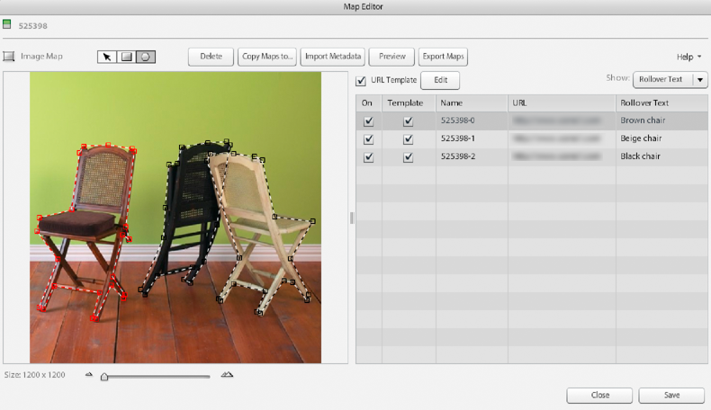

# 画像マップの作成 {#creating-image-maps}

画像マップは、画像、eCatalog ページまたはスピンセット内の画像の中で、テキストを含んだロールオーバーパネルが表示される領域です。ユーザーが画像マップを選択すると、何らかのアクションがトリガーされます。 例えば、製品の詳細を説明した Web ページが起動します。ユーザがポインタを画像マップ上に移動すると、画像マップの周囲にアウトラインが表示されます。

Adobe Dynamic Media Classicで画像マップを作成する機能に加えて、Adobe AcrobatまたはAdobe InDesignでカタログをデザインする際に、画像マップを作成することもできます。

画像マップを作成する際に、次の操作を行うことができます。

* ロールオーバーテキストの入力
* Web ページを起動するための JavaScript と URL の入力
* 画像マップの URL テンプレートの作成
* 画像マップの別の画像、eCatalog ページまたはスピンセットへのコピー
* CSV または XML への画像マップの書き出し
* タブ区切りファイルまたは XML ファイルから画像メタデータを読み込みます。
* World Wide Web Consortium（W3C）によって定義された他のアクションの定義
* 画像マップのプレビュー

## 画像マップの描画と調整 {#drawing-and-adjusting-an-image-map}

1. 次のいずれかの操作を行います。

   * グリッド表示またはリスト表示で画像を操作している場合は、「編集」ドロップダウンリストで「 **[!UICONTROL 画像マップ]**. または、詳細ビューで開き、を選択します。 **[!UICONTROL 画像マップ]** を画像の上に配置します。
   * グリッド表示またはリスト表示でスピンセットを操作する場合は、 **[!UICONTROL 編集]**. または、詳細ビューで開き、を選択します。 **[!UICONTROL 編集]**. 画像アセットを選択し、「 **[!UICONTROL 画像マップ]**.
   * eCatalog を使用する場合は、グリッドビュー、リストビュー、詳細ビューで、 **[!UICONTROL 編集]**. を選択します。 **[!UICONTROL ページをマッピング]** タブをクリックします。

   

1. 長方形または多角形の画像マップを描画します。

   * **長方形マップ**  — 長方形画像マップツールを選択し、ページ上にドラッグして長方形を作成します。 長方形のマップにポイントを追加する（ポリゴンマップに変更する）には、[Ctrl] を押し、挿入ツールを目的の場所に配置して、を選択します。

   * **ポリゴンマップ**  — 多角形画像マップツールを選択し、囲む画像の領域の周囲の点を選択します。 多角形の密度スライダを使用して、多角形内のポイント密度を変化させます。ほかのマップを選択した場合、元の密度は記憶されます。多角形内でポイントが追加、削除または移動されると、元の密度は失われ、スライダは最大値にリセットされます。

1. 必要に応じて、画像マップリストに、画像マップの名前を入力します。画像マップを描画した後、Adobe Dynamic Media Classicによって画像マップに名前が割り当てられます。

   名前を作成するために、Adobe Dynamic Media Classicは、操作している画像または eCatalog ページの名前に連続した番号を追加します。 これと異なる名前を自由に指定することもできます。

1. ユーザーが画像マップを選択したときに新しい Web ページを開きたい場合、画像マップリストに URL を入力します。

   詳しくは、[JavaScript と URL の入力](creating-image-maps.md#using_a_template_to_enter_javascript_and_urls)を参照してください。

1. ユーザが画像マップにポインタを合わせたときに、ロールオーバーテキストを表示する場合は、画像マップリストにそのテキストを入力します。画像マップリストで、 **[!UICONTROL 表示]** メニューと選択 **[!UICONTROL ロールオーバーテキスト]**. 次に、ユーザーに画面に表示するテキストを入力します。 ワードプロセッサーで入力したテキストを「ロールオーバーテキスト」フィールドにコピーすることもできます。

1. 画像マップにポインタを合わせたときに別のアクション効果を実行する場合は、アクションを定義します。内 **[!UICONTROL 表示]** ドロップダウンリストで、「 **[!UICONTROL その他のアクション]**. アクションの属性を入力します( に移動します。 **[!UICONTROL 表示]** > **[!UICONTROL 両方]** ：画像マップのロールオーバーテキストとアクションを作成する場合 )。

   詳しくは、 [画像マップのその他のアクションの定義](creating-image-maps.md#defining_other_actions_for_image_maps).

1. 必要に応じて次の操作を行います。

   * 画像マップをプレビューするには、「 **[!UICONTROL プレビュー]**.
   * 画像マップまたは多角形の頂点を削除するには、画像上の図形を選択し、 **[!UICONTROL 削除]**. eCatalog の場合は、「ページの順序」タブで、 **[!UICONTROL マップをクリア]** をクリックして、すべてのページから画像マップを削除します。
   * 画像マップを削除せずに一時的に画像、スピンセット内の画像または eCatalog ページから取り除くには、画像マップリストの画像マップの「オン」オプションを選択解除します。

1. 選択 **[!UICONTROL 保存]**.

### 画像マップの位置、形状、サイズを調整する {#adjusting-the-position-shape-and-size-of-image-maps}

画像マップの位置、形状、およびサイズを変更するには、画像マップボタン  を選択します。次に、 **[!UICONTROL パン]** ツールを使用して、次の手順に従います。

* **位置を変更**  — ポインターを、画像マップの境界線の上ではなく、近くに移動します。 ポインタが 4 方向の矢印アイコンに変わったら、マップを移動先の位置にドラッグします。

* **サイズと形状の変更**  — 画像マップの形状とサイズを変更する方法は、長方形または多角形の画像マップを使用しているかどうかによって異なります。

>[!TIP]
>
>画面の下部にあるサイズスライダをドラッグすると、表示を変更して、画像マップを詳細に確認することができます。

* **長方形画像マップ**  — 画像マップの端または角にポインターを移動します。 ポインタが 2 方向の矢印アイコンに変わったら、ドラッグします。縦横比（形状）を維持しながらサイズを変更するには、Shift キーを押しながらドラッグします。

* **多角形の画像マップ**  — 四角形の選択ハンドルをドラッグします。 選択ハンドルを作成するには、画像マップの境界線を選択し、ドラッグを開始します。

### 重複する画像マップを処理 {#handling-overlapping-image-maps}

画像または eCatalog ページに、複数の画像マップとマップの重なり順序がある場合、マップの重なり順序を決定できます。これには、画像マップリストでマップの順序を変更します。リストでマップ名を上下にドラッグします。リスト内で名前が上にある画像マップは、下にあるほかの画像マップの上に重なります。

### 画像マップデータの読み込み {#importing-image-map-data}

ページごとに画像マップデータを入力する方法もありますが、画像、スピンセットまたは eCatalog のデータをマップの概要画面で読み込むこともできます。イメージマップデータは、タブ区切りファイルまたは XML DTD 形式で読み込みます。ファイルのフィールドの並び順は、マップの概要画面の表示順と同じにする必要があります。名前、TOC ラベル、マップ、URL、ロールオーバーテキスト、その他のアクション、検索文字列の順に並ぶようにしてください。画像マップデータを読み込むと、画像マップを作成するたびにそのデータを画像マップリストで入力する手間が省けます。

**画像マップデータを読み込むには:**

1. 画像マップエディタページ（画像またはスピンセット内の画像の場合）または eCatalog 編集画面の「ページをマップ」タブに進みます。
1. 選択 **[!UICONTROL メタデータを読み込み]**.
1. メタデータをアップロードダイアログボックスで、「画像」または「画像マップ」を選択して、目的のアセットプロパティタイプからメタデータをアップロードします。
1. 「ファイルを生成」ドロップダウンリストで、作成するファイルの種類を選択します。
1. （オプション）「 」を選択します。 **[!UICONTROL 生成]** をクリックし、作成するファイルのタイプに基づいて結果のデータをプレビューします。 選択 **[!UICONTROL 閉じる]** をクリックして、メタデータをアップロードダイアログボックスに戻ります。
1. アップロードするファイルを探して選択します。「ファイル名」テキストフィールドに、生成したファイルの名前を指定します。
1. （オプション）「ジョブ名」フィールドに、メタデータアップロードジョブの名前を指定します。
1. 選択 **[!UICONTROL アップロード]**.

### 画像マップをコピー {#copying-image-maps}

画像または eCatalog ページ間で画像マップをコピーできます。用途 **[!UICONTROL 画像マップをコピー]** 頭を使って作り始めるのです また、画像マップをコピーして、レイアウトやマッピング構造を共有する画像やページで再作成することもできます。

例えば、eCatalog 内の画像マップをコピーすることで、同じ eCatalog の各言語バージョン間ですべての画像マップを簡単にコピーすることができます。コピーのメリットを最大限に活かすには、ページ数が同じで、同じ画像が含まれている eCatalog 間でコピーします。コピー先の eCatalog に既に画像マップが含まれている場合、コピー時にそれらの画像マップは削除されます。

**画像マップをコピーするには:**

1. 画像マップエディタページ（画像またはスピンセット内の画像の場合）または eCatalog 編集画面の「ページをマップ」タブに進みます。
1. 選択 **[!UICONTROL マップのコピー先]**.
1. 画像から画像マップをコピーするか、eCatalog から画像マップをコピーするかに基づいて、次のいずれかの操作を行います。

   * （画像）画像を選択画面で、画像マップのコピー先の画像を選択します。
   * （eCatalog）アセットを選択画面で、画像マップのコピー先の画像または eCatalog ページを選択します。

1. 選択 **[!UICONTROL 選択]**.

## テンプレートを使用して JavaScript と URL を入力 {#using-a-template-to-enter-javascript-and-urls}

URL テンプレート（Href テンプレート）を定義すると、画像マップの URL を簡単に、より効率的に入力できるようになります。使用する画像マップの URL のほとんどが、共通の決まった形式を共有している場合、URL テンプレートを定義することをお勧めします。固定された URL の一部を URL テンプレートとして入力することにより、画像マップを作成するたびにこの URL の部分を入力する必要がなくなります。URL テンプレートにはまた、JavaScript コマンド、パス名、およびパラメータを含めることができます。デフォルトでは、この URL テンプレートには、という独自のAdobe Dynamic Media Classic JavaScript ハンドラーが含まれています。 `loadProduct` 新しいウィンドウで画像が開きます。

>[!NOTE]
>
>JavaScript コードを画像マップの HREF 属性に追加すると、そのコードはクライアントのコンピューターで実行されます。 そのため、JavaScript コードが安全であることを確認してください。

### URL テンプレートについて {#about-url-templates}

URL テンプレートは次のように、画像マップリストの「URL」列の内容をテンプレートの 2 つのドル記号（$$）に代入して使用します。

```as3
Javascript:loadProduct(‘$$’);void(0);
```

URL テンプレート内の画像マップ間で変更されないすべての値を配置します。 画像マップリストの「URL」列には、共通部分以外の値のみを追加します。以下に例を挙げます。

* URL テンプレート — `javascript:loadProduct(‘https://www.examplesitehere.com/$$’);void(0);`
* URL 値 — `product.htm`
* 実際に生成された URL - `javascript:loadProduct(‘https://www.examplesitehere.com/product.html);void(0);`

デフォルトでは、この URL テンプレートには、と呼ばれる独自のAdobe Dynamic Media Classic JavaScript ハンドラーが含まれています。 `loadProduct` URL の宛先を含む新しいウィンドウが開きます。 ただし、任意の JavaScript コードを使用してこの JavaScript ハンドラーを置き換えることも、次のAdobe Dynamic Media Classicハンドラーのいずれかを使用することもできます。

* `loadProductCW`  — 現在のウィンドウの「URL」列で指定された URL ターゲットを表示します。 このハンドラーは、主に、Web サイト内のページに統合される eCatalog に対して使用します。

* `loadProductPW`  — 親ウィンドウ（現在のウィンドウを開いたページ）の「URL」列で指定された URL ターゲットを表示します。 現在のウィンドウは開いたままですが、親ウィンドウは URL ターゲットの表示に変更されます。

   >[!NOTE]
   >
   >ハンドラー `loadProductPW` は、DHTML および HTML5 ビューアをサポートしていません。

### URL テンプレートの作成 {#creating-a-url-template}

1. マップエディター画面（画像またはスピンセットの場合）または eCatalog 画面の「ページをマップ」タブ（eCatalog の場合）で、「URL テンプレート」オプションの横の「編集」を選択します。マップテンプレートを編集ダイアログボックスが開きます。
1. JavaScript コードと完全な URL を入力します（変数部分はドル記号に置き換えられます）。 [$$]) をクリックします。 右クリックし、「 」を選択して、コードを貼り付けることができます。 **[!UICONTROL 貼り付け]**.
1. 選択 **[!UICONTROL 保存]**.

### URL テンプレートの処理 {#handling-url-templates}

マップエディタページ（画像およびスピンセットの場合）および eCatalog 画面の「ページをマップ」タブ（eCatalog の場合）には、URL テンプレートを処理するための次のコマンドが用意されています。

* **URL テンプレートオプション** - 「URL テンプレート」オプションを選択して、画像または eCatalog ページ上のすべての画像マップに URL テンプレートを適用します。

* **テンプレートオプション**  — 個々の画像マップで URL テンプレートを使用しない場合は、URL 画像マップリストの「テンプレート」オプションの選択を解除します。

## 画像マップのその他のアクションの定義 {#defining-other-actions-for-image-maps}

次の項目を選択できます。 **[!UICONTROL 表示]** メニューと選択 **[!UICONTROL その他のアクション]** ：ロールオーバーテキストと web ページの起動以外のトリガーアクション。 ユーザが画像マップにポインタを合わせたときに、アクションを起動できます。このようなアクションは、World Wide Web Consortium の HTML 仕様によって、クライアント側画像マップとして定義されている属性を使用します。以下に例を示します。

* **`accesskey`**  — ユーザーがキーボードの指定されたキーを押したときのアクションをトリガーします。

* **`onfocus`**  — 画像マップがフォーカスを受け取ったときに、カーソル、タブキー、またはアクセスキーを押してイベントをトリガーします。 例えば、対象の画像マップにフォーカスが移動したときに Web ページが起動し、画像マップがフォーカスを失ったときに閉じることができます。

* **`onblur`**  — 画像マップがカーソルまたはタブによってフォーカスを失ったときのイベントをトリガーします。

**画像マップのその他のアクションを定義するには:**

1. [ マップエディタ ] 画面（画像とスピンセット）または eCatalog 画面 (eCatalog) の [ ページをマップ ] タブで、 **[!UICONTROL 表示]** メニューと選択 **[!UICONTROL その他のアクション]**.
1. World Wide Web Consortium の HTML 仕様によって指定されている構文を使用して、画像マップリストの「その他のアクション」列に、サポートされている属性を追加します。
1. 選択 **[!UICONTROL 保存]**.

を選択します。 **[!UICONTROL 表示]** メニューと選択 **[!UICONTROL 両方]** 画像マップにロールオーバーテキストとアクションを設定する場合。

## Adobe AcrobatまたはAdobe InDesignでの画像マップの作成 {#creating-image-maps-in-adobe-acrobat-or-adobe-indesign}

画像マップは、Adobe Acrobat や Adobe InDesign での eCatalog のデザイン中に作成できます。

Adobe AcrobatまたはAdobe InDesignで、画像マップを表示する場所にハイパーリンク参照を作成し、画像マップの URL の場所を指定します。 PDFファイルをAdobe Dynamic Media Classicにアップロードする際に「リンクを抽出」オプションを選択すると、リンクが画像マップに自動的に変換されます。

詳しくは、「 Adobe InDesignヘルプ」または「 Adobe Acrobatヘルプ」を参照してください。

### Adobe InDesign で画像マップを作成するには： {#to-create-image-maps-in-adobe-indesign}

1. Adobe InDesignで、に移動します。 **[!UICONTROL Windows®]** > **[!UICONTROL インタラクティブ]** > **[!UICONTROL ハイパーリンク]**.
1. ハイパーリンクパネルで、画像マップに追加するテキスト、枠、またはグラフィックを選択します。
1. 選択 **[!UICONTROL 新しいハイパーリンク]** を選択します。
1. [ 新しいハイパーリンク ] ダイアログボックスで、 **[!UICONTROL リンク先]** メニュー、選択 **[!UICONTROL URL]**.
1. 「 URL 」ボックスに製品 ID を入力するか貼り付けます。
1. 選択 **[!UICONTROL OK]**. (Adobe Dynamic Media Classicは、画像マップ URL テンプレートを使用して URL を完成します )。

   >[!NOTE]
   >
   >Adobe InDesignで外観オプションを設定する必要はありません。 外観はAdobe Dynamic Media Classicで指定できます。

1. 作成するすべての画像マップに対して手順 2 ～ 6 を繰り返します。
1. ファイルを PDF として書き出します。
1. Adobe Dynamic Media ClassicにPDFをアップロードします。
1. In **[!UICONTROL PDFオプション]**&#x200B;を選択します。 **[!UICONTROL リンクを抽出]**.

### Adobe Acrobat で画像マップを作成するには {#to-create-image-maps-in-adobe-acrobat}

1. Adobe Acrobatで、に移動します。 **[!UICONTROL ツール]** > **[!UICONTROL 高度な編集]** > **[!UICONTROL リンクツール]**.
1. ポインタをドラッグして画像マップを作成します。
1. 「リンクを作成」ボックスで、 **[!UICONTROL カスタムリンク]**&#x200B;を選択し、 **[!UICONTROL 次へ]**.

>[!NOTE]
>
>Adobe Acrobatで外観オプションを設定する必要はありません。 外観はAdobe Dynamic Media Classicで指定できます。

1. 「リンクプロパティ」ボックスで、 **[!UICONTROL アクション]**.
1. 選択 **[!UICONTROL Web リンクを開く]** [ アクションの選択 ] メニューから、 **[!UICONTROL 追加]**.
1. 画像マップの製品 ID を「URL を編集」ボックスに入力し、を選択します。 **[!UICONTROL OK]**. (Adobe Dynamic Media Classicは、画像マップ URL テンプレートを使用して、URL を完成します )。
1. 作成するすべての画像マップに対して手順 1 ～ 7 を繰り返します。
1. ファイルを保存します。
1. PDFをAdobe Dynamic Media Classicにアップロードし、オプションオプションから「リンクをPDF」を選択します。
