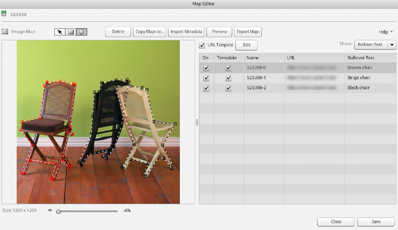

# 画像マップの作成 {#creating-image-maps}

画像マップは、画像上の領域、e カタログページ、またはSpinSet内の画像で、テキスト付きのロールオーバーパネルを表示します。 ユーザーが画像マップを選択すると、何らかのアクションがトリガーされます。 例えば、ユーザーが製品について詳しく知ることができるように、Web ページが起動されます。 ユーザーが画像マップの上にポインターを移動すると、画像マップの周囲にアウトラインが表示されます。

Adobe Dynamic Media Classicで画像マップを作成する機能に加えて、Adobe AcrobatまたはAdobe InDesignでカタログをデザインするときに画像マップを作成することもできます。

画像マップを作成する場合は、次のいずれかの操作を行うことができます。

* ロールオーバーテキストの入力
* Web ページを起動するためのJavaScriptとURLを入力します。
* 画像マップの URL テンプレートの作成
* 画像マップの別の画像、eCatalog ページまたはスピンセットへのコピー
* CSV または XML への画像マップの書き出し
* タブ区切りファイルまたはXML ファイルから画像メタデータを読み込みます。
* World Wide Web Consortiumによって決定されるその他のアクションを定義します。
* 画像マップのプレビュー

## 画像マップの描画と調整 {#drawing-and-adjusting-an-image-map}

1. 次のいずれかの操作を行います。

   * グリッド表示またはリスト表示で画像を操作している場合は、「編集」ドロップダウンリストで「**[!UICONTROL 画像マップ]**」を選択します。 または、詳細ビューで開き、画像の上にある&#x200B;**[!UICONTROL 画像マップ]**&#x200B;を選択します。
   * グリッドビューまたはリストビューでスピンセットを操作している場合は、**[!UICONTROL 編集]**&#x200B;を選択します。 または、詳細ビューで開き、**[!UICONTROL 編集]**&#x200B;を選択します。 画像アセットを選択し、**[!UICONTROL 画像マップ]**&#x200B;を選択します。
   * eCatalogで作業している場合は、「グリッド表示」、「リスト表示」、「詳細表示」で「**[!UICONTROL 編集]**」を選択します。 「**[!UICONTROL ページをマップ]**」タブを選択します。

   

1. 長方形または多角形の画像マップを描画します。

   * **長方形マップ**：長方形画像マップツールを選択し、ページ上でドラッグして長方形を作成します。 長方形マップにポイントを追加するには（したがってポリゴンマップに変更する）、Ctrl キーを押してから、挿入ツールを目的の場所に配置して選択します。

   * **多角形マップ**：多角形の画像マップツールを選択し、囲む画像の領域の周囲にあるポイントを選択します。 多角形の密度スライダを使用して、多角形内のポイント密度を変化させます。 ほかのマップを選択した場合、元の密度は記憶されます。 ポリゴン内の任意のポイントが追加、削除、または移動されると、元の密度は失われます。 スライダーが最大値にリセットされます。

1. 必要に応じて、画像マップリストに、画像マップの名前を入力します。 画像マップを描画すると、Adobe Dynamic Media Classicによって名前が割り当てられます。

   名前を作成するために、Adobe Dynamic Media Classicは、操作している画像またはe カタログページの名前に連続番号を追加します。 これと異なる名前を自由に指定することもできます。

1. ユーザーが画像マップを選択したときに新しいWeb ページを開く場合は、画像マップリストにURLを入力します。

   JavaScriptとURLを入力するには、[を参照してください](creating-image-maps.md#using_a_template_to_enter_javascript_and_urls)。

1. ユーザが画像マップにポインタを合わせたときに、ロールオーバーテキストを表示する場合は、画像マップリストにそのテキストを入力します。 画像マップリストで、**[!UICONTROL 表示]** メニューを選択し、**[!UICONTROL 繰り越しテキスト]**&#x200B;を選択します。 次に、ユーザーに画面に表示させるテキストを入力します。 ワードプロセッサーで入力したテキストを「ロールオーバーテキスト」フィールドにコピーすることもできます。

1. 画像マップにポインタを合わせたときに別のアクション効果を実行する場合は、アクションを定義します。 **[!UICONTROL 表示]** ドロップダウンリストで、**[!UICONTROL その他のアクション]**&#x200B;を選択します。 アクションの属性を入力します （**[!UICONTROL 表示]** > **[!UICONTROL 両方]**&#x200B;に移動して、ロールオーバーテキストと画像マップのアクションを作成します）。

   画像マップ [&#128279;](creating-image-maps.md#defining_other_actions_for_image_maps)に対する他のアクションの定義を参照してください。

1. 必要に応じて次の操作を行います。

   * 画像マップをプレビューするには、**[!UICONTROL プレビュー]**&#x200B;を選択します。
   * 画像マップまたは多角形の頂点を削除するには、画像上のシェイプを選択し、**[!UICONTROL 削除]**&#x200B;を選択します。 または、eCatalogの場合、「注文ページ」タブで「**[!UICONTROL マップをクリア]**」を選択して、すべてのページから画像マップを削除します。
   * を削除するには：
      * 画像からの画像マップ
      * スピンセット内の画像
      * eCatalog ページなどで使用できます

     一時的に、削除せずに、画像マップリストの適切な「オン」オプションの選択を解除します。

1. **[!UICONTROL 保存]**&#x200B;を選択します。

### 画像マップの位置、形状、サイズを調整する {#adjusting-the-position-shape-and-size-of-image-maps}

画像マップの位置、形状、サイズを変更するには、「画像マップ」ボタンを選択します。 次に、**[!UICONTROL パン]** ツールを選択し、次の手順に従います。

* **位置を変更**: ポインターを画像マップの境界線の近くに移動しますが、境界線の上には移動しません。 ポインタが 4 方向の矢印アイコンに変わったら、マップを移動先の位置にドラッグします。

* **サイズとシェイプを変更**：画像マップのシェイプとサイズを変更する方法は、長方形または多角形の画像マップを使用しているかどうかによって異なります。

>[!TIP]
>
>画面の下部にあるサイズスライダをドラッグすると、表示を変更して、画像マップを詳細に確認することができます。

* **長方形の画像マップ**：画像マップの側面または隅にポインターを移動します。 ポインタが 2 方向の矢印アイコンに変わったら、ドラッグします。 Shift キーを押しながらドラッグすると、サイズは変更されますが、縦横比（シェイプ）は維持されます。

* **多角形画像マップ**：正方形の選択ハンドルをドラッグします。 選択ハンドルを作成するには、画像マップの境界線を選択し、ドラッグを開始します。

### 重複する画像マップの処理 {#handling-overlapping-image-maps}

画像またはeCatalog ページに複数の画像マップが含まれ、マップが重なっている場合は、マップの重なり方を指定できます。 これには、画像マップリストでマップの順序を変更します。 リストでマップ名を上下にドラッグします。 リスト内で名前が上にある画像マップは、下にあるほかの画像マップの上に重なります。

### 画像マップデータの読み込み {#importing-image-map-data}

ページごとに画像マップデータを入力する方法もありますが、画像、スピンセットまたは eCatalog のデータをマップの概要画面で読み込むこともできます。 イメージマップデータは、タブ区切りファイルまたは XML DTD 形式で読み込みます。 ファイルのフィールドの並び順は、マップの概要画面の表示順と同じにする必要があります。名前、TOC ラベル、マップ、URL、ロールオーバーテキスト、その他のアクション、検索文字列の順に並ぶようにしてください。 画像マップデータを読み込むと、各画像マップを作成する際に、画像マップリストにデータを入力する手間が軽減されます。

**画像マップデータを読み込むには：**

1. 画像マップエディタページ（画像またはスピンセット内の画像の場合）または eCatalog 編集画面の「ページをマップ」タブに進みます。
1. 「**[!UICONTROL メタデータを読み込み]**」を選択します。
1. メタデータをアップロードダイアログボックスで、「画像」または「画像マップ」を選択して、目的のアセットプロパティタイプからメタデータをアップロードします。
1. `Generate File` ドロップダウンリストで、作成するファイルのタイプを選択します。
1. （オプション）作成するファイルのタイプに基づいて結果のデータをプレビューするには、**[!UICONTROL 生成]**&#x200B;を選択します。 「**[!UICONTROL 閉じる]**」を選択して、メタデータをアップロードダイアログボックスに戻ります。
1. アップロードするファイルを探して選択します。 「ファイル名」テキストフィールドに、生成したファイルの名前を指定します。
1. （オプション）「ジョブ名」フィールドに、メタデータアップロードジョブの名前を指定します。
1. 「**[!UICONTROL アップロード]**」を選択します。

### 画像マップをコピー {#copying-image-maps}

画像または eCatalog ページ間で画像マップをコピーできます。 **[!UICONTROL 画像マップのコピー]**&#x200B;を使用して、画像マップの作成を開始します。 画像マップをコピーして、レイアウトやマッピング構造を共有する画像やページで再作成することもできます。

例えば、eCatalogで画像マップをコピーすると、同じeCatalogの外国語バージョン間で画像マップをすべてコピーするのに便利です。 最適な結果を得るには、同じページ数と同じ画像を持つeCatalog間でコピーを行うと、コピーが最も成功します。 コピー先のeCatalogに既に画像マップが含まれている場合、コピーが作成されると、それらの画像マップは削除されます。

**画像マップをコピーするには：**

1. 画像マップエディタページ（画像またはスピンセット内の画像の場合）または eCatalog 編集画面の「ページをマップ」タブに進みます。
1. 「**[!UICONTROL マップを]**&#x200B;にコピー」を選択します。
1. 画像から画像マップをコピーするか、eCatalog から画像マップをコピーするかに基づいて、次のいずれかの操作を行います。

   * （画像）画像を選択画面で、画像マップのコピー先の画像を選択します。
   * （eCatalog）アセットを選択画面で、画像マップのコピー先の画像または eCatalog ページを選択します。

1. **[!UICONTROL Select]**&#x200B;を選択します。

## テンプレートを使用してJavaScriptとURLを入力する {#using-a-template-to-enter-javascript-and-urls}

URL テンプレート（Href テンプレート）を定義すると、画像マップの URL を簡単に、より効率的に入力できるようになります。 使用する画像マップの URL のほとんどが、共通の決まった形式を共有している場合、URL テンプレートを定義することをお勧めします。 固定された URL の一部を URL テンプレートとして入力することにより、画像マップを作成するたびにこの URL の部分を入力する必要がなくなります。 URL テンプレートには、JavaScript コマンド、パス名、パラメーターも含めることができます。 デフォルトでは、URL テンプレートには、`loadProduct`という名前のAdobe Dynamic Media Classic JavaScript ハンドラーが含まれており、新しいウィンドウで画像が開きます。

>[!NOTE]
>
>JavaScript コードをImage MapのHREF属性に追加すると、そのコードはクライアントのコンピューターで実行されます。 したがって、JavaScript コードが安全であることを確認してください。

### URL テンプレートについて {#about-url-templates}

URL テンプレートは、画像マップリストのURL列の内容を置き換えることで機能します。 テンプレートのダブル ドル記号（&#39;$$&#39;）に置き換えます。

```as3
Javascript:loadProduct('$$');void(0);
```

URL テンプレート内の画像マップ間で変更されないすべての値を配置します。 画像マップリストの「URL」列には、共通部分以外の値のみを追加します。 以下に例を挙げます。

* URL テンプレート：`javascript:loadProduct('https://www.examplesitehere.com/$$');void(0);`
* URL値：`product.htm`
* 実際のURLが生成されました：`javascript:loadProduct('https://www.examplesitehere.com/product.html);void(0);`

デフォルトでは、URL テンプレートには、URLの宛先で新しいウィンドウを開く`loadProduct`というAdobe Dynamic Media Classic JavaScript ハンドラーが含まれています。 ただし、任意のJavaScript コードを使用して、このJavaScript ハンドラーを置き換えることも、次のいずれかのAdobe Dynamic Media Classic ハンドラーを使用することもできます。

* `loadProductCW`：現在のウィンドウのURL列で指定されたURL ターゲットを表示します。 このハンドラーは、主に、Web サイト内のページに統合される eCatalog に対して使用します。

* `loadProductPW`：親ウィンドウ（現在のウィンドウを開いたページ）のURL列で指定されたURL ターゲットを表示します。 現在のウィンドウは開いたままですが、親ウィンドウは URL ターゲットの表示に変更されます。

  >[!NOTE]
  >
  >ハンドラー`loadProductPW`はDHTML ビューアとHTML5 ビューアをサポートしていません。

### URL テンプレートの作成 {#creating-a-url-template}

1. マップエディター画面（画像またはスピンセット）またはeCatalog画面（eCatalogs）の「ページをマップ」タブで、「URL テンプレート」オプションの横にある「編集」を選択します。 マップテンプレートを編集ダイアログボックスが開きます。
1. JavaScript コードと完全なURLを入力します（変数部分はドル記号[$$]に置き換えられます）。 コードを貼り付けるには、右クリックして「**[!UICONTROL 貼り付け]**」を選択します。
1. **[!UICONTROL 保存]**&#x200B;を選択します。

### URL テンプレートの処理 {#handling-url-templates}

マップエディタページ（画像およびスピンセットの場合）および eCatalog 画面の「ページをマップ」タブ（eCatalog の場合）には、URL テンプレートを処理するための次のコマンドが用意されています。

* **URL テンプレートオプション**: URL テンプレートオプションを選択して、画像またはeCatalog ページのすべての画像マップにURL テンプレートを適用します。

* **テンプレートオプション**：個々の画像マップでURL テンプレートを使用しない場合は、URL画像マップリストの「テンプレート」オプションの選択を解除します。

## 画像マップの他のアクションの定義 {#defining-other-actions-for-image-maps}

「**[!UICONTROL 表示]**」メニューを選択し、「**[!UICONTROL その他のアクション]**」を選択して、ロールオーバーテキストとWeb ページのローンチ以外のアクションをトリガーできます。 ユーザが画像マップにポインタを合わせたときに、アクションを起動できます。 このようなアクションは、World Wide Web Consortium の HTML 仕様によって、クライアント側画像マップとして定義されている属性を使用します。 以下に例を示します。

* **`accesskey`**: ユーザーが指定されたキーをキーボードで押したときに操作をトリガーします。

* **`onfocus`**：画像マップがフォーカスを受け取ったときに、カーソル、タブ、またはアクセスキーを押してイベントをトリガーします。 例えば、画像マップがフォーカスを受け取ったときにWeb ページを起動し、画像マップがフォーカスを失ったときに閉じることができます。

* **`onblur`**：画像マップがフォーカスを失ったときに、カーソルまたはタブによってイベントをトリガーします。

**画像マップの他のアクションを定義するには：**

1. マップエディター画面（画像とスピンセット）またはeCatalog画面（eCatalogs）の「マップページ」タブで、**[!UICONTROL 表示]** メニューを選択し、**[!UICONTROL その他のアクション]**&#x200B;を選択します。
1. World Wide Web Consortium の HTML 仕様によって指定されている構文を使用して、画像マップリストの「その他のアクション」列に、サポートされている属性を追加します。
1. **[!UICONTROL 保存]**&#x200B;を選択します。

画像マップにロールオーバーテキストとアクションを含める場合は、**[!UICONTROL 表示]** メニューを選択し、**[!UICONTROL 両方]**&#x200B;を選択します。

## Adobe AcrobatまたはAdobe InDesignでの画像マップの作成 {#creating-image-maps-in-adobe-acrobat-or-adobe-indesign}

画像マップは、Adobe Acrobat や Adobe InDesign での eCatalog のデザイン中に作成できます。

Adobe AcrobatまたはAdobe InDesignで、画像マップを表示する場所にハイパーリンク参照を作成し、画像マップのURLの場所を指定します。 PDF ファイルをAdobe Dynamic Media Classicにアップロードする際に、「リンクを抽出」オプションを選択すると、リンクが自動的にImage Mapsに変換されます。

詳しくは、Adobe InDesign ヘルプまたはAdobe Acrobat ヘルプを参照してください。

### Adobe InDesign で画像マップを作成するには： {#to-create-image-maps-in-adobe-indesign}

1. Adobe InDesignで、**[!UICONTROL Windows®]** > **[!UICONTROL インタラクティブ]** > **[!UICONTROL ハイパーリンク]**&#x200B;に移動します。
1. ハイパーリンクパネルで、画像マップにするテキスト、フレーム、グラフィックを選択します。
1. パネルメニューから「**[!UICONTROL 新規ハイパーリンク]**」を選択します。
1. 新規ハイパーリンクダイアログボックスの&#x200B;**[!UICONTROL リンク先]** メニューから、**[!UICONTROL URL]**&#x200B;を選択します。
1. 「URL」ボックスに製品IDを入力するか貼り付けます。
1. **[!UICONTROL OK]**&#x200B;を選択します。 （Adobe Dynamic Media Classicは、画像マップ URL テンプレートを使用してURLを補完します）。

   >[!NOTE]
   >
   >Adobe InDesignで外観オプションを設定する必要はありません。 Adobe Dynamic Media Classicでアピアランスを指定できます。

1. 作成するすべての画像マップについて、手順2 ～ 6を繰り返します。
1. ファイルを PDF として書き出します。
1. PDFをAdobe Dynamic Media Classicにアップロードします。
1. **[!UICONTROL PDF オプション]**&#x200B;で、**[!UICONTROL リンクを抽出]**&#x200B;を選択します。

### Adobe Acrobat で画像マップを作成するには {#to-create-image-maps-in-adobe-acrobat}

1. Adobe Acrobatで、**[!UICONTROL ツール]** > **[!UICONTROL 詳細編集]** > **[!UICONTROL リンクツール]**&#x200B;に移動します。
1. ポインタをドラッグして画像マップを作成します。
1. リンクを作成ボックスで、**[!UICONTROL カスタムリンク]**&#x200B;を選択し、**[!UICONTROL 次へ]**&#x200B;を選択します。

>[!NOTE]
>
>Adobe Acrobatで外観オプションを設定する必要はありません。 Adobe Dynamic Media Classicでアピアランスを指定できます。

1. 「リンクのプロパティ」ボックスで、「**[!UICONTROL アクション]**」を選択します。
1. 「アクションを選択」メニューから「**[!UICONTROL Web リンクを開く]**」を選択し、「**[!UICONTROL 追加]**」を選択します。
1. 「URLを編集」ボックスに画像マップの製品IDを入力し、**[!UICONTROL OK]**&#x200B;を選択します。 （Adobe Dynamic Media Classicは、画像マップ URL テンプレートを使用してURLを補完します）。
1. 作成するすべての画像マップに対して手順 1 ～ 7 を繰り返します。
1. ファイルを保存します。
1. PDFをAdobe Dynamic Media Classicにアップロードし、「PDF オプション」から「リンクを抽出」を選択します。
