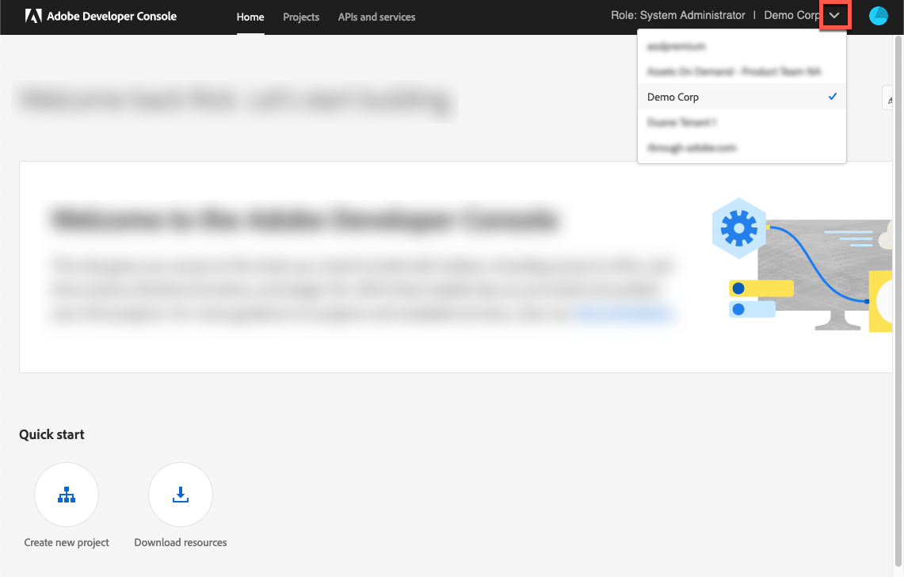

# Adobe Analyticsにログオンします{#log-in-to-adobe-analytics}

自分がAdobe AnalyticsのWeb サービスアクセスグループのメンバーであることを確認します。 ログインする前に、これを行ってAdobe Analytics レポートを設定し、Adobe Analytics レポート変数をAdobe Dynamic Media Classic イベントに一致させます。 このグループのメンバーは、指定されたレポートスイートのすべてのレポートにアクセスできます。 インターフェイスで設定された権限に関係なく、Experience CloudのWeb サービス APIを使用して行います。 グループにメンバーを追加するには、Adobe Analyticsで、**[!UICONTROL 管理ツール]** > **[!UICONTROL ユーザー管理]** > **[!UICONTROL グループを編集]**&#x200B;に移動します。

ログインすると、Experience Cloud組織IDを入力して、最新のビデオ分析実装を使用するオプションが表示されます。 IDを入力しない場合でも、ビデオレポートは機能します。 ただし、Adobe Dynamic Media Classic外部からクライアントの他のデータとデータが正しく統合されなくなる可能性があります。

>[!NOTE]
>
>Adobe Analytics アカウントがログイン用のAdobe IMSベース認証（Identity Management System）に移行されている場合、ダイレクト認証情報の入力が機能しません。

## Adobe Dynamic Media ClassicからAdobe Analyticsにログオンします {#log-in-to-analytics-from-dmc}

まず、Dynamic Media ClassicとAdobe Analytics OAuthを統合します。 Adobe AnalyticsとDynamic Media ClassicのOAuth統合は、通常、ユーザーごとに1回だけ実行されます。

1. [Adobe Developer Console](https://developer.adobe.com/console)にアクセスします。 アカウントに、統合が必要な組織の管理者権限があることを確認します。
1. ホームページの右上隅付近にあるドロップダウンリストから、適切な会社を選択します。 （以下のスクリーンショットは、情報提供のみを目的としています。選択する実際の会社名は異なる場合があります）。

   

1. 次のいずれかの操作を行います。

   * ページの上部の「**[!UICONTROL ホーム]**」タブで、「**[!UICONTROL 新しいプロジェクトを作成]**」を選択します。
   * ページの上部の「**[!UICONTROL プロジェクト]**」タブから。 ページの右隅付近にある「**[!UICONTROL 新しいプロジェクトを作成]**」を選択します。

1. プロジェクトのページで、「**[!UICONTROL APIを追加]**」を選択します。
1. **[!UICONTROL Add an API]** ページで、**[!UICONTROL Adobe Analytics]**&#x200B;を選択します。
1. ページの右下隅付近にある「**[!UICONTROL 次へ]**」を選択します。

   

1. **[!UICONTROL `Configure API`]** ページで、**[!UICONTROL USER AUTHENTICATION OAuth]**&#x200B;を選択します。
1. ページの右下隅付近にある「**[!UICONTROL 次へ]**」を選択します。
1. **[!UICONTROL `Configure API`]** ページで、**[!UICONTROL OAUTH 2.0 Web]**&#x200B;を選択します。
1. 「**[!UICONTROL デフォルトのリダイレクト URI]**」テキストフィールドに、次のパスを正確に入力します。

   `https://exploreadobe.com/dynamic-media-upgrade/`

1. 「**[!UICONTROL リダイレクト URI パターン]**」テキストフィールドに、次のパスを正確に入力します。

   `https://exploreadobe\.com/dynamic-media-upgrade/`

1. ページの右下隅で、**[!UICONTROL 設定したAPIを保存]**&#x200B;を選択します。
1. ナビゲーションパネルのAdobe Analytics ページの左側の&#x200B;**[!UICONTROL 資格情報]**&#x200B;で、**[!UICONTROL OAuth Web]**&#x200B;を選択します。
1. **[!UICONTROL 資格情報の詳細]**&#x200B;で、次の操作を行います。
   * **[!UICONTROL クライアント ID]**&#x200B;で、**[!UICONTROL コピー]**&#x200B;を選択して値をコピーします。 この値は、後に続くDynamic Media Classic デスクトップアプリケーションの後続のAnalytics設定に必要です。
   * **[!UICONTROL クライアントシークレット]**&#x200B;で、**[!UICONTROL クライアントシークレットの取得]**&#x200B;を選択して、関連付けられた値を表示します。 値をコピーするには、**[!UICONTROL コピー]**&#x200B;を選択します。 この値は、後に続くDynamic Media Classic デスクトップアプリケーションの後続のAdobe Analytics設定に必要です。

## Adobe Dynamic Media ClassicでのAdobe Analyticsの設定 {#configure-analytics-in-dmc}

>[!NOTE]
>
>Dynamic Media ClassicでのAdobe Analyticsの初期設定の後、設定をやり直す必要があるのは次の場合だけです。
>
>* Analyticsに新しいレポートが追加され、ユーザーはその新しいレポートにデータの送信を開始したいと考えています。
>* トラッキングサーバーがAdobe Analyticsで更新されます。
>* 新しいトラッキング変数がレポートに導入され、Dynamic Media Classic ユーザーインターフェイスの特定のViewer変数をその新しいAnalytics変数にリンクする必要があります。
>

1. Adobe Dynamic Media Classic デスクトップアプリケーションの右上隅付近で、**[!UICONTROL Setup]** > **[!UICONTROL Application Setup]**&#x200B;に移動します。
1. 左側のパネルの&#x200B;**[!UICONTROL Application Setup]**&#x200B;で、**[!UICONTROL Adobe Analytics]**&#x200B;を選択します。
1. **[!UICONTROL Adobe Analytics Configuration]** ページで、**[!UICONTROL Adobe Analytics Login]**&#x200B;を選択します。
1. **[!UICONTROL Adobe Analytics ログイン]** ダイアログボックスの&#x200B;**[!UICONTROL CLIENT ID]** フィールドと&#x200B;**[!UICONTROL CLIENT SECRET]** フィールドに、先ほどコピーした各値を貼り付けます。
1. ダイアログボックスの右下隅にある「**[!UICONTROL ログイン]**」を選択し、Adobe IMS（Identity Management サービス）ログインを実行します。

   ログインが正常に完了すると、利用可能な企業によって開始された&#x200B;**[!UICONTROL COMPANIES]** ドロップダウンリストと共に、Adobe Analytics ログインダイアログボックスが再び表示されます。

1. **[!UICONTROL COMPANIES]** ドロップダウンリストから、会社を選択します。

   会社を選択すると、選択した会社で使用可能なレポートスイートによって開始される&#x200B;**[!UICONTROL SUITES]** ドロップダウンリストが表示されます。

1. 「**[!UICONTROL スイート]**」ドロップダウンリストから、レポートスイートを選択します。

   >[!NOTE]
   >
   >デフォルトでは、**[!UICONTROL COMPANIES]**&#x200B;と&#x200B;**[!UICONTROL SUITES]**&#x200B;の両方のドロップダウンリストが空であることをユーザーは認識しておく必要があります。 そのため、ユーザーは各リストから値を選択する必要があります。

1. 設定を保存できるように、**[!UICONTROL OK]**&#x200B;を選択します。

   >[!NOTE]
   >
   >**[!UICONTROL OK]**&#x200B;を選択すると、**[!UICONTROL Adobe Analytics Server]** フィールドに、Analytics名前空間に一致するサード パーティの推奨トラッキングサーバーが入力されます。 別のトラッキングサーバーを使用している場合は、データの損失を避けるために、このフィールドで更新してください。

1. Adobe Analytics設定ページの左下隅にある「**[!UICONTROL 保存]**」を選択して、Adobe Analytics アカウント設定が更新されていることを確認します。

>[!MORELIKETHIS]
>
>* [Adobe Analytics レポートの設定](configuring-analytics-reports.md#configuring_adobe_analytics_reports)
