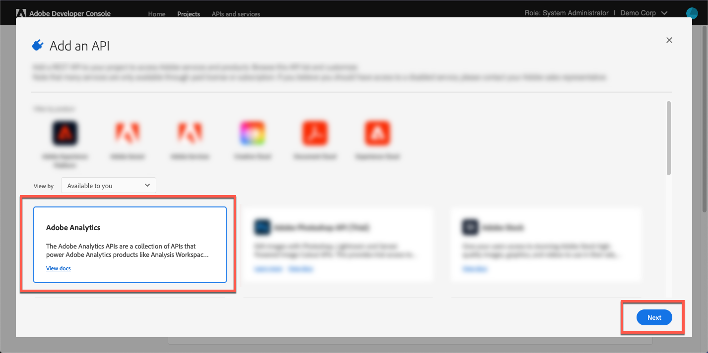

# Adobe Analyticsへのログオン{#log-in-to-adobe-analytics}

ログインしてAdobe Analytics レポートを設定し、Adobe Analytics レポート変数をAdobe Dynamic Media Classic イベントと照合する前に、Adobe Analyticsの web サービスアクセスグループのメンバーであることを確認してください。 このグループのメンバーは、インターフェイスで設定された権限に関係なく、Experience Cloudの Web サービス API を介して、指定されたレポートスイート内のすべてのレポートにアクセスできます。 グループにメンバーを追加するには、Adobe Analyticsで、次に移動します **[!UICONTROL 管理ツール]** > **[!UICONTROL ユーザー管理]** > **[!UICONTROL グループの編集]**.

ログイン時に、Experience Cloud組織 ID を入力して最新のビデオ分析実装を使用することもできます。 ID を入力しない場合でも、ビデオレポートは機能します。 ただし、Adobe Dynamic Media Classicの外部からのそのクライアントの他のデータと正しく統合されない可能性があります。

>[!NOTE]
>
>ログインのためにAdobe Analytics アカウントがAdobe IMSベースの認証（Identity Management System）に移行されている場合、直接資格情報の入力は機能しません。

## Adobe Dynamic Media ClassicからAdobe Analyticsへのログオン {#log-in-to-analytics-from-dmc}

最初に、Dynamic Media ClassicをAdobe Analytics OAuth と統合します。 Dynamic Media ClassicとのAdobe Analytics OAuth 統合は、通常、ユーザーごとに 1 回だけ行われます。

1. アクセス [Adobe Developer コンソール](https://developer.adobe.com/console). 統合が必要な組織の管理者権限がアカウントにあることを確認します。
1. ホームページの右上隅付近にあるドロップダウンリストで適切な会社を選択します。 （以下のスクリーンショットは情報提供のみを目的としています。選択した実際の会社名は異なる場合があります。）

   

1. 次のいずれかの操作をおこないます。

   * ページの上部にある、 **[!UICONTROL ホーム]** タブ、選択 **[!UICONTROL 新規プロジェクトを作成]**.
   * ページの上部にある、 **[!UICONTROL プロジェクト]** タブ。 ページの右隅付近にある、を選択します。 **[!UICONTROL 新規プロジェクトを作成]**.

1. プロジェクトのページで、 **[!UICONTROL API を追加]**.
1. 日 **[!UICONTROL API を追加]** ページ、選択 **[!UICONTROL Adobe Analytics]**.
1. ページの右下隅付近にある「」を選択します **[!UICONTROL 次]**.

   

1. 日 **[!UICONTROL `Configure API`]** ページ、選択 **[!UICONTROL ユーザー認証 OAuth]**.
1. ページの右下隅付近にある「」を選択します **[!UICONTROL 次]**.
1. 日 **[!UICONTROL `Configure API`]** ページ、選択 **[!UICONTROL OAUTH 2.0 Web]**.
1. が含まれる **[!UICONTROL デフォルトのリダイレクト URI]** テキストフィールドに、次のパスを図のように正確に入力します。

   `https://exploreadobe.com/dynamic-media-upgrade/`

1. が含まれる **[!UICONTROL リダイレクト URI パターン]** テキストフィールドに、次のパスを図のように正確に入力します。

   `https://exploreadobe\.com/dynamic-media-upgrade/`

1. ページの右下隅にあるを選択します。 **[!UICONTROL 設定済み API を保存]**.
1. ナビゲーションパネルのAdobe Analyticsページの左側にある以下の場所 **[!UICONTROL 資格情報]**&#x200B;を選択 **[!UICONTROL OAuth Web]**.
1. 次の下 **[!UICONTROL 資格情報の詳細]**、次の手順を実行します。
   * 次の下 **[!UICONTROL クライアント ID]**&#x200B;を選択 **[!UICONTROL コピー]** 値をコピーします。 この値は、後続のDynamic Media Classic デスクトップアプリケーションで Analytics を設定する際に必要になります。
   * 次の下 **[!UICONTROL クライアント秘密鍵]**&#x200B;を選択 **[!UICONTROL クライアント秘密鍵の取得]** 関連付けられている値を表示します。 を選択 **[!UICONTROL コピー]** 値をコピーします。 この値は、後続のDynamic Media Classic デスクトップアプリケーションでAdobe Analyticsを設定する場合に必要になります。

## Adobe Dynamic Media ClassicでのAdobe Analyticsの設定 {#configure-analytics-in-dmc}

>[!NOTE]
>
>Dynamic Media ClassicでのAdobe Analyticsの初期設定後、設定をやり直す必要があるのは次の場合のみです。
>
>* Analytics に新しいレポートが追加され、ユーザーがその新しいレポートへのデータ送信を開始しようとしています。
>* トラッキングサーバーがAdobe Analyticsで更新されます。
>* レポートに新しいトラッキング変数が導入され、Dynamic Media Classic ユーザーインターフェイスの特定のビューア変数を、その新しい Analytics 変数にリンクするとします。
>

1. Adobe Dynamic Media Classic デスクトップアプリケーションの右上隅付近にある、に移動します **[!UICONTROL 設定]** > **[!UICONTROL アプリケーション設定]**.
1. 左側のパネルの下の **[!UICONTROL アプリケーション設定]**&#x200B;を選択 **[!UICONTROL Adobe Analytics]**.
1. 日 **[!UICONTROL Adobe Analytics設定]** ページ、選択 **[!UICONTROL Adobe Analytics ログイン]**.
1. が含まれる **[!UICONTROL Adobe Analytics ログイン]** ダイアログボックス、内 **[!UICONTROL クライアント ID]** フィールドと **[!UICONTROL クライアント秘密鍵]** フィールドに、前の手順でコピーしたそれぞれの値をペーストします。
1. ダイアログボックスの右下隅にある「」を選択します **[!UICONTROL ログイン]** Adobe IMS（Identity Management サービス）にログインします。

   正常にログインすると、Adobe Analyticsのログインダイアログボックスが再び表示され、 **[!UICONTROL 会社]** 使用可能な会社によって開始されるドロップダウンリスト。

1. から **[!UICONTROL 会社]** ドロップダウンリストから、会社を選択します。

   会社を選択すると、 **[!UICONTROL スイーツ]** 選択した会社で使用可能なレポートスイートによって開始されたドロップダウンリストが表示されます。

1. から **[!UICONTROL スイーツ]** ドロップダウンリストから、レポートスイートを選択します。

   >[!NOTE]
   >
   >デフォルトでは、ユーザーは次の両方を認識する必要があります **[!UICONTROL 会社]** および **[!UICONTROL スイーツ]** ドロップダウンリストは空です。 そのため、ユーザーは各リストから値を選択する必要があります。

1. を選択 **[!UICONTROL OK]** そのため、設定を保存できます。

   >[!NOTE]
   >
   >この **[!UICONTROL Adobe Analytics Server]** フィールドには、を選択したときに analytics 名前空間に一致するサードパーティのトラッキングサーバーが候補として表示されます。 **[!UICONTROL OK]**. 別のトラッキングサーバーを使用している場合は、データの損失を避けるために、このフィールドで更新してください。

1. Adobe Analytics設定ページの左下隅で、を選択します **[!UICONTROL 保存]** Adobe Analytics アカウント設定が更新されていることを確認してください。

>[!MORELIKETHIS]
>
>* [Adobe Analytics レポートの設定](configuring-analytics-reports.md#configuring_adobe_analytics_reports)
